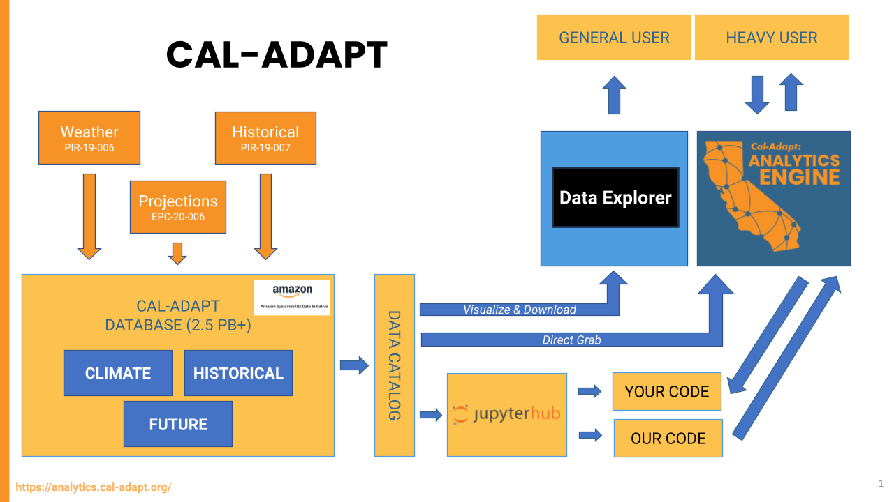

## The Cal Adapt Ecosystem 
Cal-Adapt encompasses a range of research and development efforts designed to provide access to California climate data. Each component of Cal-Adapt serves a specific purpose within the broader mission. As Cal-Adapt evolves and expands, it aims to support California’s Climate Change Assessments and offer a more comprehensive and powerful solution for technical and data-intensive needs. Cal-Adapt includes two distinct but interrelated products: **Cal-Adapt: Analytics Engine** and **Cal-Adapt: Data Explorer**.

::: {#fig-cal-adapt-ecosystem}
```{mermaid}
%%{init: {'flowchart': {'rankSpacing': 30}}}%%
flowchart TD
    ROOT(["<span style='font-size:24px'>CAL-ADAPT</span>"])
    AE(["<span style='font-size:24px'>Analytics<br>Engine</span>"])
    DE(["<span style='font-size:24px'>Data Explorer</span>"])
    DA(["<span style='font-size:24px'>Data Access</span>"])
    NB(["<span style='font-size:24px'>Notebooks</span>"])
    CK(["<span style='font-size:24px'>ClimaKitAE</span>"])
    VZ(["<span style='font-size:24px'>Visualizations</span>"])
    DD(["<span style='font-size:24px'>Data<br>Download</span>"])

    subgraph HIGHLIGHT [ ]
        direction LR
        GU(["<span style='font-size:24px'>Guidance</span>"])
        ED(["<span style='font-size:24px'>Education</span>"])
    end

    ROOT --> AE
    ROOT --> DE
    AE --> DA
    AE --> NB
    AE --> CK
    AE --> GU
    DE --> ED
    DE --> VZ
    DE --> DD

    classDef root fill:#EE7B30,stroke:#EE7B30,color:#ffffff,font-weight:bold
    classDef node fill:#2F6FED,stroke:#2F6FED,color:#ffffff

    class ROOT root
    class AE,DE,DA,NB,CK,GU,ED,VZ,DD node
    style HIGHLIGHT fill:none,stroke:#EE7B30,stroke-width:3px
```
This graphic shows how Cal-Adapt is broken down into its two distinct but interrelated products: Cal-Adapt: Analytics Engine and Cal-Adapt: Data Explorer.
:::

While @fig-cal-adapt-ecosystem shows how these two products relate structurally, @tbl-ae-vs-data-explorer highlights the practical differences between them, including the type of analysis they support, the underlying climate data, and who can access them.

| Cal-Adapt: Analytics Engine | Cal-Adapt: Data Explorer |
|---|---|
| Detailed data analysis | Interactive maps and tools |
| Optimized for big data computation analysis using the cloud | Optimized for fast interactive data visualization on a web browser |
| JupyterHub available to California energy sector users only (code available to everyone via GitHub) | Available to everyone |

: Comparison between the Cal-Adapt: Analytics Engine and Cal-Adapt: Data Explorer. {#tbl-ae-vs-data-explorer .striped}

@fig-cal-adapt-operational traces this same distinction through Cal-Adapt's underlying technical architecture.

::: {#fig-cal-adapt-operational}


Cal-Adapt's operational diagram, showing how weather, historical, and projections data flow into the Cal-Adapt database and are served to general and heavy users through the Data Explorer and Analytics Engine.
:::

## Cal Adapt: Analytics Engine
The Cal-Adapt: Analytics Engine is designed for complex and detailed analyses, requiring extensive data and technical or scientific expertise. Energy-sector partners can utilize cloud computing resources through the Analytics Engine JupyterHub, while the underlying data is accessible to anyone via an array of data access methods. It is particularly valuable for informing technical decisions, such as planning future infrastructure investments or assessing vulnerabilities to various climate hazards. Access to the Analytics Engine JupyterHub is restricted to energy sector partners, reflecting the project's funding by the California Energy Commission, but all of the underlying code is publicly available via the [GitHub repository of Jupyter Notebooks](https://github.com/cal-adapt/cae-notebooks).

### Project Partnership
The Analytics Engine team co-develops industry-specific climate data and decision-support tools tailored to the electricity sector. Through curated conversations and working groups with users and decision-makers, the team ensures that the data and tools are directly applicable to real-world challenges. 

This co-development process leverages an interdisciplinary team with expertise in climate science, data management, and electricity sector engagement, brought together through a public-private partnership including: 

- [Eagle Rock Analytics](http://www.eaglerockanalytics.com/)
- [Lawrence Berkeley National Lab](https://www.lbl.gov/)
- [UCLA Center for Climate Science](https://www.ioes.ucla.edu/climate/)
- [Geospatial Innovation Facility](http://gif.berkeley.edu/)
- [Spatial Informatics Group LLC](https://sig-gis.com/)
- [Energy and Environmental Economics, Inc.](https://www.ethree.com/)

### Development Approach 
The Analytics Engine enhances the use of climate data for climate resilience planning in the electricity sector and supports California’s Climate Change Assessment research. The development approach for the Analytics Engine includes:

1. Creation of an open and transparent data platform architecture,
2. Deployment of a computing sandbox for the co-generation of resilience analytics, and
3. Provision of guidance and learning opportunities for users to encourage widespread platform adoption.

Ultimately, the platform continues to generate downscaled climate model data at 3km, 9km, and 45km spatial resolutions and hourly and daily temporal resolutions to facilitate more effective analytical applications in the electricity sector.

### Computing Environment: JupyterHub and JupyterLab
The Analytics Engine’s computing environment is built on [JupyterHub](https://jupyter.org/hub), which gives users access to standardized computational environments and data resources through a web browser, without having to install complex software. The JupyterHub is maintained by the Analytics Engine team and is currently available to energy sector partners in California. 

Within JupyterHub, users work in [JupyterLab](https://jupyterlab.readthedocs.io/en/stable/), a web-based interactive development environment for notebooks, code, and data. JupyterLab’s flexible interface allows users to configure and arrange workflows across data science, scientific computing, and computational analysis, making it well-suited for the types of climate data workflows supported by the Analytics Engine.

### Project Benefits
- Actionable climate data that supports decision-making for resilience planning.
- Collaboration and coordination among electric utility staff, researchers, scientists, practitioners, and platform developers.
- Comprehensive projections and metrics with broad potential applications.
- Flexible analytical tools allowing users to conduct nuanced analyses of climate data for specific sectoral decision-making processes.
- Tailored guidance to help users find the most relevant data and analysis for their needs.
- An open platform offering reliable and trustworthy data and tools, curated by multidisciplinary experts.
- Opportunities for users to contribute to the development of the platform.
- Opportunities for electric utilities to integrate Analytics Engine outputs with existing and past sector research.

### Professional Services
The Analytics Engine supports a wide range of climate data analysis needs, with a current focus on California’s energy sector, reflecting its funding from the California Energy Commission (CEC). Within this scope, the project provides open-access climate data, analytical tools, and JupyterHub-based computing resources tailored to energy sector applications. The capabilities of the Analytics Engine extend well beyond its current funded scope. The project team can support additional sectors, customized analyses, and tailored decision-support tools, such as climate risk assessments, infrastructure resilience planning, and industry-specific climate modeling, through external collaborations or professional services opportunities.

While all data and analytics developed within the Analytics Engine are openly available, access to the JupyterHub platform is currently limited to energy sector partners in California. Organizations interested in leveraging the Analytics Engine for projects outside the current funding scope are encouraged to reach out to analytics@cal-adapt.org to discuss potential opportunities.

## Cal Adapt: Data Explorer 
The [Cal-Adapt: Data Explorer](https://cal-adapt.org/) is a publicly available resource for exploring climate projections and accessing data and analytics with a targeted scope. This focus emphasizes understanding trends and gaining a holistic view of specific locations, rather than performing in-depth analyses across datasets. The Cal-Adapt: Data Explorer is particularly useful for quick access to interactive maps and tools, providing a valuable overview of how climate change may impact various regions of the state.

## Ongoing CEC-funded Climate Research
Cal-Adapt’s foundation includes research grants that generate extensive downscaled data. This data supports the planning and execution of applied research, including the development of climate projections, wildfire and hydrologic scenarios, quality-controlled historical weather data, and analyses that contribute to a resilient transition to a 100 percent clean energy system. Details about these grants are linked below:

- [Cal-Adapt: Analytics Engine - Scaling up to Enhance Digital Platform, Accelerate Production of Data Products, & Expand User Base (EPC-23-024)](https://www.energizeinnovation.fund/projects/cal-adapt-analytics-engine-scaling-enhance-digital-platform-accelerate-production-data){target="_blank"}
    - Cal-Adapt: Analytics Engine
- [A Co-Produced Climate Data and Analytics Platform to Support California's Electricity Resilience Investments (EPC-20-007)](https://www.energizeinnovation.fund/projects/co-produced-climate-data-and-analytics-platform-support-californias-electricity-resilience){target="_blank"}
    - Cal-Adapt: Analytics Engine
- [Development of Climate Projections for California and Identification of Priority Projections (EPC-20-006)](https://www.energizeinnovation.fund/projects/development-climate-projections-california-and-identification-priority-projections){target="_blank"}
- [Development and Evaluation of a High Resolution Historical Climate Dataset over California (PIR-19-007)](https://www.energizeinnovation.fund/projects/development-and-evaluation-high-resolution-historical-climate-dataset-over-california){target="_blank"}
- [Climate Analytics to Support Natural Gas Sector Utilities: Actionable, Responsive and Open Solutions for Historical Climate Needs in California (PIR-19-006)](https://www.energizeinnovation.fund/projects/climate-analytics-support-natural-gas-sector-utilities-actionable-responsive-and-open){target="_blank"}
- [Climate-Informed Energy Sector Adaptation Planning Web Application via Cal-Adapt (EPC-21-038)](https://www.energizeinnovation.fund/projects/climate-informed-energy-sector-adaptation-planning-web-application-cal-adapt){target="_blank"}
    - [Cal-Adapt: Data Explorer](https://cal-adapt.org/){target="_blank"}
- [Advancing California's Electricity Resource Planning Tools to Assess and Improve Climate Resilience (EPC-22-001)](https://www.energizeinnovation.fund/projects/advancing-californias-electricity-resource-planning-tools-assess-and-improve-climate){target="_blank"}
- [Climate-Informed Load Forecasting & Electric Grid Modeling to Support a Climate Resilient Transition to Zero-Carbon (EPC-21-041)](https://www.energizeinnovation.fund/projects/climate-informed-load-forecasting-electric-grid-modeling-support-climate-resilient){target="_blank"}
- [Climate-Informed Generation Capacity Modeling to Support a Climate Resilient Transition to a Clean Electricity System (EPC-21-037)](https://www.energizeinnovation.fund/projects/climate-informed-generation-capacity-modeling-support-climate-resilient-transition-clean){target="_blank"}
- [Developing Next-generation Cal-Adapt Features to Support Natural Gas Sector Resilience (PIR-17-014)](https://www.energizeinnovation.fund/projects/developing-next-generation-cal-adapt-features-support-natural-gas-sector-resilience){target="_blank"}
    - [Cal-Adapt: Data Explorer](https://cal-adapt.org/){target="_blank"}
- [Developing Next-generation Cal-Adapt Features to Support Natural Gas Sector Resilience (PIR-17-012)](https://www.energizeinnovation.fund/projects/developing-next-generation-cal-adapt-features-support-natural-gas-sector-resilience-0){target="_blank"}
    - [Cal-Adapt: Data Explorer](https://cal-adapt.org/){target="_blank"}
- [Comprehensive Open Source Development of Next Generation Wildfire Models for Grid Resiliency (EPC-18-026)](https://www.energizeinnovation.fund/projects/comprehensive-open-source-development-next-generation-wildfire-models-grid-resiliency){target="_blank"}
    - [Pyregence](https://pyregence.org/){target="_blank"}
- - [Probabilistic Seasonal and Decadal Forecasts for the Electricity System Using Linear Inverse Modeling (EPC-15-036)](https://www.energizeinnovation.fund/projects/probabilistic-seasonal-and-decadal-forecasts-electricity-system-using-linear-inverse){target="_blank"}

## Disclaimer
This material is provided for informational purposes only. While the Cal-Adapt team has made reasonable efforts to ensure the accuracy and completeness of the information presented herein, this work is provided on an “as-is” basis without warranties of any kind, express or implied, including but not limited to warranties of accuracy, completeness, fitness for a particular purpose, or non-infringement. The findings, conclusions, and recommendations presented in this material represent the analysis and professional judgment of the authors and do not necessarily reflect the official positions or policies of the California Energy Commission or the State of California. 

This analysis is based on current scientific understanding, available data, and specified modeling assumptions as of the publication date. The information in this material may become outdated as new data and methodologies become available. 

This material is intended to support long-term energy system planning and policy development. It should not be used for real-time operational decisions, emergency response, or applications requiring high-frequency data updates without independent verification. Users are responsible for evaluating the applicability of this analysis to their specific context and for seeking additional expert guidance as needed. The Cal-Adapt team shall not be liable for any damages, losses, or claims, - whether direct, indirect, consequential, or incidental - arising from the use of or reliance upon this material. 
