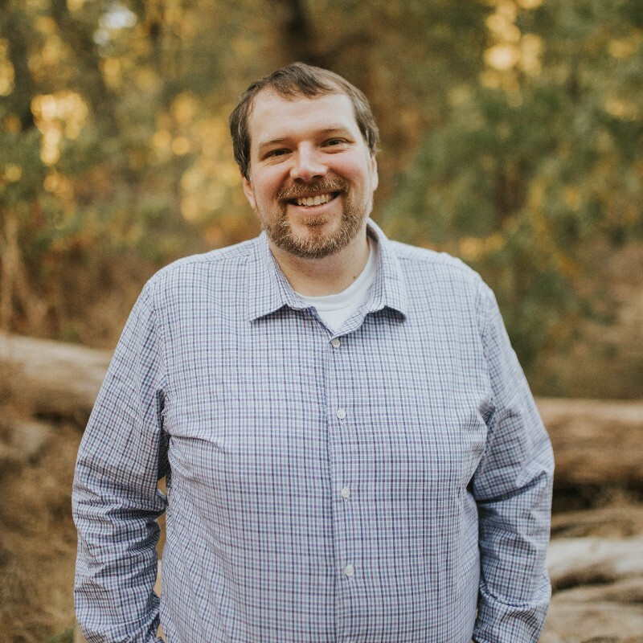
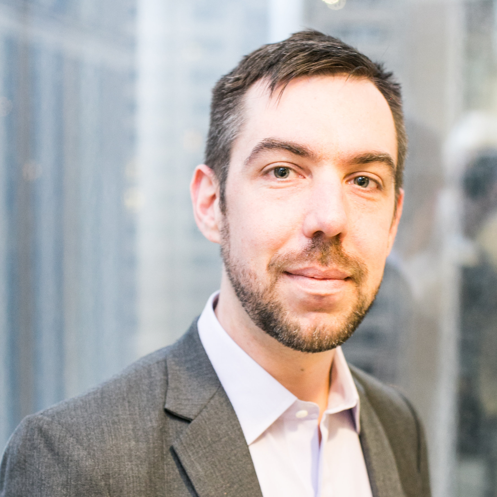
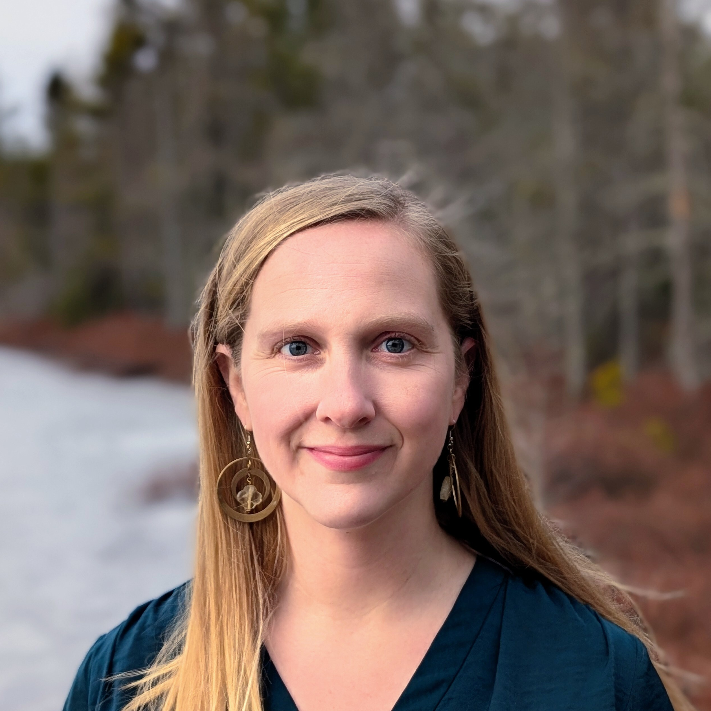
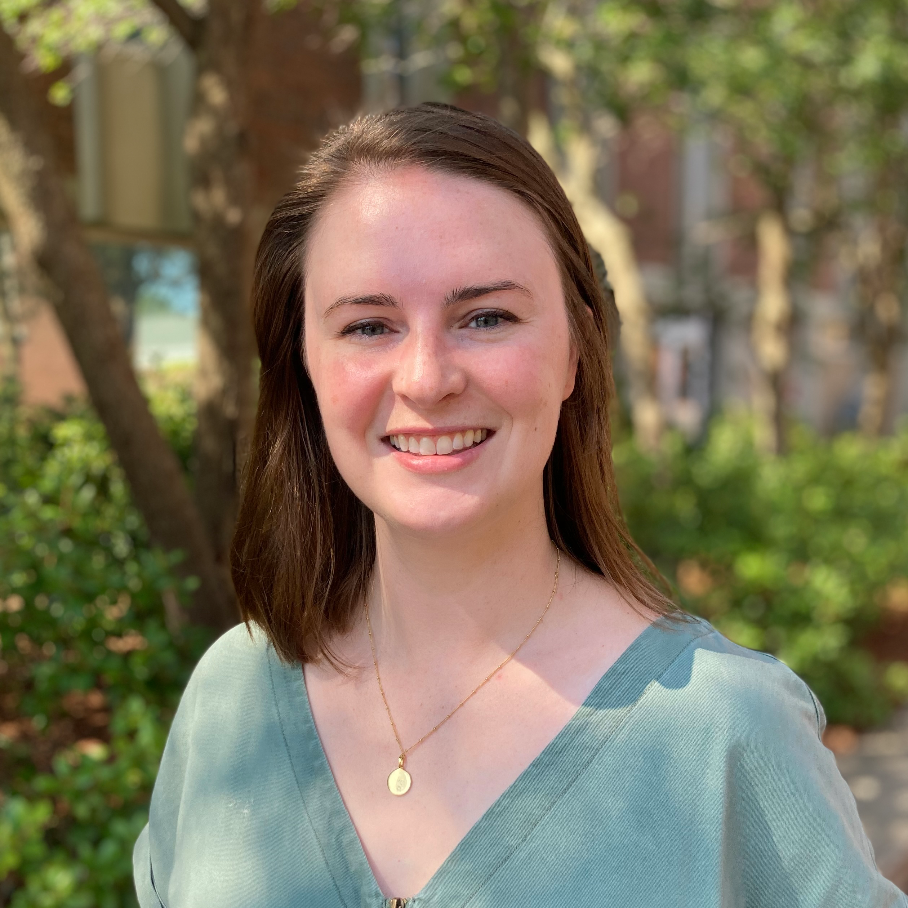
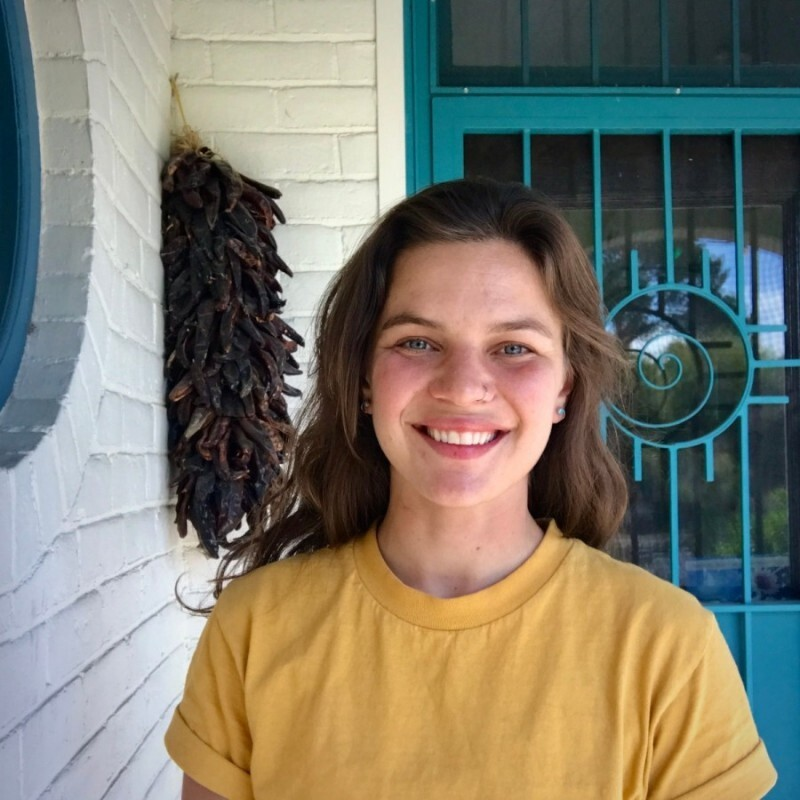
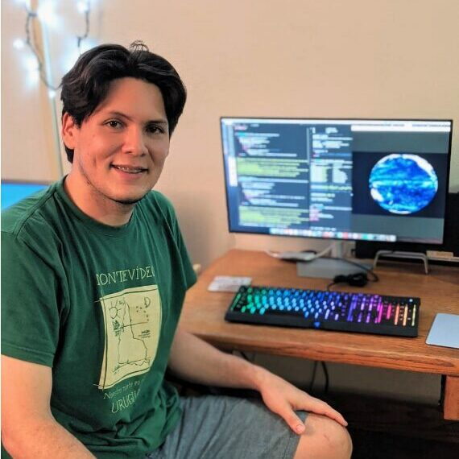
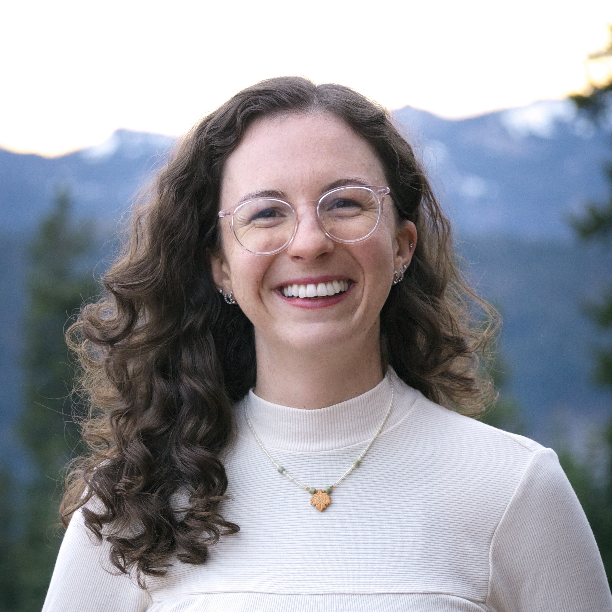
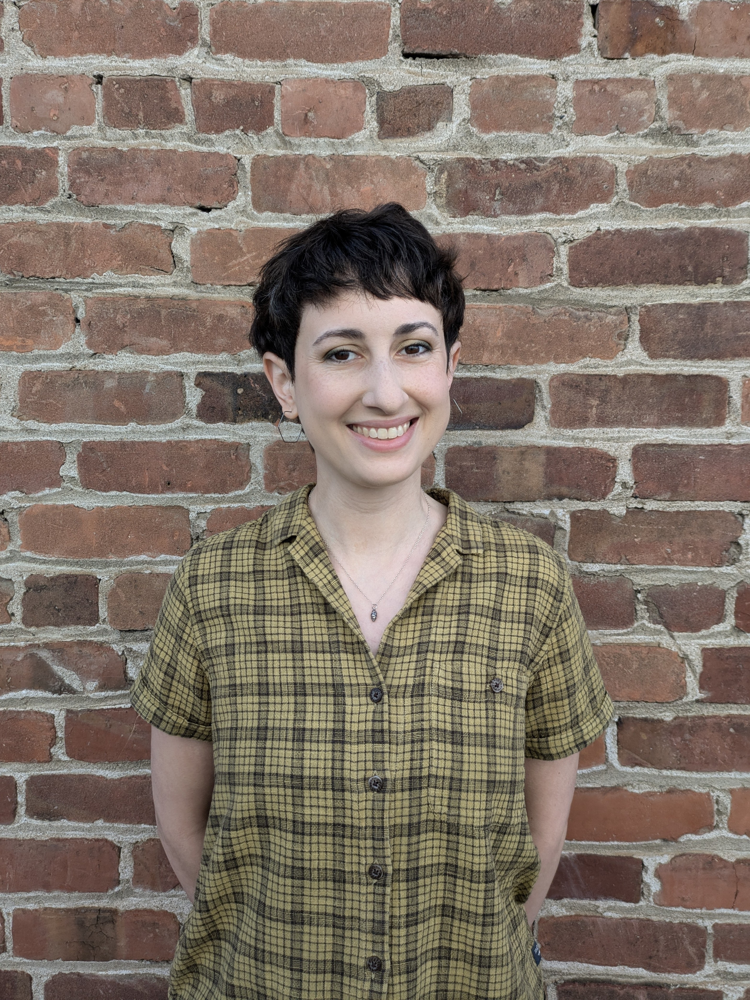
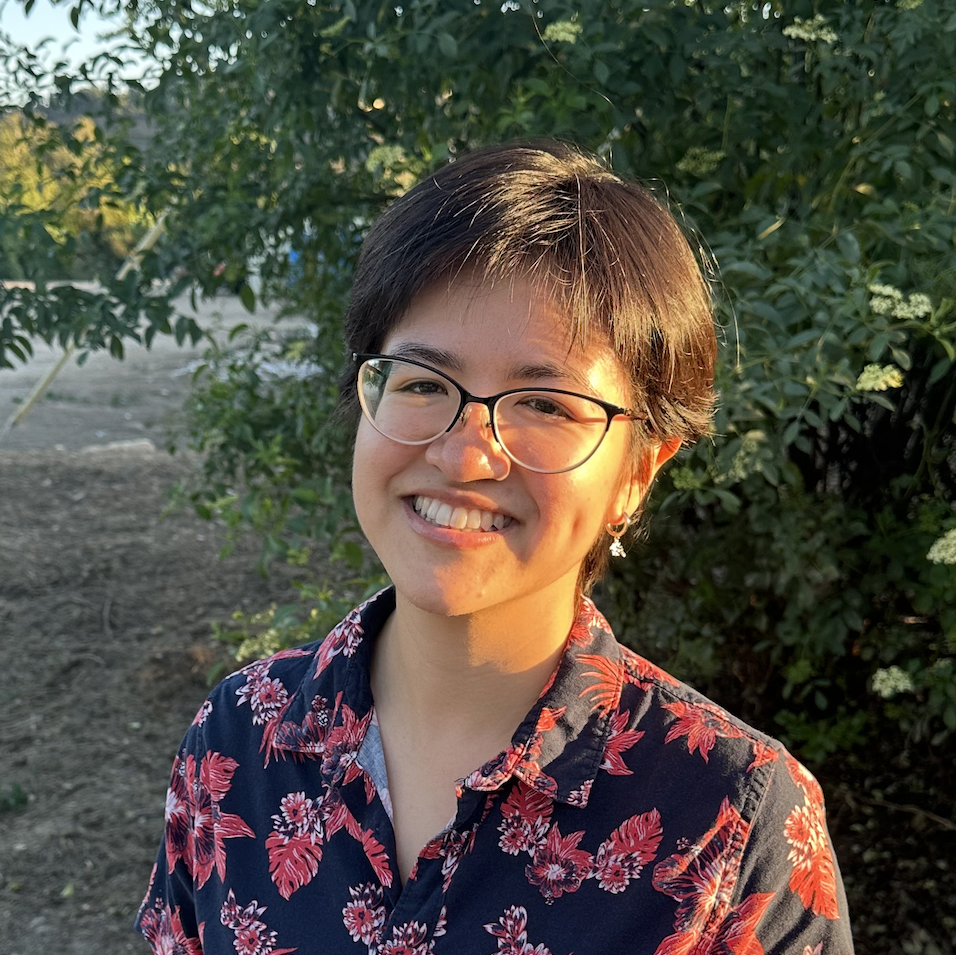
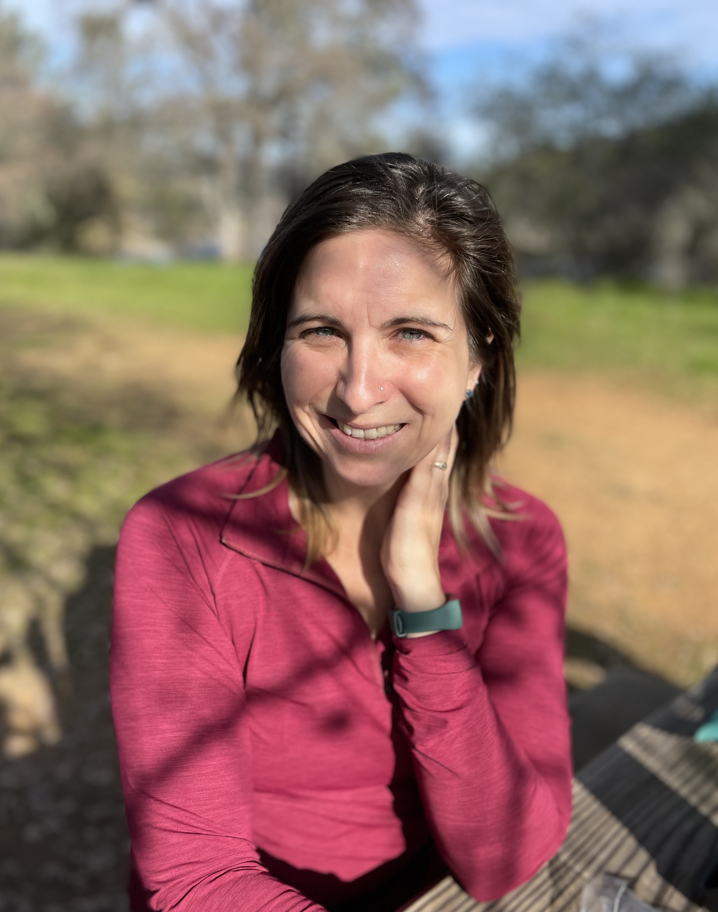

## Who We Are
The Cal-Adapt: Analytics Engine team consists of both experts and emerging talents from diverse disciplines, integrating deep academic research, practical development expertise, innovative climate insights, and a strategic approach to user engagement. This collaborative effort enables the team to address California's energy sector data and analytics challenges effectively.

This team is led by Dr. Owen Doherty (Eagle Rock Analytics, Inc.) and organized around two main goals: engagement and development. At the heart of this project is a focus on people and understanding the impact of climate on the energy sector and its ratepayers. Engagement with Investor-Owned Utilities (IOUs), state agencies, research groups, and other interested parties allows for a deeper understanding and prioritization of user needs. The development of metrics, data, and analytical tools is guided by an understanding of these needs and the practical methods required to address them.

:::: {.grid}

::: {.g-col-12 .g-col-md-6 .g-col-lg-4 .team-card}

<a href="https://www.linkedin.com/in/owen-doherty-b5108914a/" target="_blank">Owen Doherty</a>

Principal Research Scientist

Eagle Rock Analytics

:::

::: {.g-col-12 .g-col-md-6 .g-col-lg-4 .team-card}

<a href="https://www.linkedin.com/in/mark-koenig-7920486/" target="_blank">Mark Koenig</a>

Vice President Of Operations And Strategy

Eagle Rock Analytics

:::

::: {.g-col-12 .g-col-md-6 .g-col-lg-4 .team-card}

<a href="https://www.linkedin.com/in/jacola-roman-4464b8178/" target="_blank">Colie Roman</a>

Senior Atmospheric Scientist

Eagle Rock Analytics

:::

::: {.g-col-12 .g-col-md-6 .g-col-lg-4 .team-card}

<a href="https://www.linkedin.com/in/nschroed/" target="_blank">Neil Schroeder</a>

Senior Python Developer

Eagle Rock Analytics

:::

::: {.g-col-12 .g-col-md-6 .g-col-lg-4 .team-card}

<a href="https://www.linkedin.com/in/victorialford/" target="_blank">Victoria Ford</a>

Atmospheric Scientist

Eagle Rock Analytics

:::

::: {.g-col-12 .g-col-md-6 .g-col-lg-4 .team-card}

<a href="https://www.linkedin.com/in/beth-mcclenny-7986a120b/" target="_blank">Beth McClenny</a>

Atmospheric Scientist

Eagle Rock Analytics

:::

::: {.g-col-12 .g-col-md-6 .g-col-lg-4 .team-card}

<a href="https://www.linkedin.com/in/will-krantz-23693221/" target="_blank">Will Krantz</a>

Climate Scientist

Eagle Rock Analytics

:::

::: {.g-col-12 .g-col-md-6 .g-col-lg-4 .team-card}

<a href="https://www.linkedin.com/in/nancy-freitas-67892a74/" target="_blank">Nancy Freitas</a>

Post-Doctoral Researcher

Eagle Rock Analytics

:::

::: {.g-col-12 .g-col-md-6 .g-col-lg-4 .team-card}

Héctor Inda

Atmospheric Scientist

Eagle Rock Analytics

:::

::: {.g-col-12 .g-col-md-6 .g-col-lg-4 .team-card}

<a href="https://www.linkedin.com/in/nicole-keeney/" target="_blank">Nicole Keeney</a>

Research Software Engineer

Eagle Rock Analytics

:::

::: {.g-col-12 .g-col-md-6 .g-col-lg-4 .team-card}

<a href="http://linkedin.com/in/chencalvin99" target="_blank">Calvin Chen</a>

Python Developer

Eagle Rock Analytics

:::

::: {.g-col-12 .g-col-md-6 .g-col-lg-4 .team-card}

<a href="https://www.linkedin.com/in/ana-ordonez-458612117" target="_blank">Ana Ordonez</a>

Senior Research Associate

Eagle Rock Analytics

:::

::: {.g-col-12 .g-col-md-6 .g-col-lg-4 .team-card}

Vanessa Machuca

Research Associate

Eagle Rock Analytics

:::

::: {.g-col-12 .g-col-md-6 .g-col-lg-4 .team-card}

<a href="https://www.linkedin.com/in/justine-luong-bui/" target="_blank">Justine Bui</a>

Engagement Co-Lead

Spatial Informatics Group

:::

::: {.g-col-12 .g-col-md-6 .g-col-lg-4 .team-card}

<a href="https://www.linkedin.com/in/ashley-conrad-saydah-02bb565/" target="_blank">Ashley Conrad-Saydah</a>

Project and Policy Advisor

Founder and Principal, Sowing Change Strategies

:::

::: {.g-col-12 .g-col-md-6 .g-col-lg-4 .team-card}

<a href="https://www.linkedin.com/in/kripa-jagannathan-38148a13/" target="_blank">Kripa Jagannathan</a>

Engagement Co-Lead

Climate and Ecosystem Sciences Division, Lawrence Berkeley National Laboratory

:::

::: {.g-col-12 .g-col-md-6 .g-col-lg-4 .team-card}

<a href="https://erg.berkeley.edu/people/andrew-d-jones/" target="_blank">Andy Jones</a>

Scientific Advisor

Climate and Ecosystem Sciences Division, Lawrence Berkeley National Laboratory

:::

::::

## Past Contributors

We are also grateful to the following past team members for their contributions to the project:

- Nancy Thomas: Executive Director, Geospatial Innovation Facility, U.C. Berkeley
- Smitha Buddhavarapu: Stakeholder Engagement, Energy and Resources Group, U.C. Berkeley
- Nabig Chaudhry: PhD Student, Energy and Resources Group, U.C. Berkeley
- Grace Di Cecco: Postdoctoral Researcher, Eagle Rock Analytics
- Brian Galey: Software Engineer, Geospatial Innovation Facility, U.C. Berkeley
- Naomi Goldenson: Analytics Lead, Center for Climate Science, and Dept. of Atmospheric and Oceanic Sciences, UCLA
- Chris Henrick: Web Developer, Geospatial Innovation Facility, U.C. Berkeley
- Cora Kingdon: Summer Research Associate, Eagle Rock Analytics
- Jessie Knapstein: Energy and Environmental Economics, Inc.
- Eric Lehmer: Senior Python Developer/Web Developer, Geospatial Innovation Facility, U.C. Berkeley
- Tianchi Liu: Data Scientist, Spatial Informatics Group
- Julia Longmate: Summer Research Associate, Eagle Rock Analytics
- Amber Mahone: Energy and Environmental Economics, Inc.
- Shruti Mukhtyar: Web Developer, Geospatial Innovation Facility, U.C. Berkeley
- John O'Brien: Atmospheric Scientist, Eagle Rock Analytics
