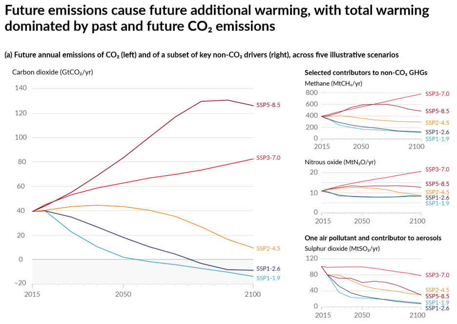
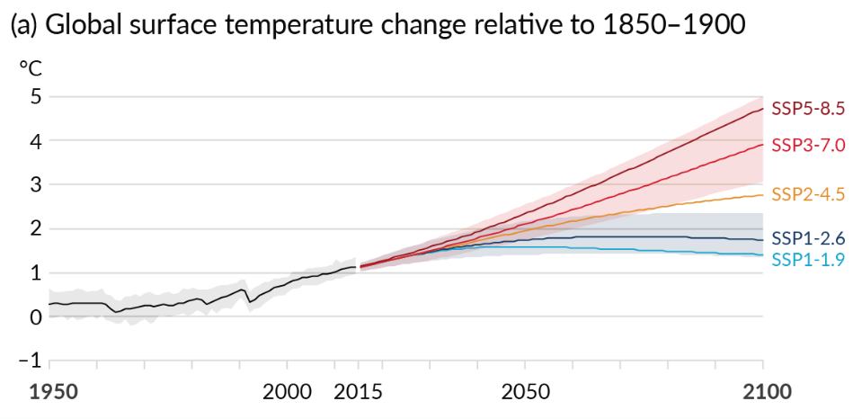
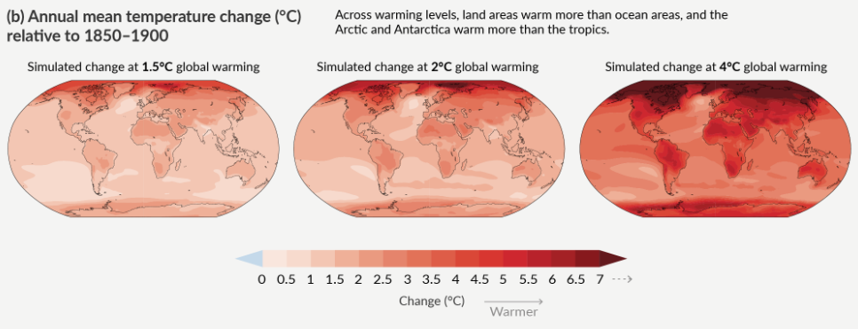
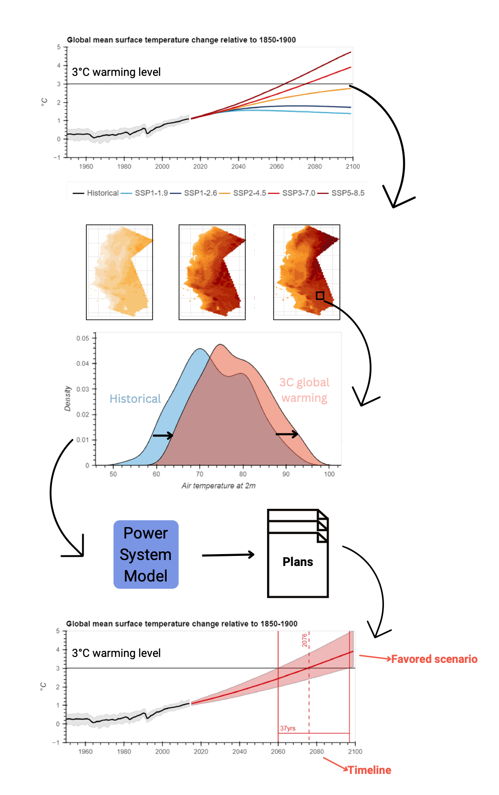

This approach shows users how to reframe regional climate projections in terms of global benchmarks like 2˚C of global average warming. We’ll show why this could be worth the effort (and the Analytics Engine will make it easier).

First we’ll explain how climate projection data are produced based on scenarios for the future. A climate model is usually run with a scenario for how concentrations of greenhouse gasses (GHGs) will change in the atmosphere. This change depends, principally, on how much people all over the world come together to reduce GHG emissions. Because this result is very hard to predict, there are usually multiple scenarios that range from large GHG reductions, minimal GHG reductions, and somewhere in between.

{style="display:block; margin:1rem auto; height:300px; width:100%; object-position:top; object-fit:cover; border-radius:5px;"}
*Annual anthropogenic (human-caused) emissions over the 2015–2100 period. Emissions scenarios differ wildly. (source: [IPCC Sixth Assessment Report](https://www.ipcc.ch/report/ar6/wg1/figures/summary-for-policymakers/figure-spm-4))*

Traditionally, if you were interested in a particular time-frame (e.g. the 2040’s or the 2080’s) a large fraction of the uncertainty in climate projections will have to do with the scenario you believe is most likely to occur, especially later in the century.

In a global warming level approach you instead consider what the regional response would be to a world that is, say 2˚C or 3˚C warmer on average. These global benchmarks for how much warming has occurred don’t mean a lot of their own. A 2˚C warmer world does not mean 2˚C warmer in California. It could be 1.5˚C warmer or 6˚C warmer. So why re-orient around these benchmarks?

{style="display:block; margin:1rem auto; height:300px; width:100%; object-position:top; object-fit:cover; border-radius:5px;"}
*Global surface temperature changes in °C relative to 1850–1900. (source: [IPCC Sixth Assessment Report](https://www.ipcc.ch/report/ar6/wg1/figures/summary-for-policymakers/figure-spm-8))*

There are three main reasons that a global warming levels approach might be worthwhile:

1. The approach allows you to **isolate the uncertainty of the regional response to a given amount of global warming** from the other sources of uncertainty, such as which emissions trajectory will the world follow, and how quickly will the global climate respond to the resulting GHG concentrations (more on that in point 3 below).
Why would you want to isolate uncertainty of the regional response? This disaggregation lends itself to adaptive management. You may have a plan for a 2˚C warmer world ready if it comes on quicker than expected, or you may have a plan for a 4˚C warmer world that you may never need. You can determine ahead of time what developments in the observed warming trajectory (or improvements in the science of projecting it) will trigger certain actions and what that may mean for your management plans.

2. The approach allows you to **include more high-quality simulations** in your regional assessment. If you are interested in extremes, risks out in the tails of the probability distribution, then you would be able **to increase the samples** of climate futures available to characterize that risk. So, if you are interested in a 2˚C world, you can combine the regional projections from all available simulations, regardless of the emissions scenario, and regardless of when they reach 2˚C of global average warming, to better consider the likelihood of the outcomes of concern in your region of interest.

3. A feature of the latest set of climate models available, also argues for this approach. In [CMIP6](https://www.carbonbrief.org/cmip6-the-next-generation-of-climate-models-explained/) some [otherwise-good models](https://doi.org/10.1175/BAMS-D-23-0100.1) have unrealistically high [climate sensitivity](https://climate.mit.edu/explainers/climate-sensitivity) to increased GHGs, causing them to project [higher-than-likely warming](https://www.carbonbrief.org/guest-post-how-climate-scientists-should-handle-hot-models/). With a warming-levels approach, the [General Circulation Models (GCMs)](https://www.ipcc-data.org/guidelines/pages/gcm_guide.html) that realistically represent atmospheric variability in the mid-latitudes (where we live), do not need to be excluded if they also warm too quickly. Indeed this is a big part of why the [Intergovernmental Panel on Climate Change (IPCC)](https://www.ipcc.ch/) adopted this approach in its [6th Assessment Report](https://www.ipcc.ch/assessment-report/ar6/).

{style="display:block; margin:1rem auto; height:300px; width:100%; object-position:top; object-fit:cover; border-radius:5px;"}
*Simulated annual mean temperature change (°C), panel (c) precipitation change (%). (source: [IPCC Sixth Assessment Report](https://www.ipcc.ch/report/ar6/wg1/figures/summary-for-policymakers/figure-spm-5/))*

Finally, having benefited from isolating sources of uncertainty, adaptive planning, and increased sample size, users can readily translate these projections back onto a time horizon. While the simulations may reach 2˚C or 3˚C benchmarks at different times, users can plan for the 2˚C or 3˚C world to occur at the point in time that the IPCC considers most likely for the selected emissions scenario. As the science advances and more data is gathered, this can be updated without redoing the entire analysis every time.

{style="display:block; margin:1rem auto; width:100%; height:auto; border-radius:5px;"}
*Global Warming Levels Process.*

### Conclusions

There are a lot of reasons to adopt a warming levels approach, from better distinguishing sources of uncertainty to facilitating adaptive planning. You also don’t need to explain emissions scenarios before you can discuss the regional impact of a 2˚C world – a common benchmark in policy conversations. The IPCC has adopted this approach for summarizing the latest GCMs – the same models that have been downscaled for California.

And, using tools and examples available in the Cal-Adapt Analytics Engine you can examine data through this framework. Check out the Warming Levels toolkit showcased in this [example notebook](https://github.com/cal-adapt/cae-notebooks/blob/main/warming_level_methods.ipynb).