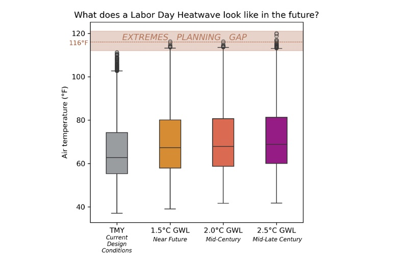
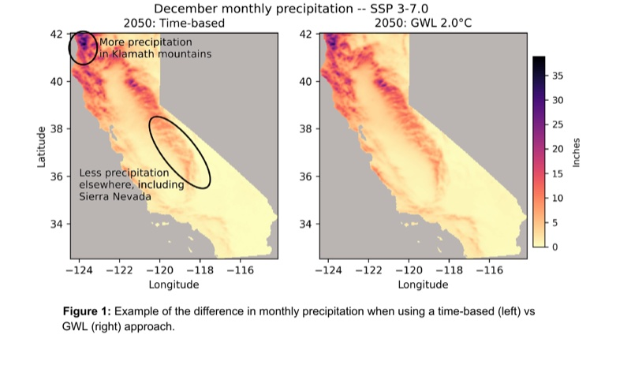

In response to user requests for citable technical materials, the Cal-Adapt team has published two new white papers documenting the science and methods behind two energy-sector climate products.

```{=html}
<div class="media-grid">
  <a class="media-card" href="../../../assets/pdfs/Cal-Adapt-XMY-Methods-White-Paper.pdf" target="_blank" rel="noopener noreferrer">
    <div class="media-thumb">
      
      <span class="media-type-icon other"><i class="bi bi-file-earmark-pdf-fill"></i></span>
    </div>
    <div class="media-body">
      <h4>Preparing for the Exceptional: Extreme Meteorological Years in Energy System Planning</h4>
      <p>Motivation and methods behind Cal-Adapt's Extreme Meteorological Year (XMY) climate profiles, developed for energy-sector applications, including use cases and limitations.</p>
    </div>
  </a>
  <a class="media-card" href="../../../assets/pdfs/Cal-Adapt-GWL-White-Paper.pdf" target="_blank" rel="noopener noreferrer">
    <div class="media-thumb">
      
      <span class="media-type-icon other"><i class="bi bi-file-earmark-pdf-fill"></i></span>
    </div>
    <div class="media-body">
      <h4>Global Warming Levels: Bringing Global Warming Levels into Regional Climate Planning for the Energy Sector</h4>
      <p>Cal-Adapt's operationalization of the Global Warming Level (GWL) framework, which assesses regional climate outcomes at specific increments of global warming rather than at specific years.</p>
    </div>
  </a>
</div>
```

Both papers are also available in the [Reference Library](https://analytics.cal-adapt.org/general-resources/reference-library.html) on the Analytics Engine website, with citation details and permanent Zenodo records for ["Preparing for the Exceptional: Extreme Meteorological Years in Energy System Planning"](https://doi.org/10.5281/ZENODO.21401751) and ["Global Warming Levels: Bringing Global Warming Levels into Regional Climate Planning for the Energy Sector"](https://doi.org/10.5281/ZENODO.21890476).