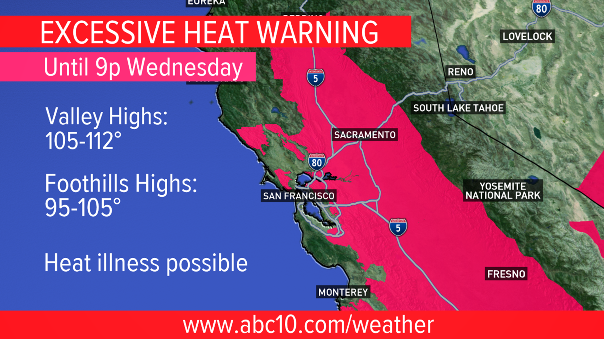

---

It was Friday, August 14, 2020. By 6 a.m., the temperature in Sacramento had already climbed past 80°F, before most of the city had woken up. By 7 a.m., before the morning commute had begun, an estimated [FILL HERE] people across the Sacramento Valley were already under extreme heat. In neighborhoods like Del Paso Heights, Meadowview, and Oak Park, sparse tree canopy leaves streets and homes exposed to direct sun with little shade relief, Meadowview, for instance, has only about 12% tree cover against the city's 35% goal. These are also among the areas the city has identified as most heat-vulnerable, with residents reporting little overnight relief during peak heat events ([Sacramento Urban Forest Plan](https://www.cityofsacramento.gov/content/dam/portal/pw/mas/climate-action/urban-forestry/SUFP%20Adopted%20Plan%20250624%20(1).pdf), pg. 107).

This was the beginning of the first of two historic back-to-back heat waves that would dominate California’s weather patterns and newsstreams throughout August and September of 2020. The typical delta breeze that passes through the Bay Area towards the Central Valley, moderating temperatures, was weakened by an exceptionally strong and persistent ridge of high pressure across the Western U.S., and was particularly felt throughout California’s Central Valley. 

By evening on August 14, the California Independent System Operator (CAISO) declared a grid emergency as air conditioner loads pushed electricity demand beyond what the system could supply. For the first time since 2001, California implemented rolling blackouts, which affected more than 300,000 Californians in Northern and Southern California at the precise time that they needed power the most.

California’s extreme heat continues to climb to new heights, and we will explore how the extreme heat events that happened in Sacramento in 2020 will continue to occur in the future, to what capacity, and affect whom the most.


{style="border-radius:5px;"}


<!-- ### What the News Captured -->

<!-- FIGURE: Static image(s) from news coverage.
     Save to blog/posts/2026-06-10-extreme-heat-event/images/ and update paths below. -->

<!-- ![Caption: [describe image and credit source].](images/news-photo-1.jpg) -->


### About This Analysis

---

This analysis was produced by [Eagle Rock Analytics](https://eaglerockanalytics.com), a climate data and analytics firm based in Sacramento. We build tools and pipelines that help California utilities, planners, and public agencies understand how climate hazards are changing, and what that means for the communities they serve.

When an extreme heat event like this one occurs, we think it’s worth going beyond the headlines: not just describing what happened, but grounding it in observed data, comparing it to the historical record, and projecting how events like this will change as the planet warms.
The analysis draws on publicly available climate datasets, including gridded historical observations and downscaled future projections hosted by [Cal-Adapt.org](https://cal-adapt.org/), and is designed to be fully reproducible at time of publication. You can explore it yourself in the [Jupyter notebook](ksac_2020_heatwave.ipynb) linked at the bottom of this page.

---

### 3 Key Messages

::: {.callout-important}
**This event was historically exceptional.** The 2020 heat waves pushed Sacramento’s temperatures above 105°F, the National Weather Service extreme danger threshold, which placed these events among the most intense in the observed record at KSAC since 1980.
:::

::: {.callout-warning}
**Events like this will become much more common.** Under 2°C of global warming, which is projected within roughly 10-20 years, heatwave events similar to the one felt in Sacramento are expected to occur **3 times more frequently** than they did in the recent past.
:::

::: {.callout-tip}
**We have tools and plans to act.** Sacramento County already has hazard mitigation plans, cooling infrastructure, and urban forestry programs in place. The data we explore shows clearly where those investments should be scaled up, and where they’re most urgently needed.
:::

---

### How Was This Event Defined?

To compare the 2020 heat waves to the historical record and to future projections, we need a consistent, reproducible definition. We use the criteria applied by the [Office of Emergency Services](https://sacoes.saccounty.gov/content/dam/oes/docs/archive/after-action-reports/2020%20Severe%20Weather%20Heat%20AAR_FINAL.pdf) to formally classify extreme heat events:

- **Duration:** Heat index exceeding 105°F for **more than 3 consecutive days**
- **Daytime threshold:** Maximum heat index at or above **105°F**
- **Nighttime threshold:** Minimum temperature at or above **75°F**
- **Spatial extent:** Sacramento metropolitan area, anchored to KSAC (Sacramento Executive Airport, station ID `ASOSAWOS_72483023232`)

---

### How Bad Was This Event, Historically?

#### **Where 2020 Ranks**

2020 was anomalously warm across the entire year — not just in August and September. The figure below shows the annual mean temperature anomaly at KSAC relative to the full-record mean. 2020 is highlighted.

::: {#fig-annual-anomaly}
::: {.content-visible when-format="html"}
```{=html}
<div class="figure-container d-none d-md-block">

</div>
```
{.d-md-none fig-alt="Bar chart of annual mean temperature anomaly at KSAC relative to the full-record mean, 2020 highlighted."}
:::
::: {.content-visible when-format="pdf"}
{fig-alt="Bar chart of annual mean temperature anomaly at KSAC relative to the full-record mean, 2020 highlighted."}
:::
Figure 4. Annual mean temperature anomaly at KSAC (Sacramento Executive Airport) relative to the full-record mean. Red bars indicate warmer-than-average years; blue bars indicate cooler-than-average years. 2020 is highlighted in gold. The black line shows the 5-year rolling mean. Data: Historical Data Platform (HDP).
:::

---

#### **A closer look at the warming trend behind 2020**

The figure below shows every year on record at KSAC plotted as daily maximum and minimum temperature traces. Gray lines are historical years; bold red is 2020 daily max, bold dark blue is 2020 daily min. Hover over any line to see the year and specific date. The two heat wave periods are shaded.
The pattern is clear: 2020 stands out not just for its peaks, but for the elevated baseline of the entire summer, which is a reflection of a long-term warming trend in which Sacramento’s summers have grown progressively hotter.

::: {#fig-daily-temp}
::: {.content-visible when-format="html"}
```{=html}
<div class="figure-container d-none d-md-block">

</div>
```
{.d-md-none fig-alt="Line chart of daily maximum and minimum temperature at KSAC across all available years, with 2020 highlighted."}
:::
::: {.content-visible when-format="pdf"}
{fig-alt="Line chart of daily maximum and minimum temperature at KSAC across all available years, with 2020 highlighted."}
:::
Figure 3. Daily maximum and minimum temperature at KSAC (Sacramento Executive Airport), all available years. Dark gray lines = historical daily max; light blue lines = historical daily min; bold red = 2020 daily max; bold dark blue = 2020 daily min. Shaded regions indicate Heat Wave I (August 14–26) and Heat Wave II (September 5–8). Dashed gray line marks the approximate 65°F AC threshold. Hover a line to see year, date, and temperature. Data: Historical Data Platform (HDP).
:::

---


### How frequently has this event occurred in the past, and how frequently will this event occur in the future?

Using climate model projections from the Cal-Adapt Analytics Engine, we can estimate how frequently heat events like 2020 will occur as the planet warms. We will use dynamically-downscaled output from the **WRF models** (UCLA, 3 km resolution, SSP3-7.0 scenario) at three warming benchmarks:

| Warming Level | Context |
|---|---|
| **0.8°C** | Approximate warming of the recent past |
| **1.5°C** | Approximately where we are today |
| **2.0°C** | Projected within roughly the next 10–20 years |


<br>

**The 2020 event by the numbers:**

| | Heat Wave I (Aug 14–26) | Heat Wave II (Sep 5–8) |
|---|---|---|
| Peak Tmax | 109.9°F | 109.0°F |
| Days Tmax > 105°F | 5 | 2 |
| Nights Tmin ≥ 75°F | 1 | 0 |

<br>

Across the full KSAC station record, only 8 of 15,584 days across the historical record had both a daily maximum temperature above 105°F and an overnight low at or above 75°F simultaneously, placing a day like this in the 99.9th percentile of all days on record.

We can take a look at the return period of this event in the historical record, and then project how that return period changes under each warming level.

<br>

::: {#fig-return-period}
::: {.content-visible when-format="html"}
```{=html}
<div class="figure-container d-none d-md-block">

</div>
```
{.d-md-none fig-alt="Bar chart of return period for extreme heat days without nighttime reprieve in Sacramento County under three warming levels."}
:::
::: {.content-visible when-format="pdf"}
{fig-alt="Bar chart of return period for extreme heat days without nighttime reprieve in Sacramento County under three warming levels."}
:::
Figure 5. Return period of extreme heat days without nighttime reprieve in Sacramento County under three warming levels. A shorter return period means the event becomes more frequent. Data: WRF UCLA 3 km, SSP3-7.0.
:::

Comparing across warming levels, days meeting this threshold are expected to occur approximately **3 times more frequently** under 2.0°C of warming than under the recent historical baseline (0.8°C). At 1.5°C, which is roughly the amount of warming we are at today, the frequency is already elevated relative to the recent past.

::: {.callout-note appearance="minimal"}
**In plain language:** This means that this type of event will become approximately **3x more likely by mid-century** compared to the recent past. What used to be a once-in-a-generation event is on track to become a near-decadal occurrence.
:::

<!-- FIGURE 5: Bar chart of projected event frequency by warming level.
     This is the `d6e7f8a9` cell matplotlib figure. Save and reference:
       plt.savefig("images/fig_future_frequency.png", dpi=150, bbox_inches="tight")  -->

<!--  -->

---

### Potential Future Impacts on Energy and Daily Life

Beyond the physical discomfort people may have, heatwaves have very real consequences for the electrical grid and public health. And they don't fall equally on everyone.

::: {.panel-tabset}

#### **Grid Health**

During extreme heat, air conditioners run continuously, driving electricity demand to its peak precisely when the grid is already under stress from high ambient temperatures that reduce transmission line capacity and thermal plant efficiency. On August 14 and 15, 2020, CAISO declared a grid emergency as demand outpaced supply, which led to rolling blackouts affecting hundreds of thousands of Californians for the first time since 2001.

<!-- PHOTO: Add an image here — e.g., CAISO demand chart during the blackout event, a news
     photo of rolling blackouts, or a photo of power infrastructure under stress.
     Save to images/ and update the path and caption below. -->
![*California grid overwhelmed and ordered rolling power outages during the August 2020 heat wave. [File: Richard Vogel/Associated Press]*](images/transmission-lines.jpeg){style="border-radius:5px; margin:1rem 0;"}

As events like this become five times more common, the grid implications are not linearly correlated to be five times worse. More frequent peaks erode the reserve margins that utilities rely on to absorb demand spikes. However, over the past three years, California has strengthened its grid resilience, with the CEC reporting that  “up to 4,500 MW of contingency resources are available for summer 2026 in case of extreme events that strain the grid.” (CEC, 2026). Still, as climate change continues to raise the likelihood of extreme events statewide (and countrywide), electric demand throughout the day is only expected to keep climbing.

#### **Public Health**

The California Department of Public Health reported a surge in heat-related emergency room visits and deaths during August 2020. Extreme heat is already the deadliest weather hazard in the United States on an average annual basis, outpacing floods, tornadoes, and hurricanes. A three-fold increase in event frequency translates directly into greater cumulative mortality risk, particularly for the elderly, outdoor workers, and those without air conditioning.

<!-- PHOTO: Add a news article screenshot or photo showing the surge in hospital/ER visits
     during the August 2020 heat wave. A screenshot from a local news story (e.g., ABC10,
     Sacramento Bee) works well here. Save to images/ and update path and caption below. -->
![*Surge in heat-related emergency room visits during the 2020 heat wave. [Credit: SOURCE — update when image is added.]*](images/test_img.jpg){style="border-radius:5px; margin:1rem 0;"}

#### **Equity and Disproportionate Impacts**

Not everyone experiences heat equally. In Sacramento, lower-income neighborhoods and communities of color are often located in **urban heat islands**, which are areas where pavement, impervious surfaces, and low tree canopy push ambient temperatures several degrees higher than surrounding areas. Residents without air conditioning, renters unable to upgrade their housing, and people who work outdoors face a fundamentally different risk profile than those with the means to adapt.

<!-- PHOTO: Add an image illustrating heat inequity in Sacramento — e.g., a satellite or
     land surface temperature map showing heat island contrast between neighborhoods,
     a street-level photo of a low-canopy neighborhood on a hot day, or a news photo
     showing outdoor workers or vulnerable residents during the heat wave.
     Save to images/ and update path and caption below. -->
![*Heat inequity in Sacramento: low-canopy, high-pavement neighborhoods experience significantly higher temperatures than more affluent areas. [Credit: SOURCE — update when image is added.]*](images/test_img.jpg){style="border-radius:5px; margin:1rem 0;"}

:::

<!-- FIGURE 6: Wide interactive map — future event frequency under 2°C GWL
     with selectable overlays (CRAI equity layers, population, transmission lines).
     Use .column-page class for full-width map layout. -->

```{=html}
<div class="figure-container">
  <!-- PASTE FIGURE 6 (INTERACTIVE MAP) HERE -->
</div>
```

#### **CRAI Layers**

Below, we've mapped the projected frequency of heat events under 2°C of global warming across the Sacramento region, overlaid with equity layers from CRAI, population density, and transmission infrastructure. This visualization highlights the areas where future heat risk is projected to be highest, and where existing vulnerabilities intersect with those risks.

::: {#fig-crai-tx105}
::: {.content-visible when-format="html"}
```{=html}
<div class="figure-container d-none d-md-block">

</div>
```
{.d-md-none fig-alt="Choropleth map of the 105°F day / 75°F night heat metric across Sacramento County census tracts, comparing the 0.8°C historical baseline against 1.5°C, 2.0°C, and 3.0°C warming levels."}
:::
::: {.content-visible when-format="pdf"}
{fig-alt="Choropleth map of the 105°F day / 75°F night heat metric across Sacramento County census tracts, comparing the 0.8°C historical baseline against 1.5°C, 2.0°C, and 3.0°C warming levels."}
:::
Figure 6. Projected number of 105°F day / 75°F night events per year across Sacramento County census tracts, by warming level. Use the tabs to toggle between the 0.8°C historical baseline and the 1.5°C, 2.0°C, and 3.0°C warming levels.
:::

::: {#fig-crai-tx105-delta}
::: {.content-visible when-format="html"}
```{=html}
<div class="figure-container d-none d-md-block">

</div>
```
{.d-md-none fig-alt="Choropleth map of change in CRAI heat hazard score for the 105°F day / 75°F night metric across Sacramento County census tracts, comparing 1.5°C, 2.0°C, and 3.0°C warming levels against the 0.8°C historical baseline."}
:::
::: {.content-visible when-format="pdf"}
{fig-alt="Choropleth map of change in CRAI heat hazard score for the 105°F day / 75°F night metric across Sacramento County census tracts, comparing 1.5°C, 2.0°C, and 3.0°C warming levels against the 0.8°C historical baseline."}
:::
Figure 7. Change in CRAI heat hazard score for the 105°F day / 75°F night metric across Sacramento County census tracts, by warming level, relative to the 0.8°C historical baseline. Red indicates an increase in projected heat hazard; blue indicates a decrease. Use the tabs to toggle between 1.5°C, 2.0°C, and 3.0°C warming levels.
:::

<!-- PNG fallback (figures/static/fig_consecutive_heatwave_by_gwl_plotly.png) not yet generated — .d-md-none/pdf fallback omitted below until it exists. -->
::: {#fig-crai-heatwave}
::: {.content-visible when-format="html"}
```{=html}
<div class="figure-container d-none d-md-block">

</div>
```
:::
Figure 8. Projected consecutive-heatwave-day counts across Sacramento County census tracts, by warming level. Use the tabs to toggle between the 0.8°C historical baseline and the 1.5°C, 2.0°C, and 3.0°C warming levels.
:::

<!-- PNG fallback (figures/static/fig_consecutive_heatwave_delta_by_gwl_plotly.png) not yet generated — .d-md-none/pdf fallback omitted below until it exists. -->
::: {#fig-crai-heatwave-delta}
::: {.content-visible when-format="html"}
```{=html}
<div class="figure-container d-none d-md-block">

</div>
```
:::
Figure 9. Change in CRAI heat hazard score for the consecutive-heatwave metric across Sacramento County census tracts, by warming level, relative to the 0.8°C historical baseline. Red indicates an increase in projected heat hazard; blue indicates a decrease. Use the tabs to toggle between 1.5°C, 2.0°C, and 3.0°C warming levels.
:::


**We can see through these CRAI layers that certain areas are expecting more difficultly to adapt than others [WIP].** The areas with the highest projected heat hazard and the lowest equity scores are likely to be the most vulnerable to future heat events, and will require targeted interventions to reduce risk.

Let's take a look at what kinds of solutions communities can adapt to address a changing climate, and what Sacramento is already doing to prepare for future heat events.

---

### Solutions We Can Adapt To Address A Changing Climate

The risks are real, but so are the tools available to address them. Communities around the world, and in California, have already begun implementing strategies that demonstrably reduce heat exposure.

#### **Nature-Based Solutions**

```{=html}
<div style="display:flex; gap:1.25rem; margin:1.5rem 0; align-items:stretch;">

  <div style="flex:1; border:1px solid #dee2e6; border-radius:0.375rem; overflow:hidden; display:flex; flex-direction:column;">
    
    <div style="padding:1rem; flex:1;">
      <strong>Urban Tree Canopy</strong>
      <p style="margin-top:0.5rem; font-size:0.9rem;">Trees shade pavement, reduce surface temperatures, and cool the air through evapotranspiration. Research consistently shows a 10% increase in urban canopy cover can lower mean summer temperatures by 1–2°F in dense, paved environments — with larger effects in low-canopy neighborhoods where the urban heat island is most intense.</p>
    </div>
  </div>

  <div style="flex:1; border:1px solid #dee2e6; border-radius:0.375rem; overflow:hidden; display:flex; flex-direction:column;">
    
    <div style="padding:1rem; flex:1;">
      <strong>Cool Corridors</strong>
      <p style="margin-top:0.5rem; font-size:0.9rem;">Shaded pedestrian and transit routes connecting cooling centers, parks, and public facilities reduce heat exposure for people traveling on foot. Cool corridors are especially effective for outdoor workers, elderly residents, and those without access to personal vehicles — potions that face the greatest risk during extreme heat events.</p>
    </div>
  </div>

  <div style="flex:1; border:1px solid #dee2e6; border-radius:0.375rem; overflow:hidden; display:flex; flex-direction:column;">
    
    <div style="padding:1rem; flex:1;">
      <strong>Riparian &amp; Wetland Restoration</strong>
      <p style="margin-top:0.5rem; font-size:0.9rem;">Restoring native vegetation along rivers and in wetlands provides natural cooling through shading and evapotranspiration, while improving flood resilience and wildlife habitat. Greenbelts along waterways can measurably lower temperatures in adjacent neighborhoods — benefits that compound as heatwaves become more frequent and severe.</p>
    </div>
  </div>

</div>
```

For a broader overview of what nature-based solutions cities are deploying, [check out this summary and table from PreventionWeb](https://www.preventionweb.net/news/how-cities-can-combat-extreme-heat-using-nature-based-solutions).

#### **What Is Already Being Done in Sacramento**

```{=html}
<div style="display:flex; gap:1.25rem; margin:1.5rem 0; align-items:stretch;">

  <div style="flex:1; border:1px solid #dee2e6; border-radius:0.375rem; overflow:hidden; display:flex; flex-direction:column;">
    
    <div style="padding:1rem; flex:1;">
      <strong>Cooling Centers Network</strong>
      <p style="margin-top:0.5rem; font-size:0.9rem;">Sacramento County operates a network of publicly accessible cooling centers — libraries, community centers, and senior facilities — that open automatically when the National Weather Service issues an Excessive Heat Warning. During the 2020 heat waves, the county activated more than 20 sites across the region. The program has since expanded its hours and outreach to reach residents without transportation.</p>
    </div>
  </div>

  <div style="flex:1; border:1px solid #dee2e6; border-radius:0.375rem; overflow:hidden; display:flex; flex-direction:column;">
    
    <div style="padding:1rem; flex:1;">
      <strong>Urban Tree Canopy Expansion</strong>
      <p style="margin-top:0.5rem; font-size:0.9rem;">The City of Sacramento's Tree Canopy Master Plan targets 25% citywide canopy cover, with priority planting in low-canopy, high heat-risk neighborhoods including Oak Park, Del Paso Heights, and Meadowview. Trees can reduce local surface temperatures by 5–10°F. The Sacramento Tree Foundation has planted over 100,000 trees since 1982 and runs free planting programs for income-qualified residents.</p>
    </div>
  </div>

  <div style="flex:1; border:1px solid #dee2e6; border-radius:0.375rem; overflow:hidden; display:flex; flex-direction:column;">
    
    <div style="padding:1rem; flex:1;">
      <strong>Hazard Mitigation Planning</strong>
      <p style="margin-top:0.5rem; font-size:0.9rem;">Sacramento County's Local Hazard Mitigation Plan (LHMP) formally identifies extreme heat as a priority hazard and outlines mitigation actions tied to state and federal funding mechanisms. The 2020 After-Action Report from the Office of Emergency Services identified gaps in cooling center communication and transportation access — and led to updates in alert protocols and coordination with PG&amp;E during grid stress events.</p>
    </div>
  </div>

</div>
```

## **Where the Gaps Are**
Now, let's take a look at where Sacramento has already invested in cooling and green infrastructure, and where gaps remain. The map below overlays existing tree canopy, cooling centers, and other green infrastructure onto the projected heat risk and equity vulnerability layers.

<!-- FIGURE 7: Map overlaying current nature-based solution sites (tree canopy,
     cooling centers, green infrastructure) onto the future frequency / equity risk map.
     Shows where solutions exist and where gaps remain. -->

::: {.column-page}

```{=html}
<div class="figure-container">
  <!-- PASTE FIGURE 7 (SOLUTIONS + RISK GAP MAP) HERE -->
</div>
```

:::

*Figure 10. Existing cooling and green infrastructure in the Sacramento region, overlaid on projected heat risk and equity vulnerability. Gaps indicate areas with high projected risk and limited current adaptation investment. Data: [sources].*

Looking at the distribution of existing tree canopy and cooling infrastructure against the equity and projected frequency layers, **[FILL IN FINDINGS — which areas appear most underserved? What types of interventions would be most appropriate?]**

---

### What Can I Do About Extreme Heatwaves in My Area?

A changing climate will affect everyone, no matter where you live. The good news is that your community likely already has resources in place, and there are meaningful actions at every scale.

```{=html}
<details style="margin:0.75rem 0; border:1px solid #dee2e6; border-radius:0.375rem;">
  <summary style="padding:0.75rem 1rem; font-weight:600; cursor:pointer; list-style:none; display:flex; align-items:center; gap:0.5rem;">
    <span style="font-size:0.8rem;">▶</span> Today
  </summary>
  <div style="padding:0.75rem 0.5rem 0.5rem; border-top:1px solid #dee2e6;">
    <ol>
      <li>Know where your nearest cooling center is <em>before</em> the next heat event — most counties publish this through their emergency management office or public health department</li>
      <li>Check on elderly neighbors, especially those without air conditioning, during heat advisories</li>
      <li>Sign up for your local emergency alert system so you receive heat warnings automatically</li>
    </ol>
  </div>
</details>

<details style="margin:0.75rem 0; border:1px solid #dee2e6; border-radius:0.375rem;">
  <summary style="padding:0.75rem 1rem; font-weight:600; cursor:pointer; list-style:none; display:flex; align-items:center; gap:0.5rem;">
    <span style="font-size:0.8rem;">▶</span> In Your Community
  </summary>
  <div style="padding:0.75rem 0.5rem 0.5rem; border-top:1px solid #dee2e6;">
    <ol>
      <li>Advocate for shade equity in parks and transit corridors, particularly in neighborhoods with low tree canopy</li>
      <li>Support urban forestry and cool corridor planning through your local planning commission or city council</li>
      <li>Connect with local environmental and community organizations working on urban heat mitigation</li>
    </ol>
  </div>
</details>

<details style="margin:0.75rem 0; border:1px solid #dee2e6; border-radius:0.375rem;">
  <summary style="padding:0.75rem 1rem; font-weight:600; cursor:pointer; list-style:none; display:flex; align-items:center; gap:0.5rem;">
    <span style="font-size:0.8rem;">▶</span> For Policymakers
  </summary>
  <div style="padding:0.75rem 0.5rem 0.5rem; border-top:1px solid #dee2e6;">
    <ol>
      <li>Prioritize urban forestry and green infrastructure funding in high-risk, low-resource communities</li>
      <li>Update heat emergency plans to account for increasing event frequency under near-term warming projections</li>
      <li>Integrate heat risk into capital improvement planning, especially for aging transmission infrastructure and public housing stock</li>
    </ol>
  </div>
</details>
```

[Explore your county's climate adaptation actions →](https://resilientca.org/rap-map/)

---

### Data Sources and Tools Used

**Data Sources:**

- **Observed station data:** Historical Data Platform (HDP), KSAC (Sacramento Executive Airport, `ASOSAWOS_72483023232`), accessed via [Cal-Adapt Analytics Engine](https://analytics.cal-adapt.org)
- **Future projections:** WRF dynamically-downscaled projections (UCLA, SSP3-7.0, 3 km resolution, d03 grid), accessed via Cal-Adapt Analytics Engine
- **Equity layers:** [CalEnviroScreen / CRAI — add citation when included]
- **Population data:** [SOURCE — add when included]

**Tools:** This analysis was built using [`climakitae`](https://github.com/cal-adapt/climakitae), Cal-Adapt's open-source Python library for climate data access and analysis.

Explore climate projections for your own area at [cal-adapt.org](https://cal-adapt.org). For tools focused specifically on extreme heat, see [our extreme heat tool](https://cal-adapt.org/dashboard/climate-metrics-map?metric=extreme-heat) on cal-adapt.org.

---

### Note on Updates

This post reflects data available at time of publication. Extreme heat events often take weeks or months to fully characterize. Final heat-related death counts, official NOAA summaries, and attribution analyses from groups like [World Weather Attribution](https://www.worldweatherattribution.org/) are typically released after the event concludes. We'll update this post as that data becomes available.

If you're a researcher, planner, or agency working on this event and have data you'd like to share or discuss, [reach out to us](mailto:calvin@eaglerockanalytics.com).

---

### Share Your Story

Were you in Sacramento during the August or September 2020 heat waves?

If you're interested in sharing how you were affected, what you experienced, what resources you did or didn't have access to, how your neighborhood handled it, we want to hear from you. We'll work with you to share your story in a way that's accurate, respectful, and useful for the communities, planners, and policymakers who need to understand what events like this actually mean on the ground.

---

[*This analysis is provided for informational and educational purposes only. Climate projections carry inherent uncertainty and should not be used as the sole basis for engineering, legal, financial, or emergency management decisions. Eagle Rock Analytics makes no warranties, express or implied, regarding the accuracy or completeness of the data or projections presented here. All source data is publicly available and credited above; users are encouraged to consult primary sources and qualified professionals before acting on this information.*]{style="font-size:0.85em;"}

[**Get in touch →**](mailto:calvin@eaglerockanalytics.com)