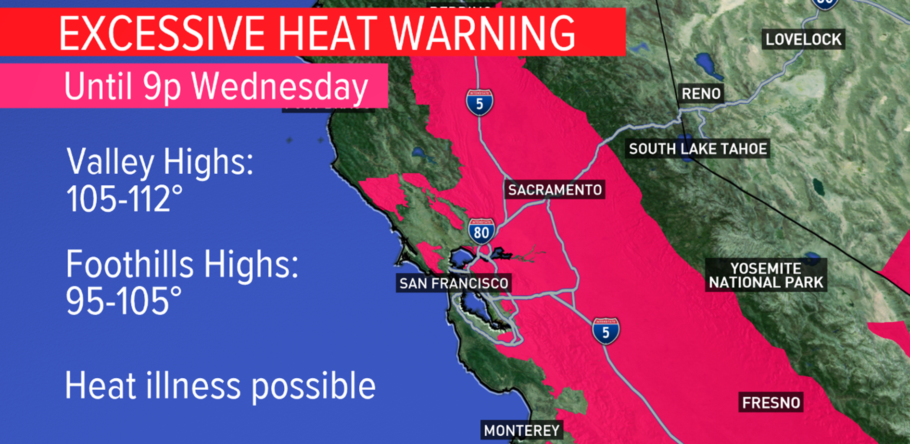
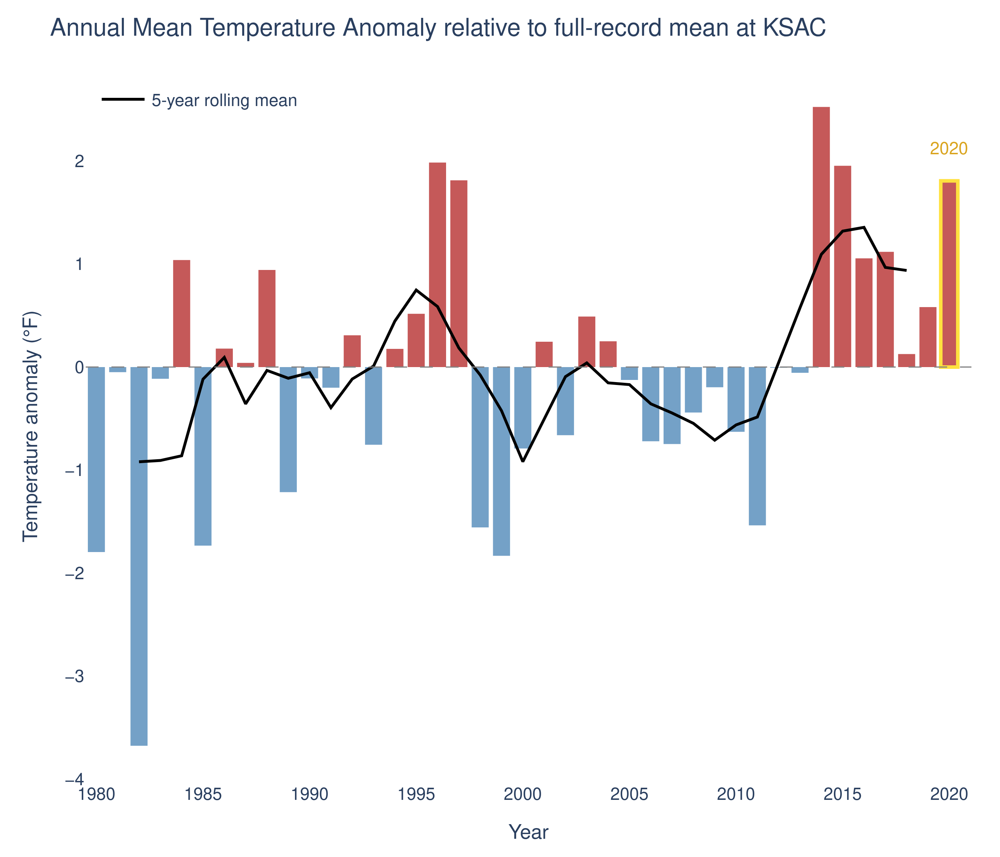
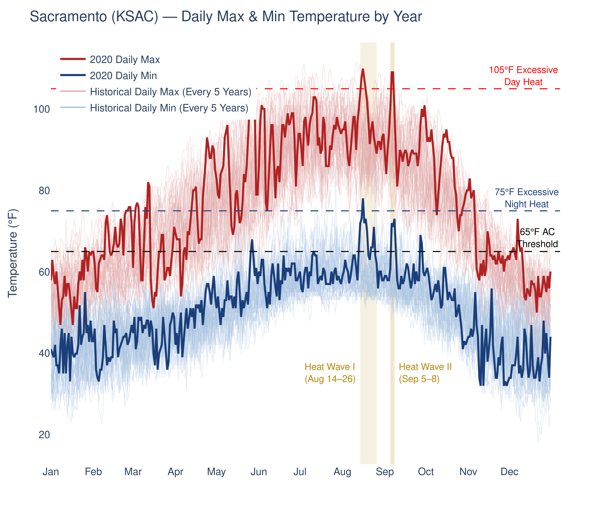
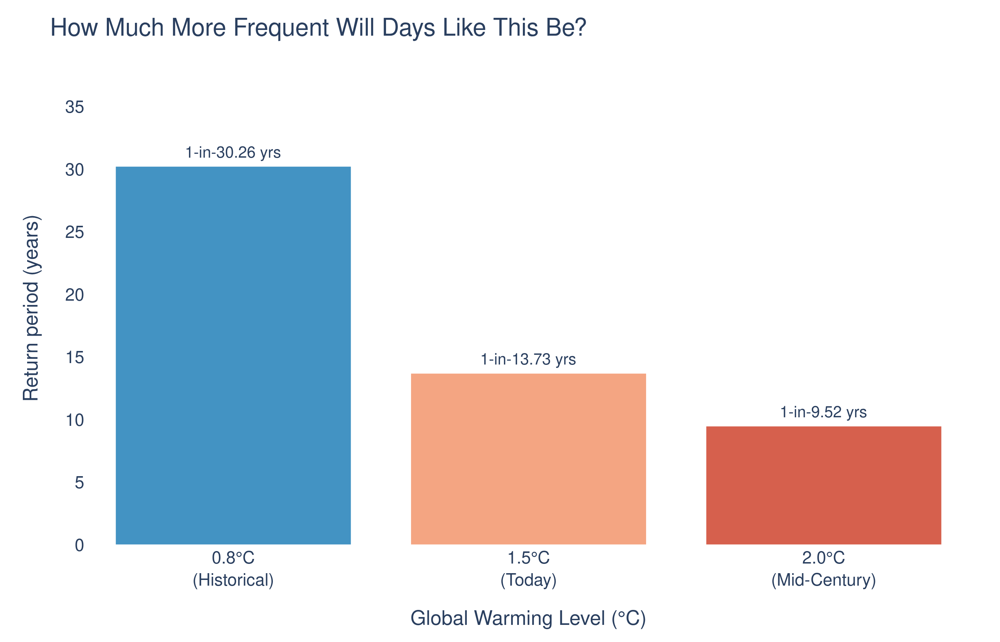
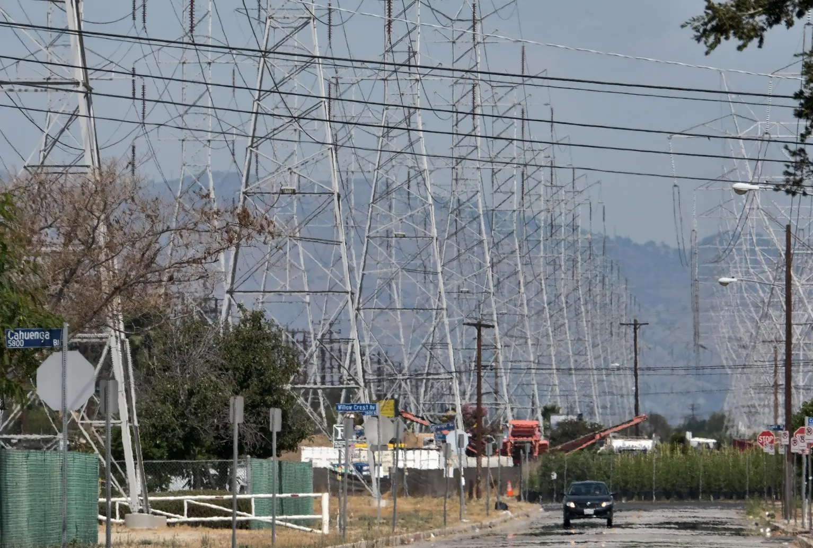
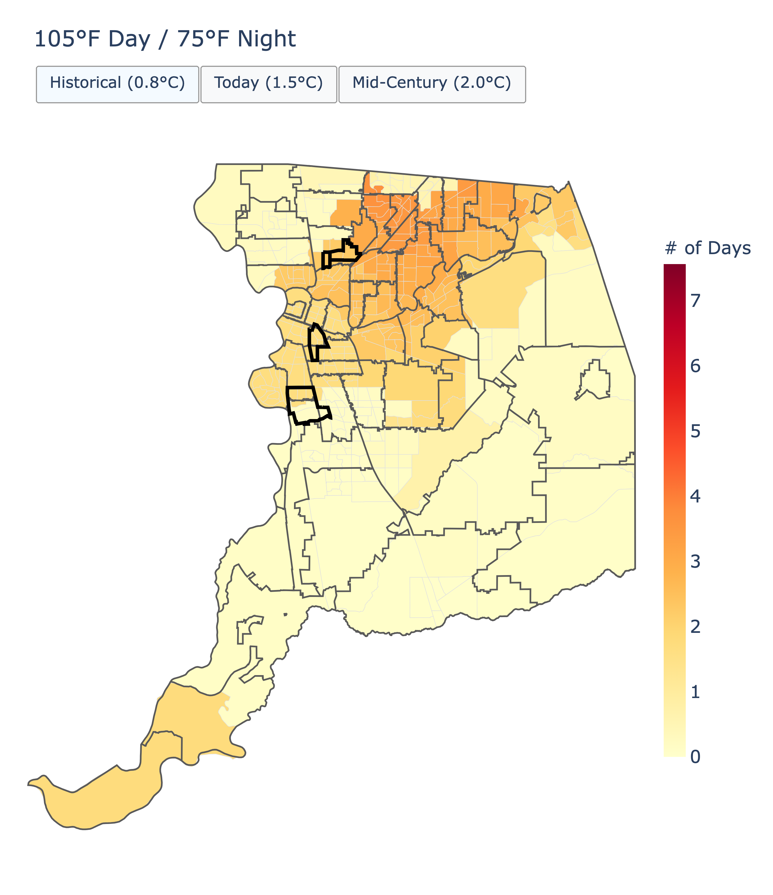
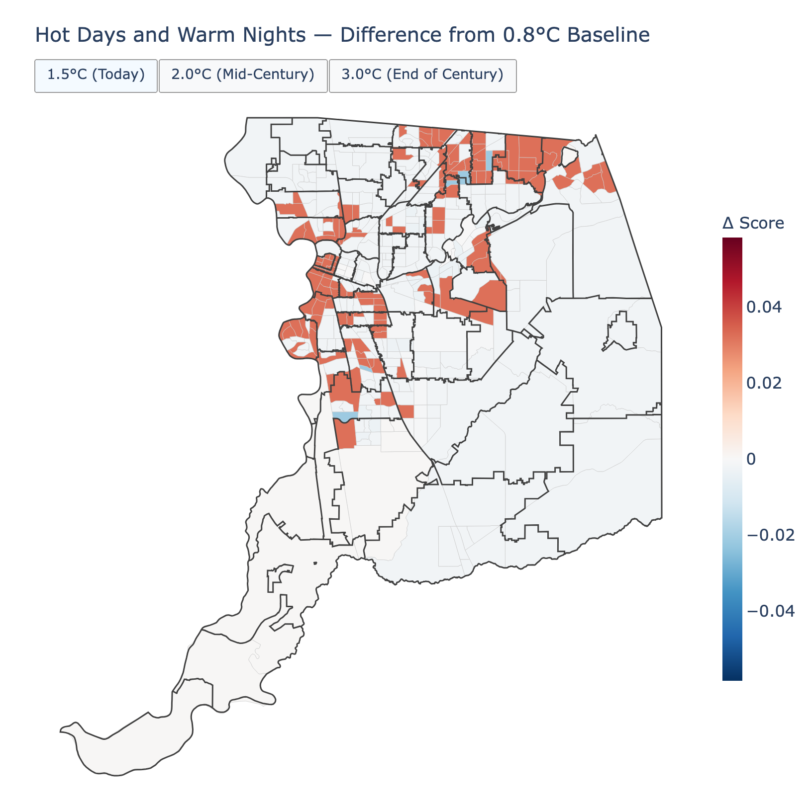

---

It was mid-August 2020 in Sacramento. COVID-19 lockdowns were long in place, and the region was already deep into a stretch of summer heat. On August 14th, that heat would escalate drastically.

By 6 a.m., as the city began to wake up, the temperature in Sacramento climbed past 80°F. Morning news warned of the potential of an excessively hot day (@fig-news-coverage). By 7 a.m., when the city was starting to wake up, an estimated [FILL HERE] people across the Sacramento Valley were already under an extreme heat warning. In neighborhoods like Del Paso Heights, Meadowview, and Oak Park, that are considered heat vulnerable, sparse tree canopy left streets and homes exposed to direct sun with little shade relief. As the temperatures continued to rise and residents began their day, the hot morning was only the beginning of what would end up being one of most impactful heat waves to hit Sacramento.

These historic heat waves would dominate California's weather patterns and newsstreams throughout August and September of 2020. Typically, the delta breeze passes through the Bay Area towards the Central Valley, moderating temperatures bringing much needed relief to the population, especially during night. However, this breeze was weakened by an exceptionally strong and persistent ridge of high pressure across the Western U.S., leaving California's Central Valley without its natural nighttime cooling mechanism.

By the evening of August 14th, the California Independent System Operator (CAISO) declared a grid emergency as cooling demand load pushed electricity demand beyond what the system could supply. For the first time since 2001, California implemented rolling blackouts, affecting more than 300,000 Californians at the precise time they needed power the most.

As California's extreme heat continues to climb to new heights, we will explore the intensity of the 2020 Sacramento heat wave in greater detail, examining how events like this will change in frequency under a warming climate. These two heatwaves were more than just long hot days and nights, they strained the energy grid to its limits, drove a surge in heat-related hospitalizations, and put lives at risk. Understanding the physical drivers of heat waves and the social conditions that determine who bears their impacts will be essential to building a more resilient and equitable future.


{#fig-news-coverage style="border-radius:5px;"}


<!-- ### What the News Captured -->

<!-- FIGURE: Static image(s) from news coverage.
     Save to blog/posts/2026-06-10-extreme-heat-event/images/ and update paths below. -->

<!-- ![Caption: [describe image and credit source].](images/news-photo-1.jpg) -->


### About This Analysis

---

This analysis was produced by the Cal-Adapt Team, led by [Eagle Rock Analytics](https://eaglerockanalytics.com), a climate data and analytics firm based in Sacramento. Cal-Adapt builds tools and pipelines that help California utilities, planners, and public agencies understand how climate hazards are changing, and what that means for the communities they serve.

When an extreme event like this occurs, we think it's worth going beyond the headlines: not just describing what happened but grounding it in data. The analysis draws on publicly available climate datasets, including gridded historical observations and downscaled future projections hosted by [Cal-Adapt.org](https://cal-adapt.org/).

Disclaimer: [ADD HERE]

---

### 3 Key Messages

::: {.callout-important}
**This event was historically exceptional.** The 2020 heat waves pushed Sacramento's temperatures above 105°F, the National Weather Service extreme danger threshold, which placed these events among the most intense in the observed record at Sacramento Executive Airport weather station (KSAC) since 1980 [@sac-county-2020-severe-weather].
:::

::: {.callout-warning}
**Events like this will become more likely.** By mid-century, heat wave events similar to the one felt in Sacramento are expected to occur **3 times more frequently** than they did in the recent past.
:::

::: {.callout-tip}
**We have tools and plans to act.** Sacramento County already has hazard mitigation plans, cooling infrastructure, and urban forestry programs in place. The data we explore shows clearly where those investments should be scaled up, and where they’re most urgently needed.
:::

---

### How Was This Event Defined?

Any climate analysis needs a consistent and reproducible definition for the event of interest. For this analysis, we used the criteria applied by the Office of Emergency Services to formally classify extreme heat events [@sac-county-2020-severe-weather]:

- **Duration:** Maximum temperature exceeding 105°F for **more than 3 consecutive days**
- **Daytime threshold:** Maximum temperature at or above **105°F**
- **Nighttime threshold:** Minimum temperature at or above **75°F**
- **Spatial extent:** Sacramento metropolitan area, anchored to KSAC (Sacramento Executive Airport, station ID `ASOSAWOS_72483023232`)

---

### How Bad Was This Event, Historically?

#### **Where 2020 Ranks**

@fig-annual-anomaly shows the annual mean temperature anomaly, the deviation from what is considered normal, at KSAC (the Sacramento Executive Airport). Red bars mean the temperature was warmer than usual for that year. Blue bars mean the temperature was cooler than usual. 2020 is outlined in yellow.

::: {#fig-annual-anomaly}
::: {.content-visible when-format="html"}
```{=html}
<div class="figure-container d-none d-md-block">

</div>
```
{.d-md-none fig-alt="Bar chart of annual mean temperature anomaly at KSAC relative to the full-record mean, 2020 highlighted."}
:::
::: {.content-visible when-format="pdf"}
{fig-alt="Bar chart of annual mean temperature anomaly at KSAC relative to the full-record mean, 2020 highlighted."}
:::
::: {.content-visible when-format="docx"}
{fig-alt="Bar chart of annual mean temperature anomaly at KSAC relative to the full-record mean, 2020 highlighted."}
:::
*Annual mean temperature anomaly at KSAC (Sacramento Executive Airport) relative to the full-record (1980–2020) mean. Red bars indicate warmer-than-average years; blue bars indicate cooler-than-average years. 2020 is highlighted in gold. The black line shows the 5-year rolling mean. Data: Historical Data Platform (HDP).*
:::

2020 was a hot year, but not necessarily the hottest year on record. So why was this event so impactful? Let's take a closer look at the historical record.
<br>

---

#### **A closer look at the 2020 heat wave**

@fig-daily-temp shows daily maximum (red) and minimum (blue) temperature for every 5 years on record. The bold lines represent 2020. The two heat waves are shaded in the plot. Feel free to hover over any line to see the year, date, and recorded daily max/min temperature for that date.

::: {#fig-daily-temp}
::: {.content-visible when-format="html"}
```{=html}
<div class="figure-container d-none d-md-block">

</div>
```
{.d-md-none fig-alt="Line chart of daily maximum and minimum temperature at KSAC across all available years, with 2020 highlighted."}
:::
::: {.content-visible when-format="pdf"}
{fig-alt="Line chart of daily maximum and minimum temperature at KSAC across all available years, with 2020 highlighted."}
:::
::: {.content-visible when-format="docx"}
{fig-alt="Line chart of daily maximum and minimum temperature at KSAC across all available years, with 2020 highlighted."}
:::
*Daily maximum and minimum temperature at KSAC (Sacramento Executive Airport), all available years. Dark gray lines = historical daily max; light blue lines = historical daily min; bold red = 2020 daily max; bold dark blue = 2020 daily min. Shaded regions indicate Heat Wave I (August 14–26) and Heat Wave II (September 5–8). Dashed gray line marks the approximate 65°F AC threshold. Hover a line to see year, date, and temperature. Data: Historical Data Platform (HDP).*
:::

The data clearly shows the peak of the two heat waves, but what stands out is the nighttime temperature. There was no overnight relief resulting in continuous energy demand and creating dangerous conditions for residents of the region. But how unusual was this extreme heat event and how frequently could these events occur in the future? Let's take a look into the data and see.
<br/>

---

### How frequently has this event occurred in the past and how will that change under a warming climate?

There have only been **8 of 15,584 days** across the historical record that had both a daily maximum temperature above 105°F and an overnight low at or above 75°F simultaneously, placing an event like this in the **99.9th percentile** of all days on record.

**Table 1: The 2020 event by the numbers**

| | Heat Wave I (Aug 14–26) | Heat Wave II (Sep 5–8) |
|---|---|---|
| Peak Tmax | 109.9°F | 109.0°F |
| Days Tmax > 105°F | 5 | 2 |
| Nights Tmin ≥ 75°F | 1 | 0 |

<br>

Needless to say, the likelihood of a day like this is extremely low historically, but how will that change under a warming climate?

California has invested in developing state-of-the-art climate projections to help build towards a more resilient future, and this data is a part of the state's 5th Climate Change Assessment, hosted on Cal-Adapt. Using these climate projections, we can estimate how frequently heat events, like the 2020 heat wave, will occur as the climate warms. For more information specific to the climate projections, check out our page [about climate projections and models](https://analytics.cal-adapt.org/scientific-guidance/general-climate-guidance/about-climate-projections.html).

We'll take a look at the projections data in terms of **[return period](/glossary/index.qmd#return-period)**, which is a common way to express the frequency of extreme events. The return period is the average time between events of a given magnitude. For example, a 100-year flood has a return period of 100 years, meaning that on average, such a flood is expected to occur once every 100 years.
<br>

::: {#fig-return-period}
::: {.content-visible when-format="html"}
```{=html}
<div class="figure-container d-none d-md-block">

</div>
```
{.d-md-none fig-alt="Bar chart of return period for extreme heat days without nighttime reprieve in Sacramento County under three warming levels."}
:::
::: {.content-visible when-format="pdf"}
{fig-alt="Bar chart of return period for extreme heat days without nighttime reprieve in Sacramento County under three warming levels."}
:::
::: {.content-visible when-format="docx"}
{fig-alt="Bar chart of return period for extreme heat days without nighttime reprieve in Sacramento County under three warming levels."}
:::
*Return period of extreme heat days without nighttime reprieve in Sacramento County under three warming levels. A shorter return period means the event becomes more frequent. Data: WRF UCLA.*
:::

Historically, this event could be characterized as a 1 in 30 year event. Under today's climate conditions, this type of heat wave is characterized as a 1 in 14 year event. By mid-century, this event could become a 1-in-10 year event.

::: {.callout-note appearance="minimal"}
**In plain language:** This type of event will become approximately **3x more likely by mid-century** compared to the recent past. What used to be a once-in-a-generation event is on track to become a near-decadal occurrence.
:::

Though seemingly still infrequent, the implications of this change are significant. The more frequently these events occur, the less time communities have to recover and adapt between events, and the more likely it is that the cumulative impacts will be felt across public health, infrastructure, and the economy. We'll explore some of these impacts in the next section.

---

### Impacts of Extreme Heat on People and Infrastructure

Below, we explore three defining avenues of impact that extreme heat events have on communities.

::: {.panel-tabset}

#### **Grid Health**

During extreme heat, the electrical grid is often pushed to its limits. Cooling demand drives energy demand throughout a service territory. This is further exacerbated as the high temperatures from the extreme heat reduce transmission line capacity and thermal plant efficiency, which can further lead to supply shortages.

On August 14 and 15, 2020, the grid faced its limit. CAISO declared a grid emergency as demand outpaced supply, which led to rolling blackouts affecting hundreds of thousands of Californians for the first time since 2001 [@cal-iso-2020-heat-wave-report].

{style="display:block; margin:1rem auto; height:300px; width:100%; object-fit:cover; object-position:bottom; border-radius:3px;"}
*California grid overwhelmed and ordered rolling power outages during the August 2020 heat wave. [File: Richard Vogel/Associated Press]*

Over the past three years, California has strengthened its grid resilience, with the California Energy Commission (CEC) reporting that "up to 4,500 MW of contingency resources are available for summer 2026 in case of extreme events that strain the grid" [@cec-grid-reliability-2026]. Still, as our climate continues to change increasing the likelihood of extreme events statewide (and countrywide), will our grid be reliable enough to withstand these stressors?

#### **Public Health**

Extreme heat is already the deadliest weather hazard in the United States, according to NOAA's National Weather Service, outpacing floods, tornadoes, and hurricanes [@nws-weather-fatalities-page]. A three-fold increase in event frequency translates directly into greater cumulative health risk, particularly for underserved communities including the elderly, outdoor workers, and those without access to cooling resources. As extreme heat continues to increase, researchers project California will see an additional 1.5 million heat-driven emergency department visits by 2050 [@gouldTemperature2025].

{style="display:block; margin:1rem auto; height:300px; width:100%; object-fit:cover; object-position:bottom; border-radius:5px;"}
*Surge in heat-related emergency room visits during the 2020 heat wave. [Credit: Unsplash (FIND AUTHOR)]*

#### **Equity and Disproportionate Impacts**

Not everyone experiences heat equally. In Sacramento, lower-income neighborhoods and communities of color are often located in **urban heat islands**, areas where pavement, impervious surfaces, and low tree canopy push ambient temperatures several degrees higher than surrounding areas. Residents without air conditioning, renters unable to upgrade their housing, and people who work outdoors face a fundamentally different risk profile than those with the means to adapt.

{style="display:block; margin:1rem auto; height:300px; width:100%; object-position:top; object-fit:cover; border-radius:5px;"}
*Heat inequity in Sacramento: low-canopy, high-pavement neighborhoods experience significantly higher temperatures than more affluent areas. [Credit: SOURCE — update when image is added.]*

:::

<br>
How will these impacts affect communities within Sacramento County differently? How will already vulnerable communities be affected by the projected increase in frequency of extreme heat events? Let's take a look at the data.

---

### Understanding the Spatial Distribution of Heat Risk and Equity Vulnerabilities
<br>
We've already seen that extreme heat events are projected to become more frequent in Sacramento County, but how will that risk be distributed across the region? And how does that risk intersect with existing vulnerabilities?

In @fig-crai-tx105, we've mapped the projected number of these extreme heat events across Sacramento County census tracts at three planning horizons, bounded by zip codes for readability.


::: {#fig-crai-tx105}
::: {.content-visible when-format="html"}
```{=html}
<div class="figure-container d-none d-md-block">

</div>
```
{.d-md-none fig-alt="Choropleth map of the 105°F day / 75°F night heat metric across Sacramento County census tracts, comparing the 0.8°C historical baseline against 1.5°C, 2.0°C, and 3.0°C warming levels."}
:::
::: {.content-visible when-format="pdf"}
{fig-alt="Choropleth map of the 105°F day / 75°F night heat metric across Sacramento County census tracts, comparing the 0.8°C historical baseline against 1.5°C, 2.0°C, and 3.0°C warming levels."}
:::
::: {.content-visible when-format="docx"}
{fig-alt="Choropleth map of the 105°F day / 75°F night heat metric across Sacramento County census tracts, comparing the 0.8°C historical baseline against 1.5°C, 2.0°C, and 3.0°C warming levels."}
:::
*Projected number of 105°F day / 75°F night events per year across Sacramento County census tracts, by warming level. Use the tabs to toggle between the 0.8°C historical baseline and the 1.5°C, 2.0°C, and 3.0°C warming levels.*
:::

There is a clear diagonal warming trend appearing across Sacramento County, mirroring the county's most urbanized areas (urban heat island effect). Some urban areas are excluded below, which is likely due to reprieve from the delta breeze. [@noaa-sac-delta-breeze-2007]

But **not all areas are equally vulnerable to heat.** So, let's take a look at how the projected increase in heat hazard intersects with existing equity vulnerabilities across the county.

In order to explore this intersection of datasets, we'll look at the Cal-CRAI index. The Cal-CRAI index uses a combination of climate hazard and social vulnerability metrics to assess the relative risk of climate impacts across communities. For more information about the CRAI index, check out the [Cal-CRAI documentation](https://zenodo.org/records/13840187).

In @fig-crai-tx105-delta, we've used the Cal-CRAI index to map the change in heat hazard score across Sacramento County census tracts relative to the historical baseline. Red indicates an increase in projected heat risk for that community, blue indicates a decrease.

::: {#fig-crai-tx105-delta}
::: {.content-visible when-format="html"}
```{=html}
<div class="figure-container d-none d-md-block">

</div>
```
{.d-md-none fig-alt="Choropleth map of change in CRAI heat hazard score for the 105°F day / 75°F night metric across Sacramento County census tracts, comparing 1.5°C, 2.0°C, and 3.0°C warming levels against the 0.8°C historical baseline."}
:::
::: {.content-visible when-format="pdf"}
{fig-alt="Choropleth map of change in CRAI heat hazard score for the 105°F day / 75°F night metric across Sacramento County census tracts, comparing 1.5°C, 2.0°C, and 3.0°C warming levels against the 0.8°C historical baseline."}
:::
::: {.content-visible when-format="docx"}
{fig-alt="Choropleth map of change in CRAI heat hazard score for the 105°F day / 75°F night metric across Sacramento County census tracts, comparing 1.5°C, 2.0°C, and 3.0°C warming levels against the 0.8°C historical baseline."}
:::

*Change in CRAI heat hazard score for the 105°F day / 75°F night metric across Sacramento County census tracts, by warming level, relative to the 0.8°C historical baseline. Red indicates an increase in projected heat hazard; blue indicates a decrease. Use the tabs to toggle between 1.5°C, 2.0°C, and 3.0°C warming levels.*
:::


<!-- ::: {#fig-crai-heatwave}
::: {.content-visible when-format="html"}
```{=html}
<div class="figure-container d-none d-md-block">

</div>
```
:::
Projected consecutive-heatwave-day counts across Sacramento County census tracts, by warming level. Use the tabs to toggle between the 0.8°C historical baseline and the 1.5°C, 2.0°C, and 3.0°C warming levels.
:::


::: {#fig-crai-heatwave-delta}
::: {.content-visible when-format="html"}
```{=html}
<div class="figure-container d-none d-md-block">

</div>
```
:::
Change in CRAI heat hazard score for the consecutive-heatwave metric across Sacramento County census tracts, by warming level, relative to the 0.8°C historical baseline. Red indicates an increase in projected heat hazard; blue indicates a decrease. Use the tabs to toggle between 1.5°C, 2.0°C, and 3.0°C warming levels.

CRAI hazard and equity data: Ford, V., Espinoza, J., & McClenny, B. (2024). *California Climate Risk and Adaptation Index Metric Files and Metadata, v1* [Data set]. Eagle Rock Analytics. [https://zenodo.org/records/13840187](https://zenodo.org/records/13840187)
:::
--->

We see clear disparities in heat vulnerability across census tracts in Sacramento, consistent with the tree canopy plan referenced above. Neighborhoods including Del Paso Heights, Meadowview, and Oak Park consistently register elevated risk scores, and the county's urban core showing an interspersed pattern of heightened risk throughout. Most notably, the division we see between the two high-risk clusters on the map (the northeast and the southwest) is due to the American River. The census tracts immediately on its banks are home to more affluent residents, and as a result have lower social vulnerability when it comes to hazardous heat [@best-neighborhood-sac-income-webpage]. This underscores how proximity to the same natural resource can produce starkly different resiliency outcomes for communities.

While the likelihood that heat risk will continue to grow is high, there are many different solutions available to address it. Sacramento County has already begun implementing some of them. Let's take a look at what has been done and what opportunities remain to build a climate-resilient future.

---

### Cooling Solutions To Address A Changing Climate

Communities around the world, including in California, have already begun implementing strategies that demonstrably reduce heat exposure. Below are a few of the most effective strategies for mitigating extreme heat, particularly in urban areas like Sacramento County.

#### **Effective Cooling Solutions**

```{=html}
<style>
/* White background, no hover-lift, 160px photo height — overrides the
   homepage .info-card-photo defaults without touching the shared
   .info-card / .info-card-photo rules other pages rely on. */
.info-card-photo.solution-card {
  background: var(--color-white);
}
.info-card-photo.solution-card:hover {
  transform: none;
  box-shadow: none;
  border-color: var(--color-border);
}
.info-card-photo.solution-card img {
  height: 160px;
}
</style>
```

::: {.grid .mt-3}

::: {.g-col-12 .g-col-md-4 .info-card .info-card-photo .solution-card}
::: {.content-visible when-format="html"}

:::

::: {.info-card-photo-body}
**Urban Tree Canopy**

Trees shade pavement and cool the air through evapotranspiration, making canopy cover one of the most effective tools for reducing heat exposure in cities, whether that's through street trees, park trees, or green roofs.
:::
:::

::: {.g-col-12 .g-col-md-4 .info-card .info-card-photo .solution-card}
::: {.content-visible when-format="html"}

:::

::: {.info-card-photo-body}
**Cool Corridors**

Shaded pedestrian and transit routes connecting cooling centers, parks, and public facilities cut heat exposure for people traveling on foot. These can be implemented in tandem with urban forestry programs to maximize cooling benefits.
:::
:::

::: {.g-col-12 .g-col-md-4 .info-card .info-card-photo .solution-card}
::: {.content-visible when-format="html"}

:::

::: {.info-card-photo-body}
**Cooling Centers & Refuge Spaces**

Air-conditioned public spaces give people without reliable home cooling somewhere safe to go during the most dangerous heat events. Unlike shade or vegetation, they don't lower ambient temperature. But, they are critical public infrastructure for anyone to spend time at during the hottest times of the day.
:::
:::

:::
<br>
For a broader look at nature-based solutions cities are using worldwide, see this [PreventionWeb report](https://www.preventionweb.net/news/how-cities-can-combat-extreme-heat-using-nature-based-solutions).
<br>

#### **What Is Already Being Done For Sacramento County**

::: {.grid .mt-3}

::: {.g-col-12 .g-col-md-4 .info-card .info-card-photo .solution-card}
::: {.content-visible when-format="html"}

:::

::: {.info-card-photo-body}
**Urban Tree Canopy Expansion**

Through NeighborWoods and the City's Urban Forest Plan, Sacramento has planted roughly 1.5 million trees county-wide, including 13,000+ shade trees and 6,000+ residents engaged in FY2024 (Oct '23 - Sept '24) alone, working toward a target of 25,000 trees/year. [Cooling-effectiveness research](https://www.sciencedirect.com/science/article/abs/pii/S1618866723003631) finds canopy cover consistently outperforms building shading and pervious surfaces, with reductions of 1–3°C, and is the broadest, most continuous intervention available county-wide.
:::
:::

::: {.g-col-12 .g-col-md-4 .info-card .info-card-photo .solution-card}
::: {.content-visible when-format="html"}

:::

::: {.info-card-photo-body}
**Cooling Centers Network**

The county operates a network of [publicly accessible cooling centers](https://www.211sacramento.org/211/severe-weather-spaces/) that activate in step with the National Weather Service's HeatRisk Red/Magenta levels. More than 20 sites were activated during the 2020 heat waves. The reach of cooling centers is narrower than canopy cover since it only serves people during an active emergency, but it's critical infrastructure for people to take reprieve during the hottest hours of the day.
:::
:::

::: {.g-col-12 .g-col-md-4 .info-card .info-card-photo .solution-card}
::: {.content-visible when-format="html"}

:::

::: {.info-card-photo-body}
**SacRT Heat-Resilient Bus Shelters**

SacRT was [awarded $449,900](https://www.masstransitmag.com/technology/facilities/shelters-benches-and-equipment/article/55242936/california-governors-office-of-land-use-and-climate-innovation-selects-sacrt-for-extreme-heat-and-community-resilience-program-grant) to build up to 20 heat-resilient shelters at bus stops in disadvantaged communities across Citrus Heights, Folsom, Rancho Cordova, and Sacramento. This has been a targeted investment for transit-dependent riders, though a small fraction of the county's full bus-stop network [@sac-transit-resilience-grant-2024].
:::
:::

:::

<!-- ### **Where the Gaps Are**
Now, let's take a look at where Sacramento has already invested in cooling and green infrastructure, and where gaps remain. The map below overlays existing tree canopy, cooling centers, and other green infrastructure onto the projected heat risk and equity vulnerability layers.

*Figure X. Existing cooling and green infrastructure in the Sacramento region, overlaid on projected heat risk and equity vulnerability. Gaps indicate areas with high projected risk and limited current adaptation investment. Data: [sources].*

Looking at the distribution of existing tree canopy and cooling infrastructure against the equity and projected frequency layers, **[FILL IN FINDINGS — which areas appear most underserved? What types of interventions would be most appropriate?]** -->

---

### What Can I Do About Extreme Heat Waves in My Area?

A changing climate will affect everyone, no matter where you live. The good news is that your community likely already has resources in place, and there are meaningful actions at every scale.

::: {.callout-note collapse="false"}
## Today

1. Know where your nearest cooling center is *before* you need it. Most counties publish this through their emergency management office or public health department.
2. Sign up for your local emergency alert system so heat warnings reach you automatically.
:::

::: {.callout-note collapse="false"}
## In Your Community

1. Advocate for shade equity in parks and transit corridors, particularly in neighborhoods with low tree canopy.
2. Support urban forestry and cool corridor planning through your local planning commission or city council.
3. Check on your neighbors and other community members, particularly the elderly and those with limited mobility, during extreme heat events. Social isolation is a well-established risk factor for heat-related illness and death, particularly among people who live alone or lack regular social contact [@semenzaHeatRelated1996].
:::

::: {.callout-note collapse="false"}
## For Policymakers

1. Prioritize urban forestry and green infrastructure funding in high-risk, low-resource communities. These neighborhoods are often underserved by green infrastructure, and targeting them is both more equitable and more efficient. Green canopy delivers its greatest cooling return exactly where canopy is lowest and density is highest [@mcdonaldTrees2026].
2. Update heat emergency plans with robust early warning systems as warming events increase in frequency over time, as they can result in a 49-73% reduction in emergency medical dispatches on heat wave days [@oconnorPromoting2025].
3. Integrate extreme heat risk into capital improvement planning across new infrastructure, ensuring public buildings, transit systems, and energy infrastructure are designed to withstand escalating heat exposure over their operational lifetime.
:::

[Explore your county's climate adaptation actions →](https://resilientca.org/rap-map/)

---

### Data & Tools Used in This Analysis

#### Data 
- **Weather station data:** Historical Data Platform (HDP), KSAC (Sacramento Executive Airport, `ASOSAWOS_72483023232`), accessed via [Cal-Adapt Analytics Engine](https://analytics.cal-adapt.org)
- **Climate model projections:** WRF dynamically-downscaled projections (UCLA, SSP3-7.0, 3 km resolution, d03 grid), accessed via Cal-Adapt Analytics Engine
- **Climate risk data layers:** Ford, V., Espinoza, J., & McClenny, B. (2024). [California Climate Risk and Adaptation Index Metric Files and Metadata, v1](https://zenodo.org/records/13840187) [Data set]. Eagle Rock Analytics.

#### Tools 
This analysis was built using [`climakitae`](https://github.com/cal-adapt/climakitae), Cal-Adapt's open-source Python library for climate data access and analysis.

Explore the climate projections for your own area at [cal-adapt.org](https://cal-adapt.org). For tools focused specifically on extreme heat, see [our extreme heat tool](https://cal-adapt.org/dashboard/climate-metrics-map?metric=extreme-heat) on cal-adapt.org.

---

### Get In Touch

**Were you in Sacramento during the August or September 2020 heat waves?**

If you're interested in sharing how you were affected, what you experienced, what resources you did or didn't have access to, how your neighborhood handled it, we want to hear from you! Please [**reach out to us**](mailto:calvin@eaglerockanalytics.com) to share your story.

**Are you a researcher, planner, policymaker, or an enthusiast interested in this analysis or chatting with us further?**

Please [**get in touch with us**](mailto:calvin@eaglerockanalytics.com) as well! We love talking about climate data, projections, and adaptation planning, and we're always happy to connect with others working in this space.