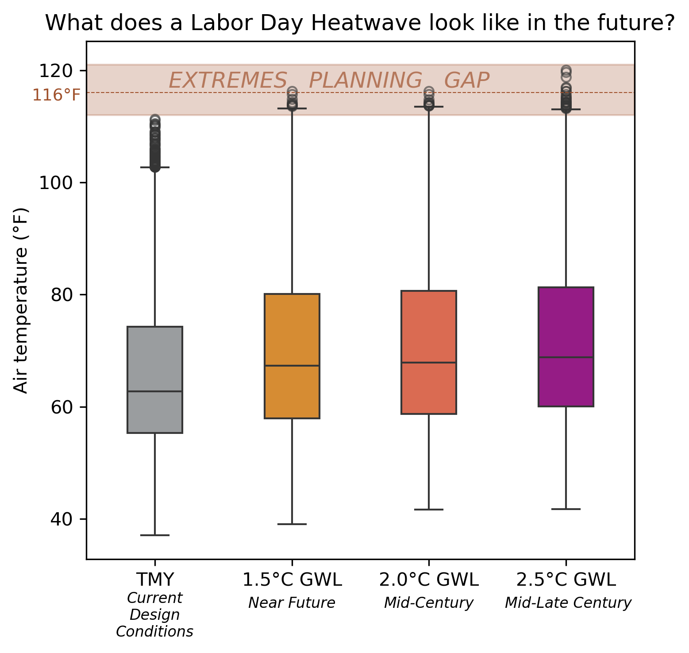

We've expanded the climate profile offerings available for download through the Cal-Adapt: [Data Download Tool](https://cal-adapt.org/dashboard/data-download-tool)! The following climate profiles are now ready for you to explore: 

- Typical Meteorological Years, built with ERA5 historical reanalysis
- Extreme Meteorological Years -- Shock
- Extreme Meteorological Years -- Persistence
- Time-based Standard Year profiles, at 50th percentile for 5 common use variables

You can download both typical and extreme climate profiles on the [Data Download Tool](https://cal-adapt.org/dashboard/data-download-tool). Want to customize your own typical or extreme climate profile? The [Custom Climate Profiles Notebook](https://github.com/cal-adapt/cae-notebooks/blob/main/custom_climate_profiles.ipynb) can do that for you! 

Cal-Adapt has also published a white paper discussing Extreme Climate Profiles, available in the [Reference Library](https://analytics.cal-adapt.org/general-resources/reference-library.html) on the Analytics Engine website, with citation details and permanent Zenodo records for ["Preparing for the Exceptional: Extreme Meteorological Years in Energy System Planning"](https://doi.org/10.5281/ZENODO.21401751). 

::: {#fig-exec-summary-boxplots}
{width=55% fig-alt="Boxplot comparing typical (TMY) and extreme heat (XMY) temperature distributions for Sacramento across sector-relevant planning horizons."}

The Labor Day 2022 Heatwave produced record-breaking electricity demand of more than 52,000 MW, but current design standards use “typical” conditions. Boxplot distribution of temperatures for Sacramento comparing typical standards (TMY) to extreme heat tailored (XMY) future conditions at sector-relevant planning horizons. 
:::