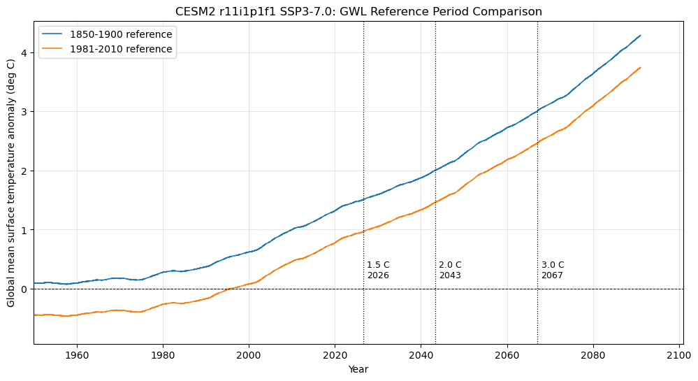

**TL;DR:** A bug in [`climakitae`](https://github.com/cal-adapt/climakitae) affected global warming level (GWL) data retrieval for custom GWLS (values other than 0.8, 1.0, 1.2, 1.5, 2.0, 2.5, 3.0, 4.0 °C); profiles using the standard GWLs were not affected. The affected code used a lookup table based on the wrong reference period, which could shift output values down by 0.5°C. The bug has been fixed. Users who generated custom Climate Profiles with a non-standard GWL should upgrade their install version of [`climakitae`](https://github.com/cal-adapt/climakitae) and regenerate those profiles. Pre-generated Cal-Adapt data products, including the Climate Profiles available through the [Data Download Tool](https://cal-adapt.org/dashboard/data-download-tool) and profiles generated at standard GWLs on the Analytics Engine JupyterHub, are not affected.

## What happened

The [`ClimateData`](https://cal-adapt.github.io/climakitae/dev/climate-data-interface/) interface used the wrong time-indexed lookup file when determining the center year for a custom GWL such as 1.7°C or 2.3°C. The lookup used a 1981–2010 reference period instead of the 1850–1900 pre-industrial reference period used to define global warming levels.

This affected the fallback calculation for warming levels that are not present in the standard lookup table. The standard precomputed values are 0.8, 1.0, 1.2, 1.5, 2.0, 2.5, 3.0, and 4.0°C. For an affected custom request, `climakitae` could select a 30-year data window corresponding to a GWL that was approximately 0.5°C lower than the requested level. The resulting profile was therefore based on the wrong warming-level period, rather than simply having a small numerical rounding difference. See Fig. 1 for more details. 

{width=80%}

The issue affected custom profile workflows that use the [`ClimateData`](https://cal-adapt.github.io/climakitae/dev/climate-data-interface/) interface, including custom Typical Meteorological Year and Extreme Meteorological Year profiles, when a non-standard GWL was requested. It did not affect requests using the standard precomputed GWL values, or requests using the legacy [`get_data()`](https://cal-adapt.github.io/climakitae/dev/api/data-access/#climakitae.new_core.data_access.data_access.DataCatalog.get_data) interface

## What users should do

Upgrade to the latest version of `climakitae`:

```bash
pip install --upgrade climakitae
```

Then regenerate any custom profiles created with a non-standard GWL. This includes profiles requested with values such as 1.7°C, 2.3°C, or another value that is not in the standard precomputed list above.

Users who generated custom profiles with a standard precomputed GWL do not need to regenerate them because of this issue.

## What was not affected

The bug did not affect pre-generated Cal-Adapt data products. Files produced by the Analytics Engine and made available through the Data Download Tool, including the published Standard Year, Typical Meteorological Year, and Extreme Meteorological Year collections, were generated using standard GWL periods and remain valid.

It also did not affect ordinary time-based data requests or custom profiles that used a standard precomputed GWL. The issue concerns the determination of the center year for non-standard GWL values in the affected `ClimateData` workflow.

For technical details and ongoing discussion, see [Discussion #813 in the _climakitae_ repository](https://github.com/cal-adapt/climakitae/discussions/813).
