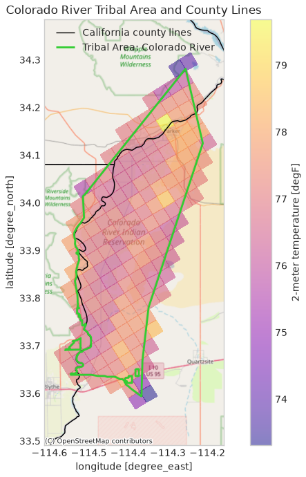

## What's New

You can now visualize and analyze climate data within the geographic context of tribal lands and territories using [`climakitae`](https://github.com/cal-adapt/climakitae). This feature enables:

- Better geographic context for climate adaptation planning relevant to tribal communities
- Enhanced analysis by overlaying climate projections with tribal boundaries
- Improved community engagement by centering tribal lands in climate assessment workflows

## Data Source

Tribal boundary data is sourced from the [U.S. Department of Interior Bureau of Indian Affairs (BIA) GeoSpatial Data Repository](https://biamaps.geoplatform.gov/), the official federal source for recognized tribal territorial information.

## How to Use

The tribal boundaries can be used for clipping like any other geographic reference layer in `climakitae`. Simply specify the boundary of choice from the available boundary options to clip your analysis area to a tribal territory.

Tribal selections use qualified names so they do not collide with counties or watersheds. For example, to clip to the Colorado River tribal area:

```python
from climakitae import ClimateData

cd = ClimateData(verbosity=-1)
query_example = (
    cd
    .catalog("cadcat")
    .activity_id("WRF")
    .institution_id("UCLA")
    .table_id("day")
    .grid_label("d03")
    .variable_id("t2")
    .processes({
        "warming_level": {
            "warming_levels": [2.0],  # Example warming level, adjust as needed
            "add_dummy_time": True
        },
        "clip": "Tribal Area: Colorado River",
        "convert_units": "degF"
    }).get()
)
```

The result is climate data clipped to the Colorado River tribal area:

{width=50% fig-align="center" fig-alt="Map of gridded 2-meter temperature, ranging from about 73 to 80 degrees Fahrenheit, clipped to the Colorado River tribal area. The tribal area boundary is outlined in green and California county lines are drawn in black over a basemap."}

Use `cd.show_boundary_options("Tribal Areas", show_n=None)` to see the exact selectors available in the current catalog. The category is available only when the optional `tribalareas` entry is present in the boundary Intake catalog.

## Important Considerations

This layer comes from the U.S. Department of Interior Bureau of Indian Affairs (BIA) GeoSpatial Data Repository and is provided as a reference layer for geographic analysis and context. Some context on its limitations:

- Boundaries are one source of information and do not fully capture the complexity of tribal governance, jurisdictional authority, or community interests.
- Equal representation of all tribal perspectives, and equal capacity for advocacy in decision-making, requires more than the availability of boundary data.
- Source agencies update their boundaries periodically, so this data reflects information available at the time of integration and may not capture the most recent changes.
- Climakitae does not independently verify external boundary information. For critical applications, official documentation and representatives of relevant tribal governments and communities are the primary references.

Please see our full guidance on [external data boundaries](https://github.com/cal-adapt/climakitae#general-external-boundary-datasets-disclaimer) for more information.

**Have feedback or questions about this feature?** We'd love to hear from you. Please contact us at support@cal-adapt.org or report an issue on our [GitHub repository](https://github.com/cal-adapt/climakitae/issues).