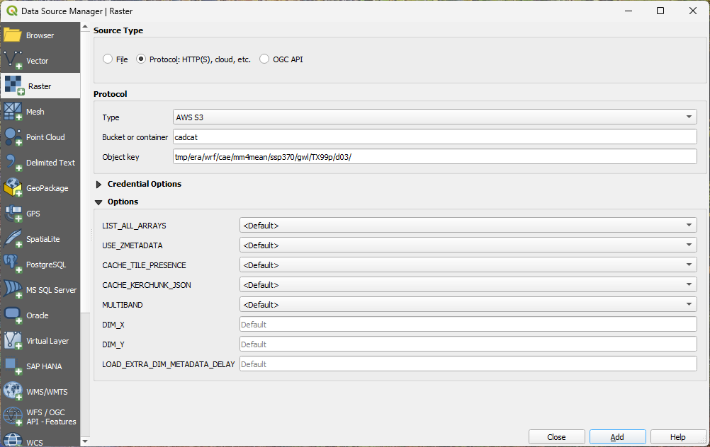
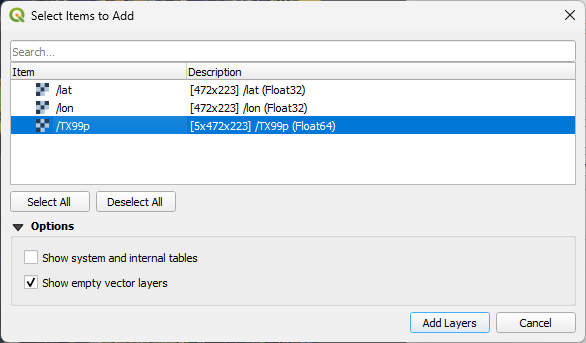

## Overview 

The source climate projections produced for California’s Fifth Climate Change Assessment that underlie the Cal-Adapt: Analytics Engine are freely available and accessible to the public. The projections can be accessed through Amazon’s Registry of Open Data and are hosted on Amazon Web Services (AWS) as part of the data catalog for the Cal-Adapt: Analytics Engine’s [“Co-Produced Climate Data to Support California’s Resilience Investments.”](https://registry.opendata.aws/caladapt-coproduced-climate-data/)

The Open Data program democratizes access by making data publicly available, enabling the use of cloud-optimized datasets, techniques, and tools in cloud-native formats, and building communities that benefit from these shared datasets. Because the Analytics Engine is part of the Open Data program, all climate projections are accessible now.

The Analytics Engine hosts nearly 1 petabyte (1000 terabytes) of multi-dimensional array data, and the size and complexity of this data make it important to become familiar with the [structure of the data](data-documentation/data-structure-and-format.qmd) before trying to access or download.

Once a user has identified a specific dataset of interest, there are many ways to access, visualize, and download that data from the Analytics Engine. A variety of ways to access the Analytics Engine data are detailed below.

## Data Access with the Analytics Engine JupyterHub
Energy-sector users with a Cal-Adapt: Analytics Engine JupyterHub login can access co-produced, pre-developed Jupyter notebooks to analyze, subset, and utilize existing Cal-Adapt: Analytics Engine data. The code and data can be customized for individual needs through the JupyterHub web interface, which provides private cloud storage through Amazon Web Services. Users can then export data in a variety of formats to cloud storage or a local machine. This solution requires a Cal-Adapt: Analytics Engine login, although all the Analytics Engine notebook code is open source and publicly available via our [cae-notebooks](https://github.com/cal-adapt/cae-notebooks) GitHub repository.

### Best Use 
The Analytics Engine JupyterHub is currently exclusively provided to energy-sector partners in California, in alignment with funding from the California Energy Commission. The JupyterHub environment is hosted in AWS and has access to cluster processing, 32GB of RAM, 10GB of storage on the Hub instance, and access to S3 storage for exporting larger datasets. It can be used to do any data processing on the Analytics Engine of interest.

### Limitations
- Not yet accessible to the general public. 
- Limited to the resources provided by the HUB instance.

### Example Usage
The notebooks in [`cae-notebooks`](https://github.com/cal-adapt/cae-notebooks) are all available upon login to the JupyterHub. 

## Data Access with `climakitae`
A powerful Python toolkit for climate data retrieval and analysis has been developed as part of the Analytics Engine project, `climakitae`. The main features of the toolset are:

- **Comprehensive climate data access**: Retrieve climate variables from hosted climate models
- **Spatial analysis tools**: Built-in support for geographic subsetting and spatial aggregation
- **Climate indices**: Calculate [heat metrics](/scientific-guidance/heat-metrics.qmd), perform analyses using [global warming levels](/scientific-guidance/global-warming-levels.qmd), and perform [extreme value analysis](/scientific-guidance/extreme-value-analysis.qmd)
- **Flexible data export**: Export to NetCDF, CSV, and Zarr

`climakitae` includes built-in methods to aid in the retrieval of data from the cadcat S3 bucket that are more intuitive and user-friendly than using the Python intake package directly.

### Best Use 
Powerful functionality allows users to retrieve data by warming level, by spatial and/or temporal filtering, by spatial and/or temporal aggregation, by derived variable, or by concatenated timeseries for historical and future scenarios. Allows users to utilize all of the Analytics Engine software functionality contained within the Analytics Engine JupyterHub, especially when combined with the notebooks developed for the JupyterHub in the `cae-notebooks` repository.

### Limitations 
The `climakitae` library is in active development and has changed throughout the project timeline. Older versions of `climakitae`, including the legacy `get_data()` approach, are deprecated and will eventually not be supported. Users of `climakitae` will want to keep up-to-date with library updates as the development team improves and expands the library offerings. 

The Analytics Engine team actively responds to issues on `climakitae`'s [GitHub](https://github.com/cal-adapt/climakitae) page. Please feel free to open an Issue or start a Discussion on GitHub if you'd like to be involved in improving the package, find any bugs you'd like us to fix, or have any feature suggestions. 

### Example Usage 
Please refer to the library's [technical documentation page](https://cal-adapt.github.io/climakitae/dev/) for comprehensive guidance on how to use `climakitae`.

## Data Access with `intake` 
As part of building `climakitae`, we created an `intake` data catalog, that allows for easy programmatic access to the data used on the Cal-Adapt: Analytics Engine. This catalog is an implementation of `intake-ESM`, which is designed for climate data. This catalog can be opened using Python by knowing the URL of the catalog file. 

For more information on how to access the Analytics Engine data using `intake`, continue to the next sections. For general information about `intake` and `intakeESM`, refer to the documentation for those libraries: 

- [`intake`](https://github.com/intake/intake)
- [`intakeESM`](https://intake-esm.readthedocs.io/en/stable/index.html)

### Best Use
The Intake-ESM Catalog CSV file can be parsed and searched directly from many programming languages in addition to Python. From there, any of the datasets can be opened using languages with a Zarr implementation, of which there are many to choose from.

### Limitations
Only provides data access; does not have any additional features such as spatial aggregation, clipping, and time slicing that are available via `climakitae`. 

### Example Usage
First, install the library using pip: 
```bash 
pip install intake-esm==2023.11.10 s3fs
```

Then open the `intake-esm` data catalog for querying:

```python 
import intake
cat = intake.open_esm_datastore(
'https://cadcat.s3.amazonaws.com/cae-collection.json'
)
```
The json catalog file stores all the metadata and paths to the data contained in the catalog and populates the intake database. To see the unique attributes contained in the catalog, run:

```python
cat.unique()
```

```
activity_id                                                 [LOCA2, WRF]
institution_id                                         [UCSD, CAE, UCLA]
source_id              [ACCESS-CM2, CESM2-LENS, CNRM-ESM2-1, EC-Earth...
experiment_id           [historical, ssp245, ssp370, ssp585, reanalysis]
member_id              [r1i1p1f1, r2i1p1f1, r3i1p1f1, r10i1p1f1, r4i1...
table_id                                          [day, mon, yrmax, 1hr]
variable_id            [hursmax, hursmin, huss, pr, rsds, tasmax, tas...
grid_label                                               [d03, d01, d02]
path                   [s3://cadcat/loca2/ucsd/access-cm2/historical/...
derived_variable_id                                                   []
dtype: object
```

The output is displayed above. Note the parameters in the left column of the code output. These paramaters are also described in the table below. 

| Familiar Name | CMIP6 Term |
|---|---|
| Downscaling Method | activity_id |
| Institution | institution_id |
| Source | source_id |
| Experiment | experiment_id |
| Variant | member_id |
| Frequency | table_id |
| Variable | variable_id |
| Resolution | grid_label |

: Familiar names and their corresponding CMIP6 terms used to query the intake-esm data catalog. {#tbl-cmip6-terms .striped}

You can use these parameters to query the data using the `.search()` method:
```python  
cat_loca2 = cat.search(
  activity_id="LOCA2",
  source_id="ACCESS-CM2",
  experiment_id="historical",
  member_id="r1i1p1f1",
  table_id="mon",
  variable_id="tasmax"
  )
```
This will narrow the catalog records to just one dataset. From there, these commands may be used to load the dataset:

```python 
dset_dict = cat_loca2.to_dataset_dict(zarr_kwargs={'consolidated': True}, storage_options={'anon': True})
ds = dset_dict['LOCA2.UCSD.ACCESS-CM2.historical.mon.d03']
```

Intake returns a dictionary of `xarray` datasets so that the catalog query may be used to return multiple datasets (such as getting historical and SSP’s, or all models). In this case we have just one dataset and can pull it out of the dictionary and assign it to an object of its own. This object is a reference to the data, not the data itself. It can now be used to further filter and/or reshape the data if desired. 

To save the dataset as a NetCDF file, run this command:

```python 
ds.to_netcdf(
  'LOCA2_UCSD_ACCESS-CM2_historical_mon_d03.nc', 
  encoding = {k: {'zlib': True, 'complevel': 6} for k in ds}
)
```

## Data Access with `xarray`
Zarr stores are a cloud-optimized dataset that are designed to be opened and queried directly over the Internet. The most basic setup to access these Zarr stores is to simply open them in Python using [`xarray`](https://github.com/pydata/xarray). For more information on Zarr in `xarray` see: [Introduction to Zarr](https://tutorial.xarray.dev/intermediate/intro-to-zarr.html).

### Best Use 
This method is best suited for users with experience in Python and `xarray` who prefer a direct and streamlined approach rather than using higher-level tools such as climakitae or `intake-esm`. It provides the most expedient way to access Zarr datasets stored in S3.

### Limitations 
None really. However, users must know the dataset’s location and handle all of the temporal and spatial filtering independently.

### Example Usage
Starting from a clean Python environment, install the prerequisites using these commands:

```bash 
pip install numcodecs==0.14.1, '`xarray`[io,parallel]==2025.4.0', s3fs==2025.5.1
```

Then run a Python shell and run these commands to access the LOCA2 dataset:

```python 
import xarray as xr
ds = xr.open_zarr(
  's3://cadcat/loca2/ucsd/access-cm2/ssp370/r1i1p1f1/day/tasmax/d03/', 
  storage_options={'anon': True}
)
```

The entire dataset can then be exported to NetCDF for conversion, but at least 6GB of free storage space is required. It is recommended to use some sort of compression algorithm when writing to NetCDF, otherwise it is uncompressed, and this can create very large datasets. Without compression, approximately 33GB of storage space is needed to store the NetCDF of this dataset.

This is the command to save to NetCDF:
```python 
ds.to_netcdf(
  'access-cm2_ssp370_r1i1p1f1_day_tasmax_d03.nc', 
  encoding={k: {'zlib': True, 'complevel': 6} for k in ds}
)
```

A more practical use case would be to temporally subset the dataset before exporting, such as a 30-year period ranging from 2045-2075. 

Filter the xarray dataset using this command:

```python 
# Temporally filter to 30 year period 2045-2075
ds = ds.sel(time=slice('2045','2075'))
```

This will result in a more manageable 13GB uncompressed, or 2.3GB compressed dataset, but still large.

## Data Access with AWS command line interface (CLI) 
The free [AWS Command Line Interface (CLI)](https://docs.aws.amazon.com/cli/latest/userguide/getting-started-install.html) tool is useful for bulk downloading entire directory structures of data at once, or downloading Zarr stores (which are directory structures) to a local machine. The AWS CLI is an open source tool enabling the use of the command-line shell to access and interact with the Analytics Engine S3 bucket, [cadcat](https://cadcat.s3.amazonaws.com/index.html), directly. This tool simplifies downloading all the data in a dataset.

### Best Use 
Downloading large amounts of data, including multiple models, simulations, and/or resolutions. Can be configured to filter for specific models, variables, resolutions, etc., based on the storage “directory” structure of the data in S3.

### Limitation 
Must download the entire dataset, whether it is NetCDF or Zarr store. Can not spatially or temporally filter the data using AWS CLI, thus resulting in the possibility of downloading more data than is necessary. This solution does not require an Analytics Engine login but does require some familiarity with shell scripting.

### Example Usage
Natively, AWS S3 does not store data in a traditional directory structure but instead uses keys to the binary data stored there. The AWS Explorer represents the data keys as directories for convenience. Users can first utilize either the [AWS Explorer](https://cadcat.s3.amazonaws.com/index.html) or [Data Catalog](data-catalog.qmd) to find the path to the data of interest. 

The following is an example of listing the bucket data using AWS CLI to display the variables available for this model:

```bash 
# LOCA2 NetCDF
aws s3 ls --no-sign-request s3://cadcat/loca2/aaa-ca-hybrid/MIROC6/0p0625deg/r1i1p1f1/ssp370/
# WRF Zarr
aws s3 ls --no-sign-request s3://cadcat/wrf/ucla/miroc6/ssp370/day/
```

The `–no-sign-request` option is required to access this public S3 bucket. Also notice the “s3://cadcat” URI is used instead of https://cadcat.s3.amazonaws.com/. S3 has its own protocol for accessing data, but users can examine the directory structure as shown above to find the path or can locate the S3 protocol path using the [Data Catalog](data-catalog.qmd).

Note the difference in “directory” structure in the two commands above between the NetCDF and Zarr data. It is important to remember that with the NetCDF, there is only one resolution, but with the Zarr data there are up to three resolutions for each variable.

Given the amount of data available, this command will return a large number of variable directories. The ideal approach to manage the size of data requested is to determine which SSP, ensemble member, temporal frequency, variables, and resolution are of interest to avoid downloading an extremely large dataset.

NetCDF data is contained within a single `.nc` file in a directory, while Zarr stores contain directories within `.zattrs`, `.zgroup`, and `.zmetadata` – all data at and below that directory are the Zarr data. 

To download a single NetCDF variable or a single Zarr store here are the AWS CLI commands:

```bash 
# LOCA2 NetCDF
aws s3 cp s3://cadcat/loca2/aaa-ca-hybrid/MIROC6/0p0625deg/r1i1p1f1/ssp370/tasmax loca2/aaa-ca-hybrid/MIROC6/0p0625deg/r1i1p1f1/ssp370/tasmax --no-sign-request --recursive

# LOCA2 Zarr
aws s3 cp s3://cadcat/loca2/ucsd/fgoals-g3/ssp585/r1i1p1f1/mon/tasmax/d03/ loca2/ucsd/fgoals-g3/ssp585/r1i1p1f1/mon/tasmax/d03/ --no-sign-request --recursive

# WRF Zarr
aws s3 cp s3://cadcat/wrf/ucla/cesm2/historical/day/rh/d02/ wrf/ucla/cesm2/historical/day/rh/d02/ --no-sign-request --recursive
```

This will synchronize the directory structure in S3 to a local directory. The second path entry in the command can be changed to another path on a local system. The –recursive option is required otherwise there will be a key error as the “directory” path itself does not exist in S3.

Using the above command and changing the paths allows users to download many datasets from S3, but be aware that these data can get extremely large. There is almost 1 petabyte of data stored in the `cadcat` S3 bucket, and an hourly, 3-km WRF variable Zarr store is about 219GB for a single GCM/SSP combination.

AWS CLI can be used to find out the size of the download before actually syncing the data to a local machine:

```bash 
# Calculate size of data on S3
# This will return 207GB
aws s3 ls --summarize --human-readable --recursive --no-sign-request s3://cadcat/wrf/ucla/miroc6/ssp370/1hr/t2/d03
```

A safer, more strategic way to download multiple datasets, whether NetCDF or Zarr, is to write a script that loops through the parameters of interest and targets the specific path to each dataset. The following example downloads the three NetCDF files containing the SSP370 LOCA2 data totaling 8GB. 

The AWS command may be combined with bash scripting (or some other form of scripting/programming language) to download a variable for multiple models:

```bash 
# LOCA2 NetCDF
activities=("MIROC6" "GFDL-ESM4")
for a in $activities; do
aws s3 cp s3://cadcat/loca2/aaa-ca-hybrid/$a/0p0625deg/r1i1p1f1/ssp370/tasmax loca2/aaa-ca-hybrid/$a/0p0625deg/r1i1p1f1/ssp370/tasmax --no-sign-request --recursive
done
```

An alternative to looping in scripts is to use the `--include` and `--exclude` flags in AWS CLI. To access all available models for a particular variable, add the variable name with wildcards to match files based on that pattern.

```bash 
aws s3 cp s3://cadcat/loca2/aaa-ca-hybrid . --no-sign-request --recursive --exclude '*' --include '*tasmax*'
```

If there is sufficient file storage for 12.7TB (12,700GB), it is possible to download the entire LOCA2 NetCDF data store using the following command:

```bash 
# !!CAUTION!! This command will download 12.7TB of data!
aws s3 cp s3://cadcat/loca2/aaa-ca-hybrid /my/local/path --no-sign-request  --recursive
```

## Data Access with QGIS
The free and open source Geographical Information System software package QGIS can open Zarr stores stored in S3 directly. **The 3.40.10 version of QGIS or later is required for this functionality.** Note that this option only works for smaller files such as aggregated monthly data, GWL, or climate indices. QGIS can only access datasets with a limited number of raster bands, so hourly or daily data have too many bands to load successfully.

### Best Use 
Loading Analytics Engine Zarrs directly from S3 should be limited to datasets represented by warming level (as with the example below) or with a monthly time frequency. Daily or hourly datasets have too many bands to be loaded directly into QGIS.

### Limitations 
GDAL, which underpins QGIS, has a default limit of 65,000 bands for reading raster layers. This is to prevent excess memory consumption. This makes it not possible to load hourly or daily data, as the QGIS driver does not allow spatial or temporal filtering upon definition of the data connection.

### Example Usage
To open the S3 Zarr store go to the menu item Layer→Add Layer→Add Raster Layer. This will bring up the Data Source Manager | Raster interface. Under Source Type switch the radio button to Protocol: HTTP(S), cloud, etc. then under the Protocol section choose AWS S3 for the Type, cadcat for the Bucket or container, and then enter the relative path to the Zarr store, which can be found by using the [AWS Explorer](https://cadcat.s3.amazonaws.com/index.html) or [Data Catalog](data-catalog.qmd). 

As an example to load the multi-model mean extreme heat absolute Zarr store, which is stored at various warming levels, enter “tmp/era/wrf/cae/mm4mean/ssp370/gwl/TX99p/d03/” for Object Key.

::: {#fig-qgis-data-access1}


The Data Source Manager | Raster dialog in QGIS, configured to connect to the `cadcat` S3 bucket via the AWS S3 protocol.
:::

Clicking the Add button will bring up another menu. Select the variable name, in this case, TX99p. The shape of the array can be seen in the description with 472 by 223 spatial cells and 5 warming level bands.

::: {#fig-qgis-data-access2}


The Select Items to Add dialog, showing the `/TX99p` variable with a shape of 5x472x223.
:::

This dataset is in Lambert Conformal projection used by WRF data. Here is the proj4 description of the custom projection:

```bash 
+proj=lcc +lat_0=38 +lon_0=-70 +lat_1=30 +lat_2=60 +x_0=0 +y_0=0 +R=6370000 +units=m +no_defs +type=crs
```

And the WKT projection definition:

```bash 
PROJCRS["undefined",
    BASEGEOGCRS["undefined",
        DATUM["undefined",
            ELLIPSOID["undefined",6370000,0,
                LENGTHUNIT["metre",1,
                    ID["EPSG",9001]]]],
        PRIMEM["Greenwich",0,
            ANGLEUNIT["degree",0.0174532925199433],
            ID["EPSG",8901]]],
    CONVERSION["unnamed",
        METHOD["Lambert Conic Conformal (2SP)",
            ID["EPSG",9802]],
        PARAMETER["Latitude of 1st standard parallel",30,
            ANGLEUNIT["degree",0.0174532925199433],
            ID["EPSG",8823]],
        PARAMETER["Latitude of 2nd standard parallel",60,
            ANGLEUNIT["degree",0.0174532925199433],
            ID["EPSG",8824]],
        PARAMETER["Latitude of false origin",38,
            ANGLEUNIT["degree",0.0174532925199433],
            ID["EPSG",8821]],
        PARAMETER["Longitude of false origin",-70,
            ANGLEUNIT["degree",0.0174532925199433],
            ID["EPSG",8822]],
        PARAMETER["Easting at false origin",0,
            LENGTHUNIT["metre",1],
            ID["EPSG",8826]],
        PARAMETER["Northing at false origin",0,
            LENGTHUNIT["metre",1],
            ID["EPSG",8827]]],
    CS[Cartesian,2],
        AXIS["easting",east,
            ORDER[1],
            LENGTHUNIT["metre",1,
                ID["EPSG",9001]]],
        AXIS["northing",north,
            ORDER[2],
            LENGTHUNIT["metre",1,
                ID["EPSG",9001]]]]
```

LOCA2 data is loaded in WGS84 (EPSG:4326), which is automatically handled by QGIS.

By default, QGIS will symbolize the Zarr as a Multiband Color raster with the first 3 GWLs as bands. Double-click on the raster layer in the Layers pane to bring up the Symbology menu, then switch Render Type to Singleband pseudocolor. Then pick the band which represents the GWL of interest and hit Ok.

## Data Access with the Data Download Tool 
The [Cal-Adapt Data Download Tool](https://cal-adapt.org/dashboard/data-download-tool) allows users to easily download data packages of LOCA2 data. These data packages are pre-made groups or clusters of statistically downscaled LOCA2 data that are most commonly accessed on Cal-Adapt, which helps make data selection and download more intuitive and user-friendly.

### Best Use 
Downloading LOCA2 NetCDF data in bulk with the ability to temporally aggregate (monthly) and spatially filter by county. Can download multiple scenarios, models, and metrics (variables) at once.

### Limitations 
Currently limited to the LOCA2 NetCDF datasets only. In addition, currently users are required to spatially filter by one or more counties, so they can not easily get the entire spatial extent of the data.

