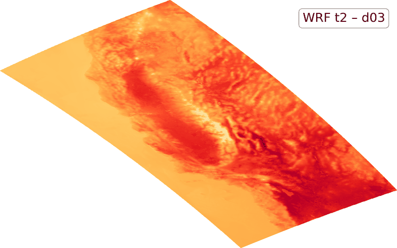
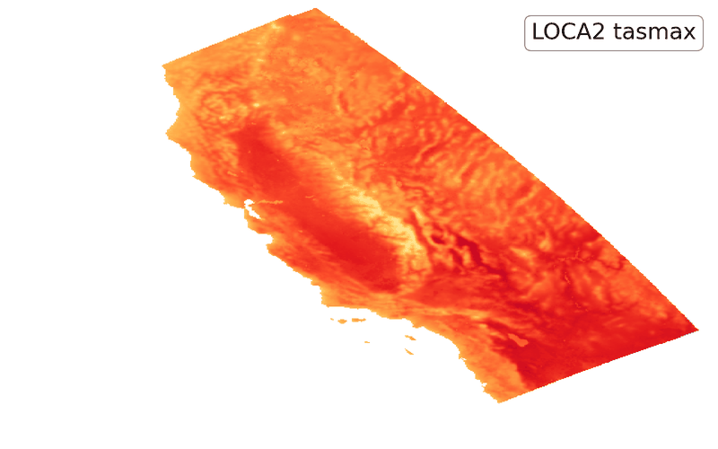
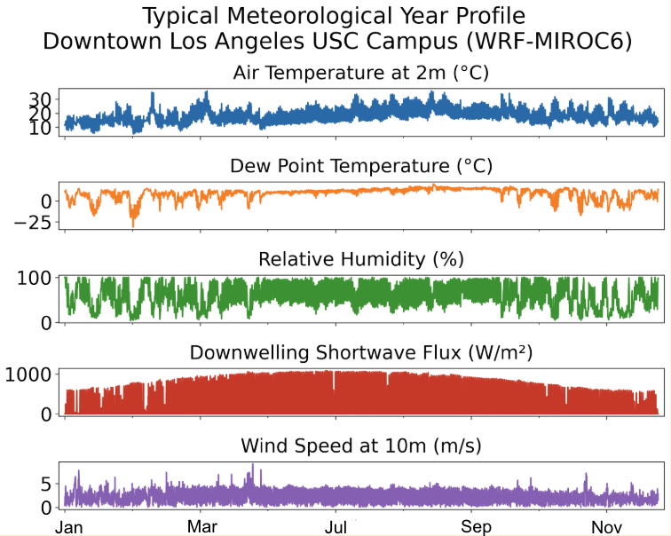
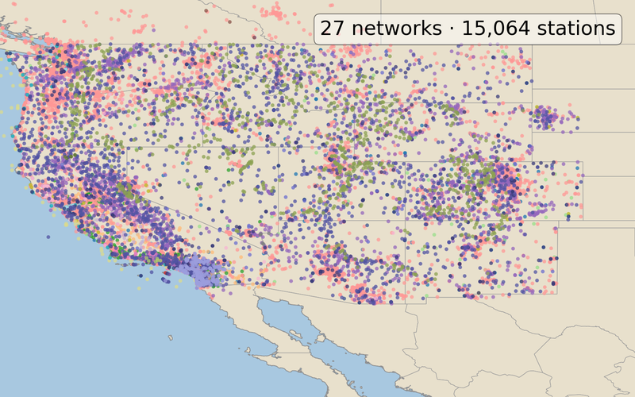
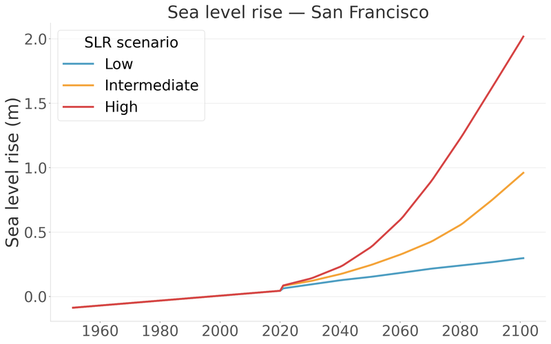
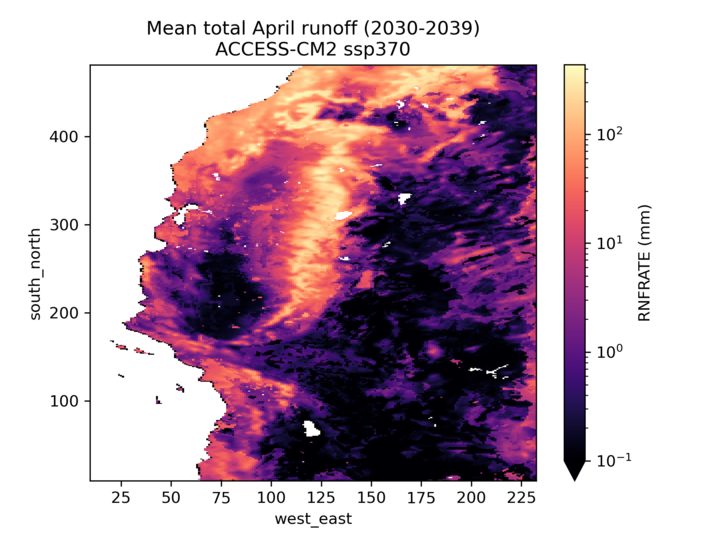
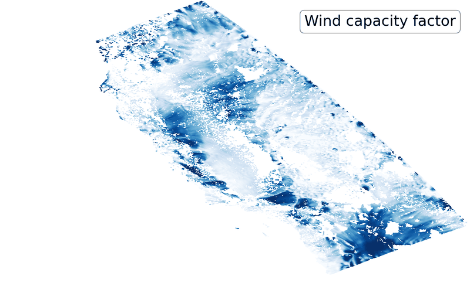

The Data Catalog is a searchable [STAC](https://stacspec.org/) (SpatioTemporal Asset Catalog) browser listing every dataset hosted on the Cal-Adapt: Analytics Engine. It's the best place to check what's available before you start pulling data: models, scenarios, variables, and spatial and temporal resolution, along with metadata for each collection.

Use the Data Catalog to:

- Browse available datasets by variable, scenario, model, or downscaling method
- View metadata describing each collection's spatial and temporal coverage
- Get direct links to the underlying Zarr and NetCDF stores referenced by [Access Methods](access-methods.qmd)

## Overview 

The Cal-Adapt: Analytics Engine hosts a variety of climate data with varying levels of support from our analytical tools. Many of these datasets have been converted to cloud-optimized formats, and all are publically available in our AWS S3 bucket. Below is a non-exhaustive summary of our highlighted datasets, including their source, download link, catalog link, description, and where to learn more.

## Climate Model Simulations

Downscaled climate projections produced for California's Fifth Climate Change Assessment, fully integrated into the Analytics Engine's Data Catalog and `climakitae` tooling. See the [Climate Model Simulations](data-documentation/climate-model-sims.qmd) page for full details on models, downscaling methods, and scenarios.

### WRF
{.dataset-thumb}

Description
:   8 unique models downscaled at 45 km, 9 km (WECC region), and 3 km (California) resolution. Primarily SSP3-7.0, with limited SSP2-4.5/SSP5-8.5 runs. Native hourly resolution, plus a WRF-ERA5 historical reanalysis.

Source
:   UCLA

Direct Download
:   [Amazon S3](https://cadcat.s3.amazonaws.com/index.html#wrf/ucla/)

Catalog Link
:   [STAC Browser](https://stac-browser.cal-adapt.org/#/collections/wrf-ucla)

Learn More
:   [Climate Model Simulations](data-documentation/climate-model-sims.qmd)

### LOCA2
{.dataset-thumb}

Description
:   15 unique models downscaled at 3 km resolution over California. Available for SSP2-4.5, SSP3-7.0, and SSP5-8.5. Bias-corrected for all models, at native daily resolution.

Source
:   Scripps Institution of Oceanography

Direct Download
:   [Amazon S3](https://cadcat.s3.amazonaws.com/index.html#loca2/ucsd/)

Catalog Link
:   [STAC Browser](https://stac-browser.cal-adapt.org/#/collections/loca2)

Learn More
:   [Climate Model Simulations](data-documentation/climate-model-sims.qmd)

## Climate Reanalysis Data

Description
:   ERA5 historical climate reanalysis dataset, dynamically downscaled at 45 km, 9 km (WECC region), and 3 km (California) resolution to match the WRF grid. Available at daily and hourly resolution. Provides an observationally-constrained historical reconstruction, useful for studying the historical record or specific meteorological events like heatwaves and droughts.

Source
:   UCLA (dynamically downscaled reanalysis)

Access
:   [Amazon S3](https://cadcat.s3.amazonaws.com/index.html#wrf/ucla/era5/)

Catalog Link
:   [STAC Browser](https://stac-browser.cal-adapt.org/#/collections/wrf-ucla)
:   Use the filtering option to select `source-id=era5`

Learn More
:   [Climate Model Simulations](data-documentation/climate-model-sims.qmd)

## Climate Profiles
{.dataset-thumb}

Description
:   Annualized hourly climate profiles at HadISD station locations, including Typical Meteorological Year, Standard Year, and Extreme Climate Profiles datasets.

Source
:   Cal Adapt

Direct Download
:   [Amazon S3](https://cadcat.s3.amazonaws.com/index.html#climate-profiles/)

Catalog Link
:   - Typical Meteorological Year: [STAC Browser](https://stac-browser.cal-adapt.org/#/collections/typical-met-year)
    - Standard Year: [STAC Browser](https://stac-browser.cal-adapt.org/#/collections/standard-year)
    - Shock XMY: coming soon!
    - Persistence XMY: coming soon!

Learn More
:   [Climate Profiles](/scientific-guidance/climate_profiles/index.qmd)

## Historic Weather Station Data
{.dataset-thumb}

Description
:   Historical weather stations for the WECC region (approx. 15k stations), including the HadISD stations. Covers 1980 to 2022 and includes multiple variables.

Source
:   Eagle Rock Analytics

Direct Download
:   [Amazon S3](https://cadcat.s3.amazonaws.com/index.html#histwxstns/)

Catalog Link
:   [STAC Browser](https://stac-browser.cal-adapt.org/#/collections/historical-data-platform)

Learn More
:   [About Climate Projections](/scientific-guidance/general-climate-guidance/about-climate-projections.qmd)

## Sea Level Rise
{.dataset-thumb}

Description
:   Hourly sea level rise projections generated for 13 tidal stations along the California coast and San Francisco Bay, covering 1950–2100.

Source
:   Scripps Institution of Oceanography, U.C. San Diego

Direct Download
:   [Amazon S3](https://cadcat.s3.amazonaws.com/index.html#hmet/)

Catalog Link
:   [STAC Browser](https://stac-browser.cal-adapt.org/#/collections/sea-level-projections)

Learn More
:   [CEC Hourly Sea Level Projections Data Adoption Justification Memo](https://www.energy.ca.gov/sites/default/files/2024-09/06_HourlySeaLevelProjections_DataJustificationMemo_Iacobellis_Adopted_v2_ada.pdf)

## Hydrologic Data
{.dataset-thumb}

Description
:   UCLA-generated daily hydrology data from VIC and NOAH-MP, forced with a subset of LOCA2-Hybrid and four non-bias-corrected WRF dynamically downscaled datasets.

Source
:   NOAH-MP and VIC models

Direct Download
:   - NOAH-MP: [Amazon S3](https://wrf-cmip6-noversioning.s3.amazonaws.com/index.html#ben_temp/d03_3km/CEC/2_NOAH_MP_SIMULATIONS/)
    - VIC: [Amazon S3](https://wrf-cmip6-noversioning.s3.amazonaws.com/index.html#lusu/CEC/VIC_SIMULATIONS/GCMs/)

Catalog Link
:   This dataset is not currently integrated into our catalog

Learn More
:   [CEC Hydrology Projections Data Adoption Justification Memo](https://www.energy.ca.gov/sites/default/files/2025-04/05_HydrologyProjections_DataJustificationMemo_BassEtAl_Adopted_v3_ada.pdf)

## Renewable Energy Profiles
{.dataset-thumb}

Description
:   Monthly counts of solar and wind resource drought days from CMIP6-driven WRF simulations, computed with NREL generation models under SSP3-7.0.

Source
:   Eagle Rock Analytics

Direct Download
:   [Amazon S3](https://wfclimres.s3.amazonaws.com/index.html#era/)

Catalog Link
:   - Wind power generation profiles: [STAC Browser](https://stac-browser.cal-adapt.org/#/collections/wind-generation)
    - Photovoltaic power generation profiles: [STAC Browser](https://stac-browser.cal-adapt.org/#/collections/pv-generation)
