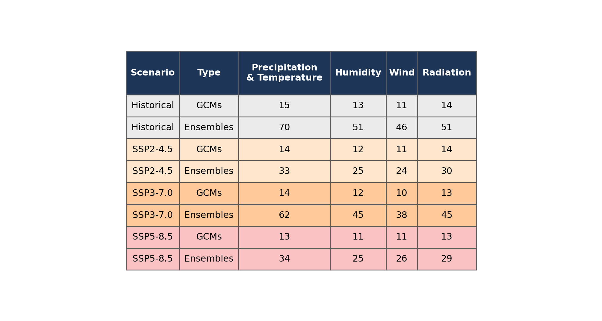
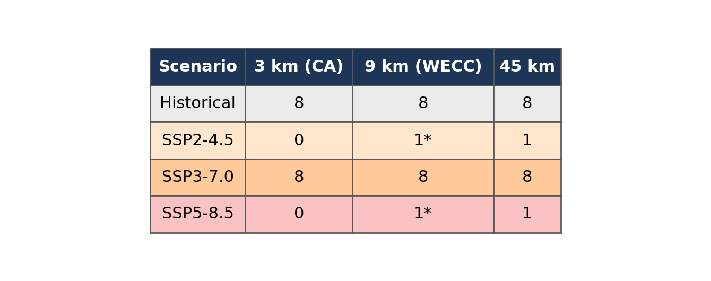
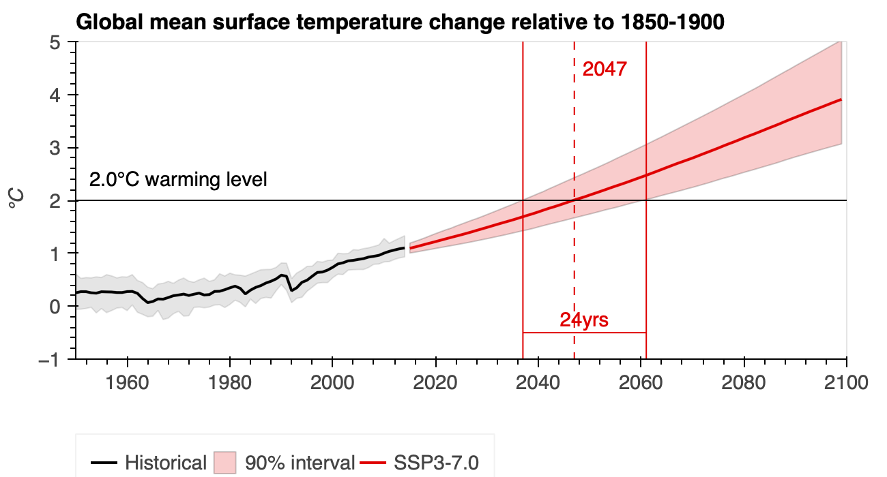
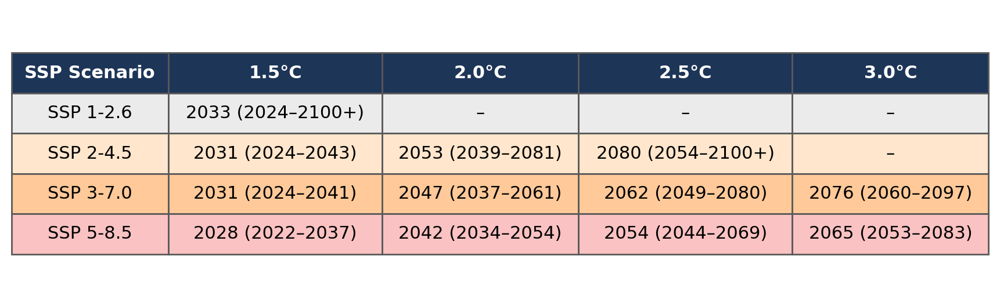

## Available Climate Data

The Analytics Engine hosts downscaled climate change projections and related data, much of which was generated for California's Fifth Climate Change Assessment. The derived projections were created using two methods: 1) dynamical downscaling and 2) hybrid-statistical downscaling, with coarse resolution data available for western North America and the finest scale (3 km) available over California. Both methods were applied to outputs of global climate models (GCMs) from CMIP6 (Coupled Model Intercomparison Project Phase 6). For more detailed information on available datasets, visit our [Data Catalog](../data-catalog.qmd).

California academic institutions implement dynamical and hybrid-statistical downscaling methods in support of California Energy Commission (CEC) initiatives. The dynamical downscaling data developed at UCLA utilized the Weather Research & Forecasting Model (WRF). This method created several physically-based projections that are available for public use and Analytics Engine use. This dynamically downscaled data was then used to train the Localized Construct Analogs (LOCA2-Hybrid) at Scripps Institution of Oceanography. The LOCA2-Hybrid hybrid-statistical datasets are bias-corrected GCM outputs that are adjusted to be consistent with station observations. WRF and LOCA2-Hybrid downscaled datasets differ in the number of GCMs, variables, temporal resolution, and [Shared Socioeconomic Pathways](/glossary/index.qmd#shared-socioeconomic-pathways) (SSPs) that are included. Depending on the analysis desired, one data set might be preferred; for more information on climate projections and models, check out our [Guidance](/scientific-guidance/general-climate-guidance/about-climate-projections.qmd) page.

A summary of the datasets hosted on the Analytics Engine is listed in the [Data Catalog](../data-catalog.qmd); for more information on how to access these datasets, see the [Accessing Data](../access-methods.qmd) section. For additional details on Dynamical versus Statistical downscaling approaches, see the California Climate Change Assessment Justification Memos, as well as our forthcoming About Climate Models and Data and [Glossary](/glossary/index.qmd) of Terms sections. To understand how to use WRF and LOCA2-Hybrid data to answer application-specific questions for decision-making and planning purposes, refer to our [Guidance on Using Climate Data in Decision-Making](/scientific-guidance/general-climate-guidance/using-climate-projections.qmd) section. For further information on these introductory comments, refer to:

- Carbon Brief's Q&A: How do climate models work? [@carbonbrief-climate-models-2018]
- Climate Data and Analytics Working Group ([C-DAWG](https://www.energy.ca.gov/programs-and-topics/topics/research-and-development/climate-data-and-analysis-working-group-c-dawg))
  - 01 - Bias Correction in the WRF and LOCA2-Hybrid Projections [@pierce-bias-correction-2023]
  - 02 - Dynamical Downscaling using WRF [@rahimi-data-justification-2024]
  - 03 - LOCA2-Hybrid (for California) - Training Data [@pierce-locav2-training-data-2023]
  - 04 - Hybrid Downscaling [@pierce-locav2-2023]
  - 05 - Hydrology Projections [@bass-justification-memo-2024]
  - 06 - Hourly Sea Level Projections from CMIP6 climate and weather [@cayan-adoption-memo-2024]

## Models, Downscaling Methods, and Scenarios

The data available on the Analytics Engine were identified and selected through a rigorous skill evaluation process based on the parent GCM's ability to capture several critical aspects of California climate characteristics. These models were then downscaled via different complex techniques for California. The GCM selection process is described in more detail in Kranz et al. 2021 [@kranz-memorandum-2021].

### Global Climate Models
Various CMIP6 GCMs are available, each of which may be used to explore possible future climate projections with built-in assumptions, methodologies, and limitations. We recommend, where possible, using as many GCMs in your workflows in order to capture the full range of possibilities.

### Downscaling Methods
Downscaled data is available via two methods:

- Downscaled by UCLA using a dynamical method with the Weather Research and Forecasting model (WRF)
- Downscaled by Scripps Institution of Oceanography using a hybrid-statistical downscaling method, Localized Constructed Analogs version 2 (LOCA2-Hybrid)

The table below summarizes the underlying data created by each institution, including the number of models available, spatial resolution, scenario (SSP) coverage, bias correction status, and native temporal resolution:

| | Dynamically Downscaled (WRF) | Hybrid-Statistically Downscaled (LOCA2-Hybrid) |
|---|---|---|
| Institution | UCLA | Scripps Institution of Oceanography |
| Models | 8 unique models | 15 unique models |
| Spatial resolution | 45 km, 9 km (WECC region), 3 km (CA) | 3 km (CA) |
| Scenarios (SSPs) | SSP3-7.0 (primary); limited SSP2-4.5/SSP5-8.5 runs — see @tbl-wrf-projections | SSP2-4.5, SSP3-7.0, SSP5-8.5 |
| Bias correction* | A priori: EC-Earth3, EC-Earth3-Veg, MIROC6, TaiESM1, MPI-ESM1-2-HR. Other models are not bias-corrected. | All 15 models |
| Native temporal resolution | Hourly | Daily |
| Reanalysis dataset | WRF-ERA5 historical reconstruction (45 km, 9 km, 3 km; daily and hourly) | None |

: Comparison of the dynamically downscaled (WRF) and hybrid-statistically downscaled (LOCA2-Hybrid) data foundations. Other pre-aggregated daily and monthly datasets are also available; see the [Data Catalog](../data-catalog.qmd) for the full listing. {#tbl-data-foundation .striped}

\* Details of the bias correction method are available in the Data Adoption Justification Memo [@pierce-bias-correction-2023].

**WRF models (8):**

- CESM2
- CNRM-ESM2-1
- EC-Earth3
- EC-Earth3-Veg
- FGOALS-g3
- MIROC6
- MPI-ESM1-2-HR
- TaiESM1

**LOCA2-Hybrid models (15):**

- ACCESS-CM2
- CESM2-LENS
- CNRM-ESM2-1
- EC-Earth3
- EC-Earth3-Veg
- FGOALS-g3
- GFDL-ESM4
- HadGEM-GC31-LL
- INM-CM5-0
- IPSL-CM6A-LR
- KACE-1-0-G
- MIROC
- MPI-ESM1-2-HR
- MRI-ESM2-0
- TaiESM1

### Spatial Resolution
See @tbl-data-foundation for which spatial resolutions are available for each downscaling method. Of particular note is the nuance that the 3km data is not "just" a narrowing of projections data but a qualitatively more accurate representation of the data than the 45km.

For both georeferenced raster data (such as LOCA2-Hybrid) and WRF data, the coordinate pair (latitude and longitude) represents the center point of the grid cell.

### Shared Scenario Pathways
Various Shared Scenario Pathways (SSPs) representing global emissions trajectories from intermediate to higher trajectories are available on the Analytics Engine (see @tbl-data-foundation for which scenarios are available for each downscaling method). SSP2-4.5, SSP3-7.0, and SSP5-8.5 each represent a combination of narratives (2, 3, and 5) and Representative Concentration Pathways (RCP) (4.5, 7.0, and 8.5). For example, SSP2-4.5 utilizes the SSP 2 narrative and RCP 4.5.

### Data Availability by Variable and Scenario

Not every model, ensemble member, or variable is available for every scenario. The tables below summarize what is available for each downscaling method; for the full, searchable listing of individual datasets, see the [Data Catalog](../data-catalog.qmd).

#### LOCA2-Hybrid

LOCA2-Hybrid data is available for 15 GCMs with a total of 199 ensemble runs, downscaled at a native daily resolution (a pre-aggregated monthly version is also available). For each scenario, **GCMs** is the count of models that were downscaled with that variable in at least one ensemble run, and **Ensembles** is the count of ensemble runs containing that variable. Variables within each group below always share identical availability:

::: {#tbl-loca2-availability}
::: {.content-visible when-format="html"}
```{=html}
<div class="figure-container">

</div>
```
:::
::: {.content-visible when-format="pdf"}

:::
LOCA2-Hybrid data availability by variable group and scenario, colored by scenario.
:::

**Precipitation & Temperature:**

- Precipitation (total) (`pr`)
- Maximum air temperature at 2m (`tasmax`)
- Minimum air temperature at 2m (`tasmin`)

**Humidity:**

- Specific humidity at 2m (`huss`)
- Maximum relative humidity (`hursmax`)
- Minimum relative humidity (`hursmin`)

**Wind:**

- Wind speed at 10m (`wspeed`)
- West-East component of Wind at 10m (`uas`)
- North-South component of Wind at 10m (`vas`)

**Radiation:**

- Shortwave flux at the surface (`rsds`)

#### WRF

There are two kinds of WRF simulations: **projections simulations**, downscaled from GCMs for a given emissions scenario and spatial resolution, and **reanalysis simulations**, a downscaled run of the ERA5 reanalysis dataset providing an observationally-constrained historical reconstruction (see @tbl-data-foundation). The table below covers projections simulations only.

WRF data is available for 8 GCMs with 1 ensemble run per emissions scenario, downscaled at a native hourly resolution; simulation counts are identical whether accessed at native hourly or pre-aggregated daily resolution, with the latter available for four of the WRF simulations:

::: {#tbl-wrf-projections}
::: {.content-visible when-format="html"}
```{=html}
<div class="figure-container">

</div>
```
:::
::: {.content-visible when-format="pdf"}

:::
Number of WRF projection simulations available by scenario and spatial resolution, colored by scenario.
:::

\* Additional simulations from CESM2 for SSP2-4.5 and SSP5-8.5 at 9 km resolution are part of the larger suite of dynamically downscaled GCMs by UCLA, of which the CEC-supported simulations are a subset; see [more information here](https://dept.atmos.ucla.edu/alexhall/downscaling-cmip6).

## Coordinate Reference Systems and Grid Conventions

### WRF Data
The CRS for WRF data on the Analytics Engine is Lambert Conformal Conic, a common projection used with WRF. WRF datasets include a `grid_mapping` attribute that references a `Lambert_Conformal` coordinate variable, which contains the full projection details. The WRF data is not identified by a standard EPSG code or datum because the WRF projection is based on a spherical Earth. For more information on WRF projections, see [this blog post](https://fabienmaussion.info/2018/01/06/wrf-projection/).

### LOCA2-Hybrid Data
The CRS for LOCA2-Hybrid data on the Analytics Engine is WGS84 (World Geodetic System 1984), a standard geographic coordinate system. Unlike WRF, LOCA2-Hybrid datasets do not include a `grid_mapping` attribute. Instead, CRS information is stored in a `spatial_ref` coordinate variable at the global level, which contains the full coordinate system details including the WGS84 datum.

## Dataset Definitions and Use

### Downscaled simulations of California's climate
The climate projections hosted on the Cal-Adapt: Analytics Engine are regional simulations over the Western United States and California, produced by downscaling Global Climate Models (GCM) from the sixth iteration of the Climate Model Intercomparison Project (CMIP6). These downscaled simulations were created in support of California's Fifth Climate Change Assessment, and detailed information about the models used and the data produced can be found in the [Data Catalog](../data-catalog.qmd).

### Additional data sources for calculating data on Global Warming Levels
When using the Analytics Engine to calculate climate variables at global warming levels, data from two additional sources are utilized in the calculations: the CMIP6 archive hosted by Pangeo, and data from the IPCC AR6 Report. A detailed methodology of how this data is used will be included in an upcoming section "How California-focused Warming Level Time Series are Calculated", and additional guidance on how to incorporate global warming levels into planning is given in [Global Warming Levels](/scientific-guidance/global-warming-levels.qmd).

### Warming level years from global GCM runs
Global warming levels are defined as the average increase in global surface air temperature relative to pre-industrial conditions (1850-1900). Combining data from several climate simulations around the years that each one reaches specified global warming levels provides a clear standard of measuring how regional impacts will scale with different levels of global warming. Because the WRF and LOCA2-Hybrid simulations in the Analytics Engine are run only over the Western US they can not be used to evaluate global temperature, so data from the parent GCM simulations is used to determine the range of years from each simulation that corresponds to a given global warming level.

For this calculation, the Analytics Engine utilizes a publicly available archive of CMIP6 simulations hosted on AWS by the Pangeo project.

### GWL timing for scenarios overall
One of the benefits of analyzing projections of climate change on global warming levels is that years for warming level estimates can be estimated independently from the trajectories of the GCMs themselves. This is particularly beneficial because the CMIP6 models are known to have a much wider range in their climate sensitivity, which introduces significant uncertainty into estimates of when each warming level will be reached.

Because of this, the Intergovernmental Panel on Climate Change (IPCC) draws in data from a variety of other scientific studies including observational constraints and climate emulators to produce a refined estimate of likely warming trajectories under each climate scenario. Details about the inputs to these likely trajectories are described in the 4th chapter of IPCC Sixth Assessment Report (AR6), and an overview of the resulting best estimates and ranges are provided in the Technical Summary.

When using warming levels, the Analytics Engine provides estimates for the crossing year and very likely range (90% confidence interval) based on the publicly available data used in the IPCC report.

::: {#fig-warming-trajectory-2c}
::: {.content-visible when-format="html"}
```{=html}
<div class="figure-container">

</div>
```
:::
::: {.content-visible when-format="pdf"}

:::
Best estimate and 90% confidence interval for the year the world will reach 2.0 °C of warming under the SSP 3-7.0 scenario. The median year of crossing is denoted by the vertical dashed line and is provided. The solid lines represent the first and last occurrence of the 5th and 95th percentiles crossing the designated warming level, with the range in years provided. For example, the median year of GCMs reaching 2.0°C of warming is in 2047, with a range of 24 years between the first and last occurrence. Figure produced by the Cal-Adapt: Analytics Engine based on data from the IPCC.
:::

::: {#tbl-gwl-year-exceedance}
::: {.content-visible when-format="html"}
```{=html}
<div class="figure-container">

</div>
```
:::
::: {.content-visible when-format="pdf"}

:::
Best estimate (with 90% very likely range in parentheses) for the year each SSP scenario reaches a given global warming level, colored by scenario. Summarized from data from the IPCC.
:::

For more information on fetching global warming level data in the Analytics Engine, or how California-focused warming level data is calculated, check out our [Global Warming Levels](/scientific-guidance/global-warming-levels.qmd) page.

## Additional Data

In addition to hosting dynamical and hybrid-statistical downscaled climate datasets, the Analytics Engine also hosts vector datasets containing administrative boundaries, hydrologic boundaries, and key regions of interest to the energy sector. Within the Jupyter notebooks available on the Analytics Engine, the below vector datasets can be used to select, view, aggregate, and summarize climate data for a geography of interest:

- California counties
- Watersheds (HUC10)
- California Electricity Demand Forecast Zones
- California Electric Balancing Authority Areas
- Investor- and public-owned electrical utility service territories
- State boundaries

## Derived Variables and Indices

In addition to the climate variables available on the Analytics Engine, several derived variables and indices may be of interest. From a computation standpoint, there is no difference between a derived variable and an index in their construction-- they both calculate a new variable based on input variables. However, an index usually has a "next step of interpretation" (e.g. a public safety warning may be issued when Heat Index exceeds 80°F). A derived variable expands the available variable list beyond the native variables within the data.

### Derived Variables

Specific Humidity
:   The amount of water vapor within a unit amount of air. Specific humidity is only computed for hourly WRF data; LOCA2-Hybrid provides specific humidity directly.

Heating & Cooling Degree Days
:   A measure of how cold or warm a location is in reference to a standard temperature.

    - Heating degree days are indicative of how much lower the ambient temperature is from the standard temperature
    - Cooling degree days are indicative of how much higher the temperature is above the threshold temperature. A common standard temperature threshold for heating/cooling degree days is 65°F.

Heating & Cooling Degree Hours
:   Similar to heating and cooling degree days, heating and cooling degree hours represent the number of hours in each day by how warm or cold a location is in reference to a standard temperature threshold.

    - Heating degree hours are the number of hours that are lower than the reference temperature threshold
    - Cooling degree hours are the number of hours that are higher than the reference temperature threshold.

### Derived Indices

Effective Temperature
:   A comparison measure of the current day's air temperature and the day prior in order to consider consumer behavior and perception of the weather. Calculated by taking half of the prior day's temperature added to half of the current day's temperature.

NOAA Heat Index
:   A measure of how hot weather "actually feels" on the body by accounting for air temperature and humidity.

Fosberg Fire Weather Index
:   Provides a quantitative assessment of weather impacts on fire management.

### Accessing Derived Variables

| Variable | Available in climakitae? | Variable Name |
|---|---|---|
| Specific Humidity | Yes | `specific_humidity_2m` |
| Heating Degree Days | Yes | `HDD_wrf`, `HDD_loca` |
| Cooling Degree Days | Yes | `CDD_wrf`, `CDD_loca` |
| NOAA Heat Index | Yes | `heat_index` |
| Fosberg Fire Weather Index | Yes | `fosberg_fire_weather_index` |
| Heating & Cooling Degree Hours | No | — |
| Effective Temperature | No | — |

: Availability of derived variables and indices in `climakitae`. {#tbl-derived-variables .striped}

For variables and indicies that are not yet available in `climakitae` -- including ones that are specific to your use case and not listed above-- you can use the methods outlined in the [`derived_variables_demo.ipynb`](https://github.com/cal-adapt/cae-notebooks/blob/main/derived_variables_demo.ipynb) notebook to easily compute your own variables using `climakitae`. 

## Historical Model Data

The Analytics Engine provides two types of downscaled data in the historical climate period (1980-2014): reanalysis datasets and global climate model historical runs. Although they appear similar, each dataset has a unique use within a planning context.

The differences between these historical datasets are explored in the historical climate data comparisons notebook.

### Reanalysis datasets

Reanalysis products are reconstructions of the historical weather record that combine model data with historical observational data. Reanalysis products synthesize disparate sources of observational data and use an atmospheric model to produce a spatiotemporally continuous, self-consistent dataset, avoiding the gaps and data collection inconsistencies in weather station data. Like a climate model, reanalysis products have a complete set of atmospheric and surface weather variables on a full spatial grid. This quality makes reanalysis an essential tool for climate scientists when evaluating and bias correcting climate model simulations.

The Analytics Engine contains data from the ERA5 reanalysis dataset that has been dynamically downscaled to 3km resolution over California. This dataset allows users to study the historical record or specific meteorological events like heatwaves and droughts.

### Historical runs from Global Climate models

Historical runs of Global Climate Models (GCMs) are simulations that use the historical record of greenhouse gas concentrations as inputs. Using combined simulations of the atmosphere, ocean, and land surface, GCMs produce a physically consistent timeline of plausible climate conditions over the historical period. Unlike reanalysis data, these simulations do not reproduce specific events from the historical record, but instead represent the general conditions during that time period.

Each simulation from a climate model produces unique weather events and represents the internal variability of the climate system slightly differently. When climate models are used to simulate future conditions, this variability between realizations can help determine the range of potential future realities. When climate models are run over the historical period, the variability across model realizations represents the range of possible conditions that could have occurred.

When calculating change signals between the past and future climate, the historical data from GCM runs provides an essential baseline to characterize climate change in each model. Because each climate model has a unique physical representation of the world, climate change signals are the most accurate when calculated relative to the historical period of the same climate model.

The Analytics Engine contains simulations over the historical period for all of the dynamically (WRF) and statistically (LOCA2) downscaled climate simulations. Because the latest generation of underlying GCMs were run starting in 2016, the historical period for models in the Analytics Engine runs through 2014, after which the simulations split into estimated future scenarios. The WRF simulations have a historical period of 1980-2014, and the LOCA2 historical simulations extend from 1950-2014.

::: {.callout-note title="A note on comparing reanalysis with historical climate simulations"}
To evaluate how well climate models represent particular features of the climate, it can be very useful to compare historical climate simulations to reanalysis. When making these comparisons, it is important to remember that the climate model data will not match the year-to-year historical record in the reanalysis data. Instead, comparisons should be made by aggregating data over a sufficiently long time period (typically at least 30 years) that samples the range of the climate's natural variability.
:::

## Leap Years

GCMs come in a variety of calendars for handling the time dimension, including: 

- "fixed 365 day" (no leap days)
- "proleptic Gregorian" (leap days)
- "fixed 360 day" (every month has 30 days)

Depending on your analysis, you may wish to either keep or remove leap days for consistency with best practices. For example, in bias adjustment localization, leap days should be removed.

In the WRF models:

- **No leap days**: `CESM2`, `FGOALS-g3`, `TaiESM1`
- **Leap days**: `EC-Earth3-Veg`, `CNRM-ESM2-1`, `EC-Earth3`, `MIROC6`, and `MPI-ESM1-2-HR`

In the LOCA2-Hybrid models, all models were interpolated to include leap days if the parent GCM did not natively retain leap days. For more information on leap days in the LOCA2-Hybrid models, please see this [blog post](https://loca.ucsd.edu/loca-calendar/).

## Data Credibility

All of the downscaled data available on the Analytics Engine comes from models that have undergone rigorous skill evaluation in terms of how well they capture specific relevant characteristics of California's climate. These models perform well for both process-based and local climate metrics [@rahimi-data-justification-2024] and are able to simulate key physical processes and patterns that strongly influence the hydrological cycle and extreme weather in California. They are also able to capture local climatic patterns such as annual and seasonal temperature and precipitation patterns. This state-level model evaluation and assessment, described by Kranz et al. 2021 [@kranz-memorandum-2021], is unique to California and lends credibility to the data hosted on the Cal-Adapt: Analytics Engine.

Although all the models on the Analytics Engine are skilled at representing California's climate, not all models perform equally well for any specific sub-region within California or for any given metric - particularly ones that the models were not specifically evaluated for. Therefore, the Analytics Engine also provides tools and guidance (see the forthcoming Guidance section) to help a user conduct additional, context-specific credibility analyses, such as examining the skill of the data or models for their specific region, metric, and/or application.


## Relative Humidity Bias

The downscaled climate models (both WRF and LOCA2-Hybrid) produced for California's Fifth Climate Change Assessment, which is available through the Cal-Adapt: Analytics Engine, originates from an international scientific endeavor called CMIP6. The GCMs comprising CMIP6 are projecting more near surface moisture than has previously been observed and measured. In essence, this higher near surface moisture may be translating to higher relative humidity and water vapor in the downscaled climate information for the Fifth Climate Change Assessment. 

Given this systematic issue, it is believed that future predictions of climate will likely also predict more near surface moisture than is likely to occur. Here, we briefly describe the key problems with the models, provide user guidance as to how to use the information as is, and discuss how the Cal-Adapt team will be responding to this issue.

### Key Scientific Issues

- In recent years as the climate has warmed, measurements of water vapor and relative humidity across the Southwestern United States have held relatively constant or even slightly declined over time. Climate models run over the recent past have however projected that water vapor content would have increased instead. This suggests that models are failing to properly resolve the historical hydroclimate of the Southwestern United States, including the inland area of California.
- Climate models project a continued increase in the amount of atmospheric water vapor in coming decades as the Earth warms. It's unclear if this will actually happen. Scientists are concerned that climate models are over-estimating the amount of water vapor in future years.
- Model errors are largest in more arid regions, and tend to be greatest in the dry / hot season.
- An over-estimation of water vapor has impacts to California's energy systems, especially if models contain too much moisture, predictions of wildfire may underrepresent the frequency and intensity of fires. Predictions of measures of heat impacts which include variables like relative humidity (such as heat index or apparent temperature) may overstate the heat impact.

**Key Citation:** Simpson et al. 2024 [@simpsonObserved2024]

### User Guidance

- Downscaled GCM data contained in the Fifth Climate Change Assessment should not be used for wildfire modeling efforts.
- Bias adjustment of data is suggested before use for quantitative assessments conducting a climatology evaluation using historical data is a crucial first step to characterize potential issues with water vapor in projections.
- Downscaled GCM data can continue to be used for evaluations of extreme heat, given that the heat index calculation response curve is relatively insensitive to a 4% offset of humidity in typical heat events in California.

### How Cal-Adapt is Responding

- We will perform an evaluation of the impact of this modeling issue, specifically on evaluations of extreme heat.
- The role of bias adjustment on potential bias will be quantified and described.
- We will make recommendations for how this information should be used, and potentially provide approaches to correct the issues.
- We will publicly share our findings, recommendations, and potential approaches by listing them on the Cal-Adapt: Analytics Engine Website, Guidance Materials, and where appropriate, incorporate into the Jupyter Notebooks and `climakitae` package.

### How To Get Further Help
Energy sector partners may contact analytics@cal-adapt.org for further information and support in using these projections. Non-energy sector users should contact the Governor's Office of Land Use and Climate Innovation for climate services.


## External and Private Data

Users are provided with a private directory space in the JupyterHub as a workspace associated with their account. Users retain this workspace between sessions, and any data uploaded to the workspace is inaccessible to other users.

## Contributing Data

The Analytics Engine team welcomes users to submit data for consideration for inclusion in the [Data Catalog](../data-catalog.qmd). Users may also request the addition of external datasets to the platform for use in the cloud computing environment. These requests will be considered on a case-by-case basis depending on size, quality, and relationship to other funded work. All datasets must comply with CF conventions, as outlined in our [Metadata Standards](metadata-standards.qmd). Please submit requests via email to analytics@cal-adapt.org.
