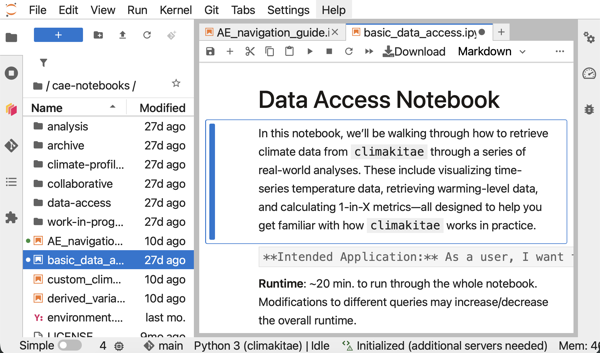
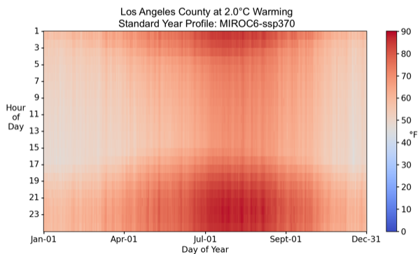
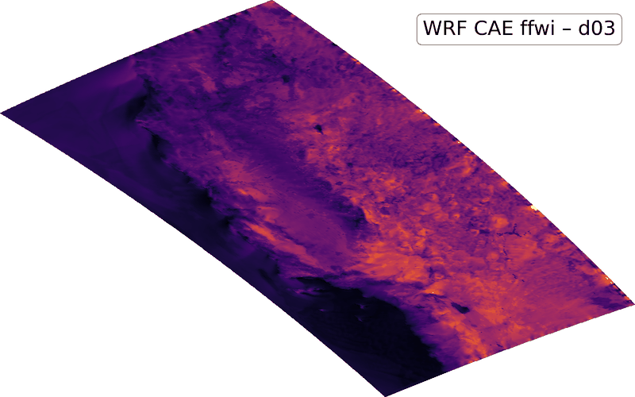
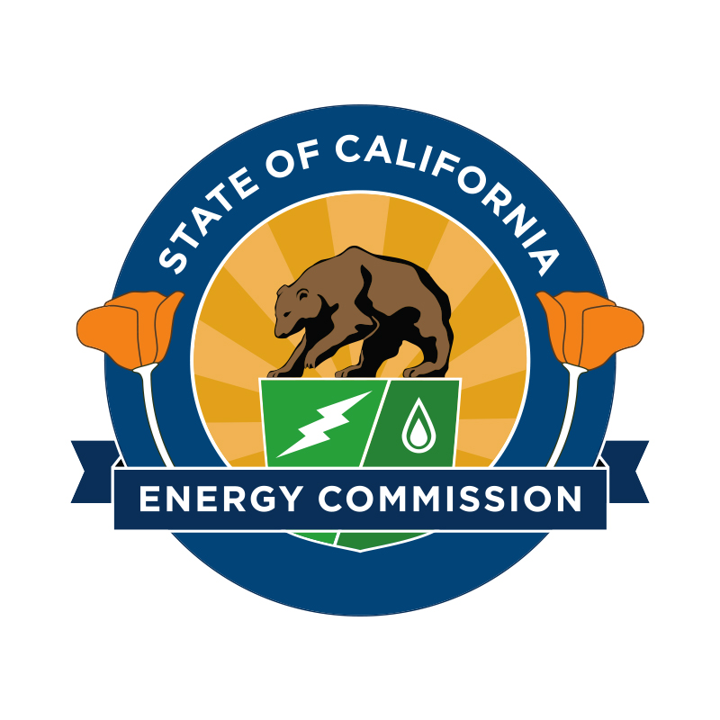
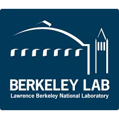
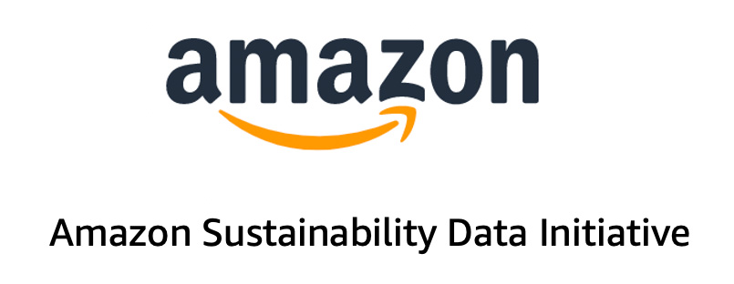
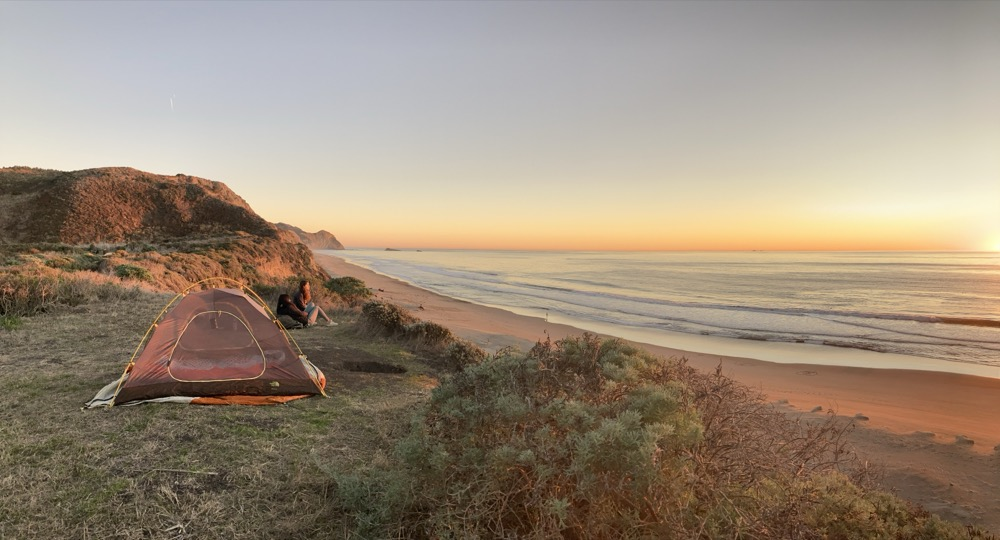
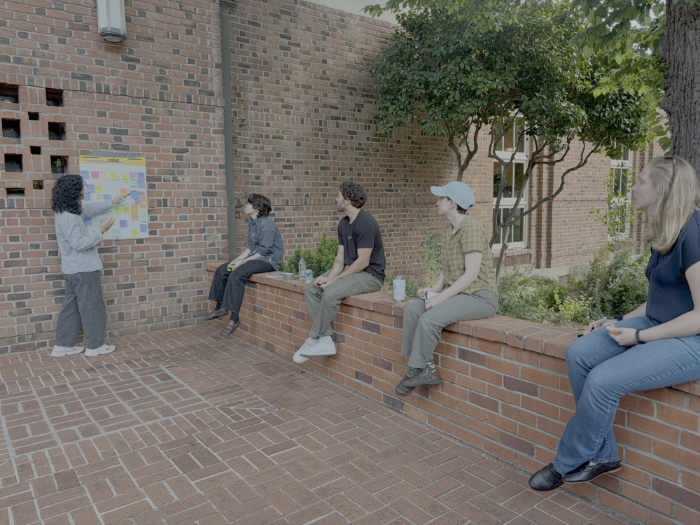
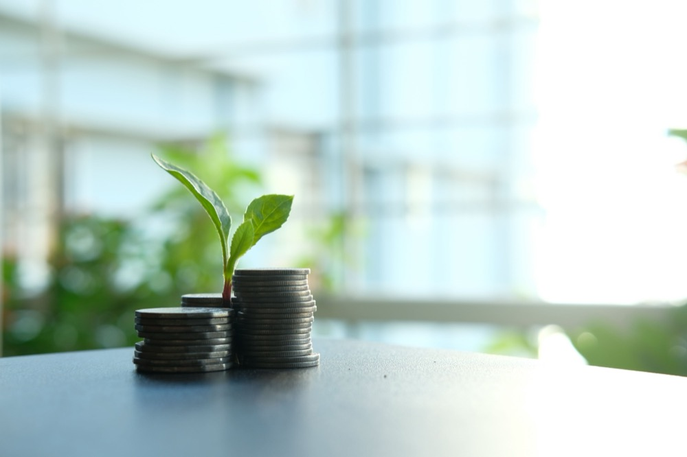

## Science-backed guidance you can trust

Climate projections are powerful, but they need interpretation. Our guidance bridges the gap between raw data and real-world decisions.

:::: {.grid .mt-3}

::: {.g-col-12 .g-col-md-6 .g-col-lg-4 .info-card}
<i class="bi bi-patch-check-fill"></i>

**Grounded in peer reviewed research**

Derived from California's Fifth Climate Change Assessment and validated by leading climate scientists.
:::

::: {.g-col-12 .g-col-md-6 .g-col-lg-4 .info-card}
<i class="bi bi-people-fill"></i>

**Co-produced with users**

Developed alongside practitioners, planners, and decision makers.
:::

::: {.g-col-12 .g-col-md-6 .g-col-lg-4 .info-card}
<i class="bi bi-signpost-fill"></i>

**Actionable, not prescriptive**

Presents options and frameworks to help you make the decisions.
:::

::: {.g-col-12 .g-col-md-6 .g-col-lg-4 .info-card}
<i class="bi bi-unlock-fill"></i>

**Publicly accessible**

Part of California's commitment to climate transparency.
:::

::: {.g-col-12 .g-col-md-6 .g-col-lg-4 .info-card}
<i class="bi bi-arrow-repeat"></i>

**Continuously evolving**

Updated with new research, user feedback, and emerging climate impacts.
:::

::: {.g-col-12 .g-col-md-6 .g-col-lg-4 .info-card}
<i class="bi bi-link-45deg"></i>

**Partners and related resources**

- [California Climate Change Assessment](https://lci.ca.gov/climate/icarp/climate-assessment/)
- [California Energy Commission](https://www.energy.ca.gov/)
- [Amazon Sustainability](https://sustainability.aboutamazon.com/)
:::

::::

## Latest updates

Stay informed about new data, guidance, and features.

:::{#latest-updates}
:::

## Explore our resources

Choose the right topic for your needs.

```{=html}
<div class="resource-explorer">
  <div class="resource-carousel-wrap">
    <button type="button" class="resource-arrow resource-arrow-prev" aria-label="Previous resource"><i class="bi bi-chevron-left" aria-hidden="true"></i></button>
    <div class="resource-carousel" role="region" aria-label="Resources carousel">
      <a id="resource-analytics" href="data-tools/analytics-engine-hub.html" class="resource-card">
        <div class="resource-card-thumb"></div>
        <div class="resource-card-body">
          <h4>Analytics Engine JupyterHub</h4>
          <p>For users with access, log in to the JupyterHub for easy cloud-based access to our data and notebooks. Perform custom analysis without downloading massive files.</p>
        </div>
      </a>
      <a id="resource-profiles" href="scientific-guidance/climate_profiles/" class="resource-card">
        <div class="resource-card-thumb"></div>
        <div class="resource-card-body">
          <h4>Climate Profiles</h4>
          <p>Pre-built hourly climate-year datasets for engineering and planning, built from future climate projections at California locations.</p>
        </div>
      </a>
      <a id="resource-catalog" href="data-tools/data-catalog.html" class="resource-card">
        <div class="resource-card-thumb"></div>
        <div class="resource-card-body">
          <h4>Data Catalog</h4>
          <p>Learn about the data hosted on Cal-Adapt and how you can access it.</p>
        </div>
      </a>
      <a id="resource-library" href="general-resources/reference-library.html" class="resource-card">
        <div class="resource-card-thumb"></div>
        <div class="resource-card-body">
          <h4>Reference Library</h4>
          <p>Find citable Cal-Adapt guidance materials written by climate experts.</p>
        </div>
      </a>
      <a id="resource-python-tools" href="data-tools/python-tools.html" class="resource-card">
        <div class="resource-card-thumb"></div>
        <div class="resource-card-body">
          <h4>Analytics Engine Python Tools</h4>
          <p>Reproducible code examples and workflows available on GitHub. Learn how to work with climate data and adapt tools to your needs.</p>
        </div>
      </a>
    </div>
    <button type="button" class="resource-arrow resource-arrow-next" aria-label="Next resource"><i class="bi bi-chevron-right" aria-hidden="true"></i></button>
  </div>
</div>

<script>
(function () {
  var carousel = document.querySelector('.resource-carousel');
  var prevBtn = document.querySelector('.resource-arrow-prev');
  var nextBtn = document.querySelector('.resource-arrow-next');

  function scrollByCard(direction) {
    var card = carousel.querySelector('.resource-card');
    var distance = card ? card.getBoundingClientRect().width + 20 : 320;
    carousel.scrollBy({ left: direction * distance, behavior: 'smooth' });
  }

  function updateArrows() {
    var maxScroll = carousel.scrollWidth - carousel.clientWidth - 1;
    prevBtn.disabled = carousel.scrollLeft <= 0;
    nextBtn.disabled = carousel.scrollLeft >= maxScroll;
  }

  prevBtn.addEventListener('click', function () { scrollByCard(-1); });
  nextBtn.addEventListener('click', function () { scrollByCard(1); });
  carousel.addEventListener('scroll', updateArrows);
  window.addEventListener('resize', updateArrows);
  updateArrows();
})();
</script>
```

## Built on trust and collaboration

Led by Eagle Rock Analytics and funded by the California Energy Commission, supported by partners across research, analytics, and state agencies.

```{=html}
<div class="partner-explorer">
  <div class="partner-carousel-wrap">
    <button type="button" class="resource-arrow partner-arrow-prev" aria-label="Previous partner"><i class="bi bi-chevron-left" aria-hidden="true"></i></button>
    <div class="partner-carousel" role="region" aria-label="Partner logos carousel">
      <div class="partner-logo-item"></div>
      <div class="partner-logo-item"></div>
      <div class="partner-logo-item"></div>
      <div class="partner-logo-item"></div>
      <div class="partner-logo-item"></div>
      <div class="partner-logo-item"></div>
      <div class="partner-logo-item"></div>
      <div class="partner-logo-item"></div>
    </div>
    <button type="button" class="resource-arrow partner-arrow-next" aria-label="Next partner"><i class="bi bi-chevron-right" aria-hidden="true"></i></button>
  </div>
</div>

<script>
(function () {
  var carousel = document.querySelector('.partner-carousel');
  var prevBtn = document.querySelector('.partner-arrow-prev');
  var nextBtn = document.querySelector('.partner-arrow-next');

  function scrollByItem(direction) {
    var item = carousel.querySelector('.partner-logo-item');
    var distance = item ? item.getBoundingClientRect().width + 24 : 220;
    carousel.scrollBy({ left: direction * distance, behavior: 'smooth' });
  }

  function updateArrows() {
    var maxScroll = carousel.scrollWidth - carousel.clientWidth - 1;
    prevBtn.disabled = carousel.scrollLeft <= 0;
    nextBtn.disabled = carousel.scrollLeft >= maxScroll;
  }

  prevBtn.addEventListener('click', function () { scrollByItem(-1); });
  nextBtn.addEventListener('click', function () { scrollByItem(1); });
  carousel.addEventListener('scroll', updateArrows);
  window.addEventListener('resize', updateArrows);
  updateArrows();
})();
</script>
```

```{=html}
<div class="grid mt-3">
  <a href="about/our-users.html" class="info-card info-card-photo g-col-12 g-col-md-6">
    
    <div class="info-card-photo-body">
      <strong>Built for Decision Makers</strong>
      <p>This project is part of California's Fifth Climate Change Assessment and represents state-of-the-art climate science for decision makers across the state.</p>
    </div>
  </a>

  <a href="about/our-team.html" class="info-card info-card-photo g-col-12 g-col-md-6">
    
    <div class="info-card-photo-body">
      <strong>Multi-Sector Team</strong>
      <p>Scientists, modelers, software engineers, and domain experts work together from multiple organizations.</p>
    </div>
  </a>

  <a href="about/our-project.html" class="info-card info-card-photo g-col-12 g-col-md-6">
    
    <div class="info-card-photo-body">
      <strong>Sustained Funding</strong>
      <p>Supported by the California Energy Commission (EPC-20-007 and EPC-23-024) and Amazon Sustainability, ensuring long-term availability.</p>
    </div>
  </a>

  <a href="about/co-production.html" class="info-card info-card-photo g-col-12 g-col-md-6">
    
    <div class="info-card-photo-body">
      <strong>Co-Production</strong>
      <p>Data producers, technical staff, and decision makers collaborate to ensure outputs are accessible and actionable.</p>
    </div>
  </a>
</div>
```
