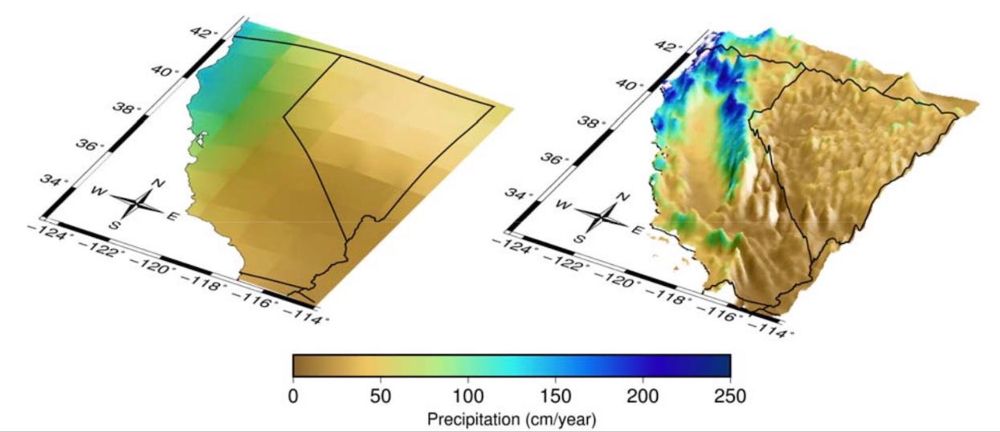

The following sections provide an overview of climate projections and models, and how Analytics Engine tools have been developed to allow users to explore a variety of concepts. To learn more about the scientific methodology that underlies each of the following sections, please see the [References](/general-resources/external-references.qmd) page. To better understand how to apply these concepts to different adaptation and planning contexts, please see the [Using Climate Projections](/scientific-guidance/using_climate_projections/using-climate-projections.qmd) page.

## What are climate projections?
The data provided on the Analytics Engine are *projections*, or estimates, of potential future climates. Projections are not weather predictions and should not be treated as such. Weather is the short-term behavior of the atmosphere, and is characterized over time periods of days and weeks. Climate is the long-term behavior of the atmosphere, and it is characterized over multiple decades – it is the long-term statistics of weather conditions. The Analytics Engine provides users with the tools to characterize the long-term climate in new and novel ways, including how extremes may change in a warming climate. Climate projections cannot tell what will happen on a given date in the future, but they can describe the future climate more generally, e.g. how much warmer the typical July is likely to be or how much less snow will accumulate in the mountains in the average winter. Climate projections can also describe how much more often (or less often) extreme events such as heat waves and heavy rainfall are likely to occur in the future. While they cannot predict when these events will actually occur, they can give estimates for the changes in frequency and likelihood of these events occurring in the future.

## What is an ensemble member? What is a model ensemble?
A single climate model can be run multiple times, using slightly different sets of initial conditions. Each of these runs, or simulations of the future, is referred to as an ensemble member. Due to the chaotic nature of the Earth’s weather systems, starting from slightly different initial conditions leads to different weather outcomes for each ensemble member. By incorporating variations in this manner, ensemble members from a single model are able to to capture the internal variability of the climate system. Users of climate data can benefit from these ensembles as they generate a range of plausible future outcomes and can help decision makers better understand planning impacts. 

To capture the full spectrum of potential future outcomes, it is crucial to examine multiple models and their available ensemble members - this is often called a model ensemble. Considering multiple models enhances the robustness of statistical analyses and enables characterization of extreme events. When performing such analyses, it is important to consider the model-to-model variability and the internal variability within each model.

For users who require a comprehensive understanding of future climate projections, utilizing a diverse set of ensemble members across multiple models is recommended. Analytics Engine notebooks are intentionally designed to enable use of multiple models and ensemble members in climate data analyses. For additional details on how to make these selections, see the question “How should users choose between the large number of models and/or ensemble members provided in the Analytics Engine?” in the Guidance on Using Climate Data in Decision Making section.

## What is gridded data?

Gridded data in climate science refers to the method of dividing geographical areas into grid cells. Climate models then calculate variables (like temperature or precipitation) for each cell. These models produce outputs that can be visualized as maps, similar to map-based visualizations currently available in Cal-Adapt, that show average conditions across each grid cell at a given time. However, it’s important to note that these grid cell averages may differ from actual observed conditions within each cell, especially in areas with complex topography (e.g., mountains) or in urban settings where microclimates or localized effects (e.g., urban heat islands) can strongly influence the local climate.

It is important to note that in the WRF data sets available on the Analytics Engine, a 9 km grid cell is not an aggregate of the corresponding 3 km grid cells for that location; rather the 9 km data is a unique, dynamically-downscaled run of the GCM that is different from the unique, dynamically-downscaled 3 km runs. This independent approach allows a wider region to be simulated by the WRF model at 9 km, and better spatial resolution to be simulated over the state of California at 3 km.

## What is downscaling?
The grid cells in most GCMs are very large – they range between 50 and 300 square kilometers. This coarse resolution is sufficient when scientists are studying climate on the global scale, but it is not as useful for adaptation and planning purposes, where data users need to understand climate change on smaller scales. Present-day climate varies greatly from region to region in California, and future climate is expected to vary accordingly. However, that detail is lost in coarse GCM outputs, where all of California may be represented by just a few large grid cells. To be able to plan for the future, higher-resolution projections of future climate need to be produced. Climate scientists therefore use various models and statistical techniques to “downscale” global climate model outputs to finer, more useful spatial scales (@fig-downscaling).

The data available on the Analytics Engine is from several GCMs that were downscaled to grid cell sizes of 3 km by 3 km, at their finest resolution. This data is available via two different downscaling methods. The first set of available data is [dynamically downscaled](/glossary/index.qmd#dynamical-downscaling) data from the Weather Research and Forecasting model (WRF), a numerical weather prediction model that simulates weather by using the coarser scale global climate model outputs as boundary conditions for its simulations. The second set of available data is statistically downscaled data from a hybrid statistical-dynamical technique called Localized Constructed Analogs (LOCA2-Hybrid). This method uses past climatological observations to add fine-scale detail to GCM output. The generation of this California-specific, high resolution data was supported by the California Energy Commission (EPC-20-006) and performed by the Scripps Institution of Oceanography (LOCA2-Hybrid) and University of California Los Angeles (WRF). The [References](/general-resources/external-references.qmd) page contains links to methods, data sets, and state-level data justification memos associated with these downscaling techniques.

:::: {#fig-downscaling fig-cap="Resolution difference in precipitation between the raw GCM output at a coarse resolution (left) and the fine-scale LOCA2-Hybrid downscaled output (right), showcasing how the additional granularity now depicts California climate more accurately. Figure from [Pierce et al. 2018.](https://www.energy.ca.gov/sites/default/files/2019-11/Projections_CCCA4-CEC-2018-006_ADA.pdf)"}

::::

## What climate projections and GCMs are on the Analytics Engine?
The Analytics Engine hosts climate projections from 15 GCMs. GCMs are usually named after the research center responsible for the model’s generation and maintenance. For example, the `GFDL-CM3` model is run by the National Oceanic and Atmospheric Administration (NOAA) Geophysical Fluid Dynamics Laboratory (GFDL).

Each GCM has strengths and shortcomings in how it depicts conditions for a place or a specific aspect of the climate. As a result, climate change analysis is usually best informed by use of the full range of possible model values. Using multiple models and ensemble members will help a data user capture all probable future climate conditions and produce statistical summaries across different models. Tools on the Analytics Engine have been designed to help users investigate spread across models and understand how to characterize the range of possible futures for their metric, region, and time period of interest.

## How are climate models validated?
To get a sense of how reliable a model is, climate data users may want to know how well a given climate model has performed. This exercise is commonly referred to as “model validation.” Climate models are typically validated by modeling the historical climate and then comparing this modeled historical climate to the observed historical climate. Observations of the historical climate come from a variety of sources: weather stations, satellites, and aircraft. If the modeled historical climate accurately recreates the observed historical climate record, the climate model is often considered valid.

Climate models can also be put through a series of standardized diagnostic tests to see how skillfully they perform as compared to other validated models, especially with regard to how they generate phenomena observed in paleoclimate records. This practice is referred to as model intercomparison. A common intercomparison test inputs an instantaneous increase in carbon dioxide to four times pre-industrial levels and diagnoses the results of each model. Another common test is a gradual, steady increase in carbon dioxide concentrations until four times pre-industrial levels are reached. 

To learn more about the diagnostic tests that were used to determine which climate models to downscale for California’s Fifth Climate Change Assessment, please refer to [Krantz et al. 2021](https://www.energy.ca.gov/media/7264). For additional details on the credibility evaluation process, see the question [“How can I assess the credibility of the Analytics Engine data?”]((/scientific-guidance/using_climate_projections/using-climate-projections.qmd#how-can-i-assess-the-credibility-of-the-analytics-engine-data)) in the Guidance on Using Climate Data in Decision Making section.

## What is bias correction?
While GCMs do a good job of capturing the big-picture behavior of global climate, they still contain some systematic biases (such as being consistently too hot in desert regions, or too cold in high elevation terrain). Multiple approaches are used to adjust for these biases, but all rely on data from a historical period to calculate the magnitude of the systematic offsets compared to observed historical values. Those offsets are then applied to future projections. Some [bias correction](/glossary/index.qmd#bias-correction) approaches distinguish between aspects of the climate differently, for example applying different systematic offsets to cold periods and warm periods by adjusting each quantile separately to preserve the changes in the distribution of values that a model may project (quantile- based bias adjustment).

On the Analytics Engine, all LOCA2-Hybrid data is bias-corrected: the [statistical downscaling](/glossary/index.qmd#statistical-downscaling) process includes a bias-correction step. Some of the dynamically downscaled WRF data is “a priori” bias corrected, meaning that a monthly average bias adjustment was applied before the WRF downscaling procedure, however further bias correction may be needed for some applications. Please refer to the References section for academic publications and state-level data justification memos that contain additional details on bias correction approaches. For additional details on which type of bias corrected data to use in your analyses, see the question [“What dataset is most appropriate for my application/context?”](/scientific-guidance/using_climate_projections/using-climate-projections.qmd#what-dataset-is-most-appropriate-for-my-applicationcontext) in the Guidance on Using Climate Data in Decision Making section.

## What historical data are available on the Analytics Engine?
Four types of historical climate data are available in the Analytics Engine data catalog: 

1. **HadISD archive**: Hourly historical station observations from a select number of weather stations across California and Nevada. Cal Adapt has converted the original HadISD files from the [Met Office Hadley Centre ](https://www.metoffice.gov.uk/hadobs/hadisd/) to cloud-optimized zarrs. 
2. **ERA5 reanalysis**: Reanalysis dataset that uses a variety of historical weather and ocean observations to recreate past atmospheric conditions on an hour-to-hour basis. The ERA5 product on the Analytics Engine was downscaled to a 3 km resolution using the [WRF model](https://www.mmm.ucar.edu/models/wrf).
3. **GCM historical runs**: Historical data from GCMs run specifically over the historical period (1980-2014). These historical climate time series should be interpreted as possible realizations of a historical climate, but do not attempt to precisely capture actual historical weather patterns. The historical period of GCMs is useful for applications such as calculating the difference between a historical baseline and projected future conditions under different global emissions scenarios.
4. **Historical Weather Platform data**: Hourly quality-controlled weather station data from 27 networks across Western Electricity Coordinating Council (WECC) domain from 1980-2022 (time period varies between networks and stations). 

## How are greenhouse gas emissions incorporated in climate models? What is an emissions scenario?
The main driver of human-caused climate change is the emission of carbon dioxide and other greenhouse gases into the atmosphere. These greenhouse gases trap heat in the atmosphere and cause global temperatures to increase over time. Atmospheric warming in turn leads to other changes throughout earth systems. How much the climate changes in the future depends in large part on the amount of greenhouse gas emitted now and going forward, as well as upon changes in anthropogenic aerosols and land-use. However, since the greenhouse gas emissions and these other factors depend on a variety of different social, political, and economic factors, it cannot be certain how they will change. Nonetheless, scientists can use estimates of these changes to generate scenarios that can drive future climate projections.

Previous generations of climate data used Representative Concentration Pathways (RCPs) to define plausible greenhouse gas, aerosol, and land-use change scenarios (e.g., RCP 8.5). In the newest generation of models, the international community has adopted new pathways, called [Shared Socioeconomic Pathways](/glossary/index.qmd#shared-socioeconomic-pathways) (SSPs). Compared to RCPs, SSPs provide a broader view of what ‘business as usual’ might look like given different global societal changes, demographics, and economic factors (for further discussion of how SSPs were developed and how they compare to RCPs, check out the [Carbon Brief explainer](https://www.carbonbrief.org/explainer-how-shared-socioeconomic-pathways-explore-future-climate-change/)). The Analytics Engine includes climate models for three future scenarios: SSP 2-4.5, a scenario where emissions continue around present levels through mid-century and then decline; SSP 3-7.0, where emissions rise steadily through the end of the century; and SSP 5-8.5, a rapid warming scenario where current emissions levels double by 2050.

| EMISSIONS TRAJECTORY | DEFINITION | DESCRIPTION | OUTCOME |
|---|---|---|---|
| SSP2-4.5 | 4.5 watts per meter squared of radiative forcing in the year 2100 | Emissions continue at present levels to mid-century and then decline | 2.7°C warmer at end of century |
| SSP3-7.0 | 7.0 watts per meter squared of radiative forcing by the year 2100 | Emissions roughly double from current levels by 2100 | 3.6°C warmer at end of century |
| SSP5-8.5 | 8.5 watts per meter squared of radiative forcing by the year 2100 | Emissions roughly double from current levels by 2050 | 4.4°C warmer at end of century |

: Three of the common greenhouse gas trajectory scenarios hosted on the Analytics Engine. {#tbl-ssp}

## What are global warming levels?
The [global warming levels](/glossary/index.qmd#global-warming-level) (GWL) framework provides an alternative approach to assessing climate impacts, as compared to a time- or scenario-based approach. A user can tailor their analyses to a specific amount of global warming, such as 2˚C or 3˚C, rather than to a particular time period like mid-century or end-of-century (i.e., 2100). This method has gained traction in international policy frameworks, including the [Paris Agreement](https://unfccc.int/process-and-meetings/the-paris-agreement) and the [6th IPCC Assessment Report](https://www.ipcc.ch/assessment-report/ar6/) because it isolates the uncertainty of regional climate responses from other variables, such as emissions trajectories and the rate of global climate response to greenhouse gas concentrations associated with scenario-based approaches. By using GWLs, a greater number of high-quality simulations can be included in regional assessments, even if some models have higher-than-likely [climate sensitivity](/glossary/index.qmd#climate-sensitivity). The GWL approach allows a data user to conduct a more comprehensive analysis by incorporating simulations that accurately represent atmospheric variability but may otherwise be excluded.

For example, consider two simulations: simulation A and simulation B. In an SSP framework under the SSP2-4.5 scenario, a data user might initially consider only simulation A because simulation B is designed only for the SSP5-8.5 scenario. This prevents them from incorporating any regional climate information from simulation B into their analysis. Instead, by employing a GWL framework, a user can examine how each simulation depicts regional climate at specific warming levels, such as 2˚C. This approach allows both simulations A and B to be included in the analysis, assuming that each reaches 2˚C of warming at some point in their projection. Thus, the GWL framework allows users to enhance their understanding of climate projection insights beyond simulation A alone. This approach also helps identify when the world is likely to reach a particular level of warming, and provides a robust framework for characterizing the risk of climate extremes and making informed policy decisions. For additional details on how to use GWLs in an analysis, see the question [“How is a GWL approach different than a time-based approach?”](/scientific-guidance/using_climate_projections/using-climate-projections.qmd#how-is-a-gwl-approach-different-than-a-time-based-approach) in the Guidance on Using Climate Data in Decision Making section.

## What are sources of uncertainty in climate projections?
Justine, can we remove this section since we are fleshing out a comprehensive uncertainty page?

## References

- Hausfather, Z. (2018). *Explainer: How 'Shared Socioeconomic Pathways' explore future climate change.* Carbon Brief. <https://www.carbonbrief.org/explainer-how-shared-socioeconomic-pathways-explore-future-climate-change/>
- Intergovernmental Panel on Climate Change (IPCC). (2021). *Sixth Assessment Report.* <https://www.ipcc.ch/assessment-report/ar6/>
- Krantz, D., et al. (2021). *Evaluating Global Climate Models for California's Fifth Climate Change Assessment.* California Energy Commission. <https://www.energy.ca.gov/media/7264>
- Met Office Hadley Centre. *HadISD: A quality-controlled global synoptic station dataset.* <https://www.metoffice.gov.uk/hadobs/hadisd/>
- NCAR/UCAR. *Weather Research and Forecasting (WRF) Model.* <https://www.mmm.ucar.edu/models/wrf>
- Pierce, D.W., et al. (2018). *Projections of Future California Climate.* California Energy Commission, CEC-500-2018-006. <https://www.energy.ca.gov/sites/default/files/2019-11/Projections_CCCA4-CEC-2018-006_ADA.pdf>
- United Nations Framework Convention on Climate Change. *The Paris Agreement.* <https://unfccc.int/process-and-meetings/the-paris-agreement>
