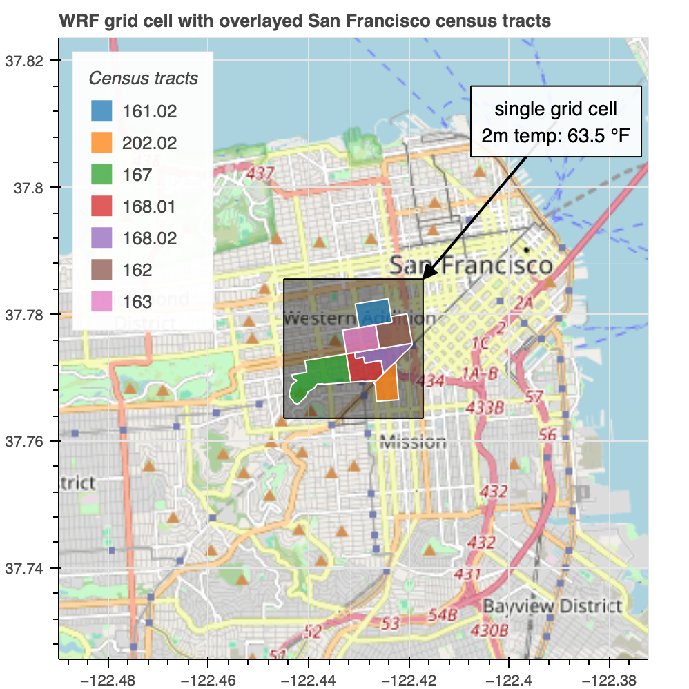
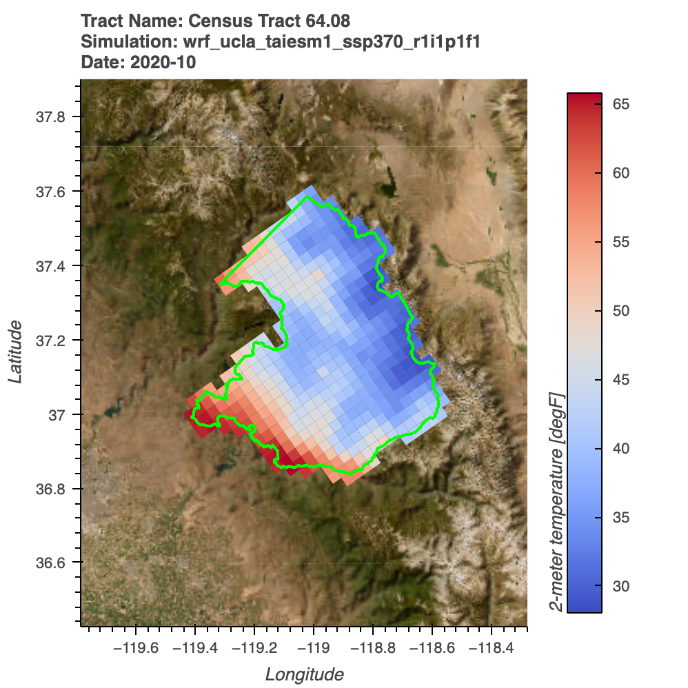

Many planners, agencies, and community organizations use census tract data because it can enable targeted planning, policy, and programmatic decision making at a local level. It is therefore common for practitioners to ask whether climate model projections can be translated to census tracts to support their analyses, particularly those that may require overlays with demographic information. However, climate models do not produce data at census tract resolution. This introduces important risks and limitations when attempting to map gridded climate data onto these boundaries.

## Analytics Engine Support for Census Tract Analysis

To support needs for climate data at a census tract level, the Analytics Engine (AE) team has developed a Python-based tool called `clip` within the project's [climakitae](https://github.com/cal-adapt/climakitae) Python toolkit that allows users to clip gridded climate datasets to census tract polygons. For more details on how to use this `clip` tool with `"clip": "<geoid>"` or `"clip: ["<geoid>", …]`, please navigate to the "Processor Example 5: Clipping to Boundaries" section in the [Data Access Notebook](https://github.com/cal-adapt/cae-notebooks/blob/main/basic_data_access.ipynb).

The following guidance describes the key risks and technical challenges associated with conducting census tract-level analyses with climate data. It aims to provide guidance on which information census tract-level estimates can and cannot reliably provide.

The Analytics Engine team's goal is not to deliver authoritative "census tract climate datasets", but to provide transparent, reproducible tools that allow users to explore climate data responsibly. The _[climakitae](https://github.com/cal-adapt/climakitae)_ census tract clipping tool is intended as a learning and analysis aid, paired with guidance like this page to help users understand the assumptions, risks, and appropriate interpretations involved in using climate data at a census tract level.

## Census Tract Analyses Present Unique Challenges

The climate models used in the Analytics Engine produce data on regular grid cells of a fixed 3 x 3 kilometer size. US census tracts, by contrast, are irregularly shaped statistical areas within a county whose size varies widely depending on population density; they are generally designed to represent 1,200 to 8,000 people ([U.S. Census Bureau, 2022](https://www.census.gov/programs-surveys/geography/about/glossary.html#par_textimage_13)). In population-dense areas like downtowns, census tracts can be very small (such as a few city blocks), while in rural areas, a single census tract can occupy a large portion of the county. This difference in census tract size can make translating gridded data onto a census tract-level tricky.

Climate models do not produce data at census tract resolution. Most datasets used in the Analytics Engine are produced on [equal-area grid cells](https://climateestimate.net/content/gridded-data.html#:~:text=Gridded%20data%20products%20are%20a%20combination%20of,the%20entire%20globe%20or%20a%20specific%20region.) that are much larger than many urban census tracts, and much smaller than rural area census tracts. This fundamental mismatch creates several technical challenges that users should carefully consider:

### Spatial Mismatch and Grid-Scale Representation

In dense urban areas, multiple census tracts may fall entirely within a single model grid cell. In these cases, the same climate variable value (e.g. temperature) will be assigned to several census tracts, even though real-world conditions may vary meaningfully across neighborhoods due to the built environment, land cover, or proximity to water (@fig-sf-tracts). For dynamically downscaled datasets such as WRF, each grid cell value represents conditions at the grid cell's center point and is assumed to be representative of the broader grid area (3km x 3km). Sub-grid variability (such as sharp elevation changes, coastal gradients, or urban features) is not explicitly resolved. As a result, when census tracts are smaller than a grid cell, or intersect only a portion of one, users should keep in mind that the climate value reflects a modeled approximation rather than conditions everywhere within that area. These tract-level differences are not resolved by the climate model and should not be inferred from the data.

::: {#fig-sf-tracts}
::: {.content-visible when-format="html"}
```{=html}
<div class="figure-container">

</div>
```
:::
::: {.content-visible when-format="pdf"}

:::
Example of spatial mismatch between a single model grid cell and multiple census tracts within the city of San Francisco, CA. If extracting air temperature for these seven census tracts, each tract would result in the same value, despite actual microclimatic differences within these neighborhoods. Census tracts shown here are: 161.02, 202.02, 167.00, 168.01, 168.02, 162.00, 163.00, San Francisco, CA.
:::

### Aggregation Issues

Census tracts and grid cells are not a perfect one-to-one match. In rural areas, a single census tract may span many grid cells that differ substantially in elevation, land cover, or climate. Any value summarized across the tract (such as a mean or percentile) will smooth this variability. As a result, a tract-wide average may not be representative of the conditions experienced by most locations within that tract (@fig-rural-tract).

::: {#fig-rural-tract}
::: {.content-visible when-format="html"}
```{=html}
<div class="figure-container">

</div>
```
:::
::: {.content-visible when-format="pdf"}

:::
Example of a large rural census tract in eastern Fresno County spanning Sierra Nevada foothills into higher elevation terrain, covering multiple climate model grid cells. If extracting a single representative air temperature value for this census tract, the variability of temperatures would be substantially smoothed, and may not accurately represent realistic conditions. The census tract shown here is Census Tract 64.08, Fresno County, CA.
:::

### Coastal Census Tracts

In coastal areas, census tracts may intersect grid cells that are partially or mostly over water. For example, the census tract that houses the University of California Santa Barbara includes coastal and off-shore grid cells, which have different temperature characteristics than the adjacent land. When these grid cells are averaged at a census tract level, the resulting values may appear cooler or less extreme than the conditions actually experienced on land. While this issue is not unique to census tracts and reflects a broader limitation of gridded climate data over complex geography, it becomes an especially important consideration when working with climate data at these small spatial scales.

### Sub-Grid Variability

For dynamically downscaled datasets such as WRF, each grid cell value represents conditions at the grid cell's center point and is assumed to be representative of the broader grid area (3km x 3km). Sub-grid variability (such as sharp elevation changes, coastal gradients, or urban features) is not explicitly resolved. When census tracts are smaller than a grid cell, or intersect only a portion of one, users should keep in mind that the climate value reflects a modeled approximation rather than conditions everywhere within that area.

::: {.callout-note}
Census tract boundaries change over time as populations shift and definitions are updated. The Analytics Engine uses a specific census tract vintage: [TIGER/Line Shapefile, 2020, State, California, Census Tracts](https://catalog.data.gov/dataset/tiger-line-shapefile-2020-state-california-census-tracts). Tract-based analyses may not align perfectly with older or newer demographic datasets.
:::

Therefore, climate model data that is extracted at the census-tract level should not be treated as representative climate values for that tract. Rather, this data should be viewed as an approximation of the climate, with uncertainty introduced by the size of the model grid and how it represents real-world geography.

## Appropriate and Inappropriate Analyses

### Appropriate Analyses

Using climate data at a census tract-level can be useful for certain types of exploratory or screening-level analyses, particularly when the goal is to understand broad spatial patterns rather than precise local values. For example:

- When identifying general "hotter" or "colder" parts of a region to support high-level prioritization ([Szagri et al., 2023](https://doi.org/10.1016/j.uclim.2023.101711)); e.g. cooling demand may be higher for inland census tracts that are relatively warmer than nearby coastal tracts, even if exact temperatures cannot be resolved at the neighborhood scale.
- Overlaying climate indicators with demographic or vulnerability datasets to understand regional patterns or disparities ([McCullagh et al., 2025](https://doi.org/10.1016/j.mex.2025.103290)); e.g. identifying census tracts with both higher projected extreme heat exposure and higher proportions of elderly residents to flag areas where heat-related health risks may be elevated at a regional scale, without interpreting the values as precise-neighborhood-level temperatures.
- Supporting qualitative or comparative assessments where relative differences matter more than precise magnitudes; e.g. comparing whether one group of census tracts is generally warmer or experiences more extreme heat days than another group (such as inland versus coastal tracts) to inform discussion, screening, or prioritization (rather than to calculate exact thresholds or design specifications).

In these contexts, tract-level climate estimates can help frame questions and guide further analysis, provided their limitations are clearly acknowledged.

### Inappropriate Analyses

A census tract approach is generally not appropriate when:

- The decision requires accurate representation of neighborhood-scale temperatures, extremes, or microclimates ([Fuhrmann et al., 2024](https://doi.org/10.1175/BAMS-D-24-0230.1)).
- Results will be interpreted as precise predictions for a specific tract, for example, counting the number of days above a critical threshold.
- The analysis depends on values that change significantly within individual grid cells (for example, coastal versus inland differences).
- Infrastructure, sizing, or engineering decisions that require higher-resolution information than climate models can reliably provide.

# References

- Szagri, D., Nagy, B., & Szalay, Z. (2023). How can we predict where heatwaves will have an impact? – A literature review on heat vulnerability indexes. *Urban Climate*, 52. <https://doi.org/10.1016/j.uclim.2023.101711>
- McCullagh, D., Cámaro-García, W., Dunne, D., Nowbakht, P., Cumiskey, L., Gannon, C., & Phillips, C. (2025). Development of a social vulnerability index: Enhancing approaches to support climate justice. *MethodsX*, 14. <https://doi.org/10.1016/j.mex.2025.103290>
- Fuhrmann, C., Robinson, A., Konrad, C., & Bhatia, A. (2024). From Data to Action: How Urban Heat Mapping Campaigns Can Expose Vulnerabilities and Inform Local Heat Policy. *Bulletin of the American Meteorological Society*, 105(11), E2078–E2084. <https://doi.org/10.1175/BAMS-D-24-0230.1>
- U.S. Census Bureau. (2022). Census Tracts. <https://www.census.gov/programs-surveys/geography/about/glossary.html#par_textimage_13>
