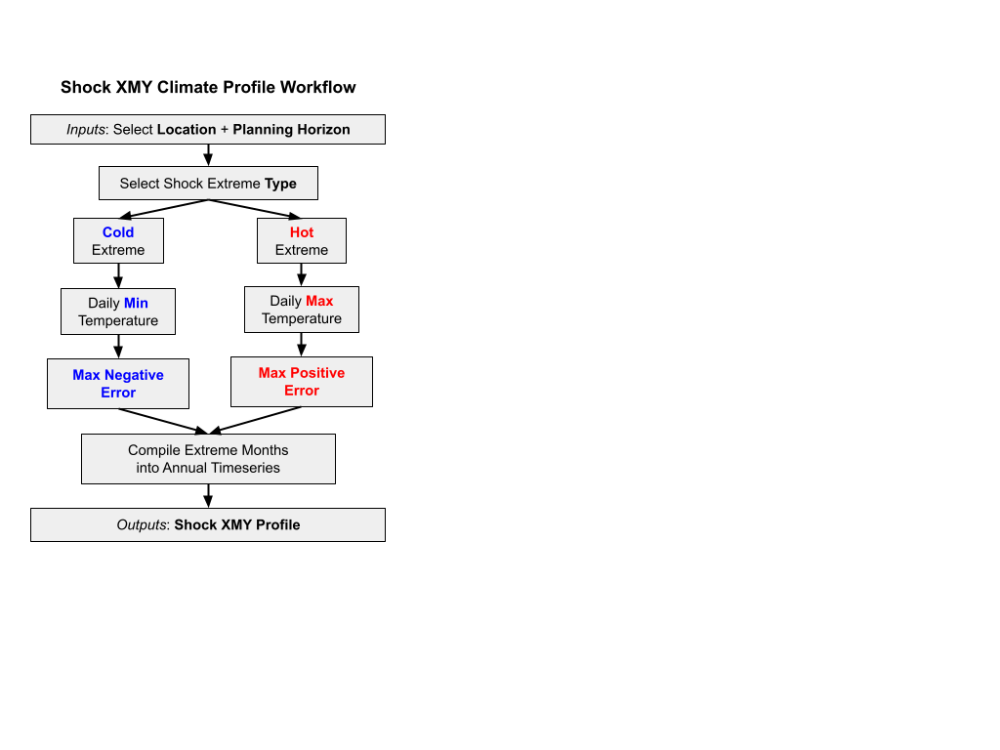
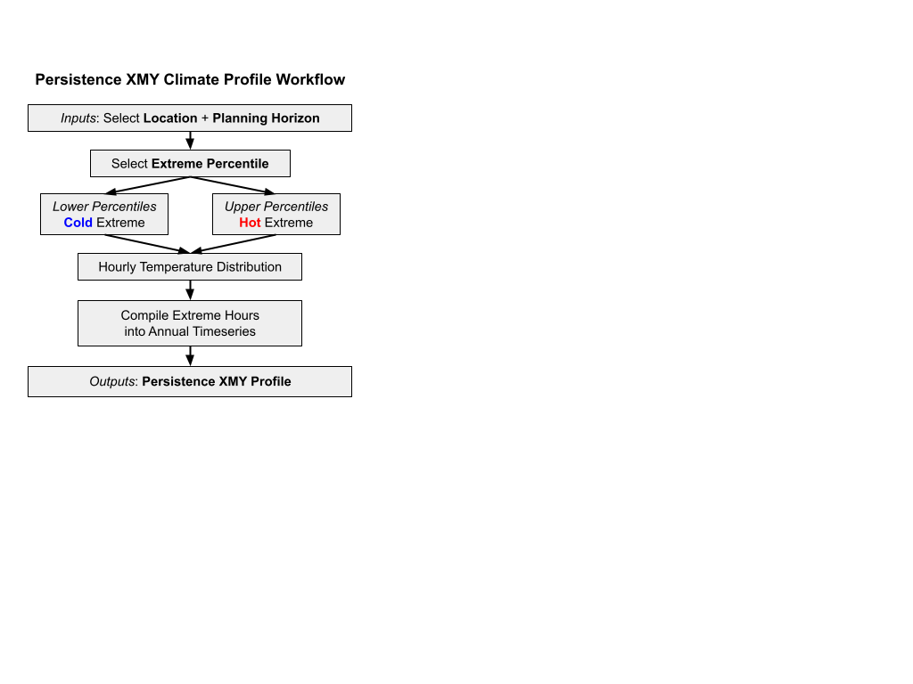

## Overview 
Extreme weather events, like the recent August 2020 and Labor Day 2022 heatwaves cause severe, and sometimes, cascading impacts affecting public health and safety, infrastructure, and grid reliability. 
Ensuring that not only can our infrastructure withstand current extreme events but can withstand the stress from future projected extremes and meet the potential demand of ratepayers. 
Similar to a [Typical Meteorological Year profile](typical-met-year.qmd), an **Extreme Meteorological Year** (XMY) profile provides the same weather variables, 
but intentionally preserves or characterizes extreme weather event representation within a one-year climate profile. 
There is currently no one recommended or accepted methodology for calculating an XMY. 
However, the general intent of an XMY is to select more extreme months (e.g., [Crawley and Lawrie 2015](https://publications.ibpsa.org/proceedings/bs/2015/papers/bs2015_2707.pdf); 
[Crawley and Lawrie 2019](https://climate.onebuilding.org/papers/2019_09%20ShouldWeBeUsingTypicalWeatherData-BS2019_210594.pdf); 
[Bass and New 2020](https://www.osti.gov/servlets/purl/1735419); [Zeng et al. 2025](https://www.sciencedirect.com/science/article/abs/pii/S1364032124009390?via%3Dihub)) 
instead of the median conditions represented in a TMY, and to use a large set of climate model simulations to do so. 

Recognizing that no single “extreme year” can satisfy all planning needs, Cal-Adapt provides two standardized methodologies tailored to common use cases: 

- **Shock Event XMY**: An extreme climate profile that is representative of *short-term event-wise pulses* that increase peak demand, such as a 4-day heatwave or a 5-day coldsnap. The Shock XMY is built upon an extreme cumulative distribution furthest from the median weather conditions for a location over a climatological period. 
- **Persistence XMY**: An extreme climate profile that is representative of *extreme annual metrics*, such as an extreme hot year or an extreme cold year, that can be applied for highly tailorable system stress tests. The Persistence XMY is built upon a given statistical extreme percentile of weather conditions for a location over a climatological period. 

::: {.callout-important title="Recent Extreme Events in California"}
The Labor Day 2022 Heatwaves was one of the hottest on record for California, with Sacramento reaching 116°F (46.7°C), it's highest temperature ever, alongside record-breaking electricity demand of more than 52,000 MW.  
:::


## Applications
### Shock Event XMY: Extreme Event-Based Stress

The Shock Event XMY represents localized weather conditions that strain peak demand by emphasizing the range of variability within a distribution. 
This method identifies the weather year distribution that differs the greatest from long-term climatology. 
Where the TMY approach minimizes the error between a candidate year and the long-term conditions, the Shock XMY approach maximizes the difference. 

The Shock XMY methodology offers the advantage of being an understandable extension of the existing TMY methodology and preserving the temporal consistency of day-to-day variability and natural diurnal cycles. 
However, the timing, duration, and sequencing of extreme events, or “shocks” within the profile, may not align with the operational conditions most relevant to a particular simulation or planning scenario. 
For example, peak temperature events may occur during periods of relatively low system demand or may not coincide with other compounding stressors to the grid. 
Additionally, the error-based selection method provides limited flexibility for tailoring events to specific return periods, dates, or desired intensity levels. 

*placeholder figure: shock comparison*


### Persistence Extreme XMY: Sustained Stress

The Persistence XMY represents localized weather conditions that stress an energy system by selecting hours associated with specific percentile-based extremes 
within the climatological distribution, prioritizing sustained statistical deviation from typical conditions. 
This method allows precise tuning for exact conditions in order to stress test systems, such as “turning a dial” on the intensity of the desired extreme. 
The Persistence XMY is more indicative of overall extreme conditions, such as a “warmer than average summer” and is determined on an hour-by-hour basis. 
The design of the Persistence XMY approach specifically allows a user the ability to combine multiple percentiles to build a fully customizable extreme profile. 

The Persistence XMY methodology offers the advantage of a fully customizable intensity level for characterizing extreme conditions, 
such as “turning a dial” on grid stress testing thresholding scenarios for specific periods of time (e.g., 2 weeks of abnormally hot conditions in October). 
The hourly chronology is not representative of a “real” year of data because it is not chronologically consistent: each hour is defined by the extreme percentile. 
A Persistence XMY is limited in its suitability for analyses that require realistic weather evolution or event chronology, but can provide key insights for extreme threshold tuning in resource adequacy planning. 

*placeholder figure: persistent comparison*


## Use Cases
Preparing for extreme events that increase system strain requires climate-driven energy inputs that go beyond TMYs to include extreme and future-oriented climate profiles. XMYs can inform:

- Extreme peak heating and cooling load
- Demand planning for rare, high societal impact extreme events 
- Risk and hazard assessment
- Grid resilience
- Financial analysis of asset investments
- Specific stress testing of peak demand windows for infrastructure planning (e.g., grid hardening).  

## Recommendations for XMYs

- Carefully consider what **kind** of extreme characterization is required for your application. Extreme weather is not a single hazard, and no single extreme climate characterization can adequately represent
the diverse conditions that drive energy system risk. Because planning objectives range from peak demand events to prolonged heatwaves, coldsnaps, and compound stressors, relying on a *"one-size-fits-all"* approach can 
obscure critical vulnerabilities and lead to incomplete assessment. 
- If you require an extreme profile that **preserves temporal consistency** of day-to-day variability and natural diurnal cycles, the **Shock XMY** climate profile is recommended. 
- If you require a **fully customizable intensity level**, such as "turning a dial" on stress testing, consider a **Persistence XMY** climate profile. Be aware that each hour is defined by the desired extreme percentile.


## Methodology: Shock XMY
The Shock Event XMY represents localized weather conditions that strain peak demand by emphasizing the range of variability within a distribution. This method identifies the weather year distribution that differs the greatest from long-term climatology. 

::: {#fig-xmy-shock-workflow}
```{=html}
<iframe src="figures/html/xmy_shock_workflow.png" width="100%" height="500px" frameborder="0"></iframe>
```
::: {.content-visible when-format="pdf"}

:::
Shock XMY climate profile workflow.
:::

### Step 1: Select Location and Planning Horizon
Cal-Adapt Shock XMYs are for point-based locations, meaning that a user will first select a specific location of interest, such as a power plant or an airport weather station. The user will also select a climatological period of time, such as a global warming level planning horizon centered around 30 years of data, or a time-based 30-year period. Cal-Adapt recommends a GWL-based approach to reduce multi-model uncertainty when using global climate models. 

### Step 2: Select Shock Extreme Type
Next, the type of extreme is selected: a hot extreme, representative of extreme heat conditions and heatwaves, or a cold extreme, representative of extreme cold conditions such as a cold snap. Based on industry partner interviews, **extreme weather conditions are most commonly characterized by the temperature profile**, reflecting the critical role temperature plays in defining system stress.

### Step 3: Retrieve and Process Hourly Air Temperature
Hourly air temperature is retrieved for the location and climatology selections as the determining environmental factor for extreme characterization. This differs from the TMY approach which includes 10 environmental metrics, including solar radiation and wind speed ([Wilcox and Marion 2008](https://docs.nrel.gov/docs/fy08osti/43156.pdf), [ISO 15927-4](https://www.iso.org/standard/41371.html)). Air temperature is then resampled to the corresponding extreme type. For a cold extreme profile, the data is resampled to daily minimum temperature. For hot extremes, the data is resampled to daily maximum temperature. Cal-Adapt uses a priori bias-adjusted dynamically downscaled WRF model outputs as the data foundation for TMY and XMY profiles.

### Step 4: Calculate the Maximized Error between Climatology and Extreme Months
For each month, two sets of cumulative distribution functions (CDF) are calculated: one for the long-term median climatology across all candidate years, and one for each year within the climatology (i.e., a candidate year). The candidate year is compared against climatology to quantitatively select the month that is furthest from the long-term median conditions, maximizing the error. For cold extremes, this translates to the lowest-value month or maximized negative error relative to climatology. For hot extremes, the highest-value month or maximized positive error relative to climatology is selected (Figure 7). This process is repeated for all months, per simulation. Doing so ensures that model data is kept intact within a single physically-consistent climate profile, rather than pooling across models which introduces multi-model uncertainty. Following TMY methodological best practice, years of abnormal volcanic activity are excluded from consideration due to the impact of aerosols on air temperatures. 

*figure placeholder*

### Step 5: Compile Extreme Months and Generate XMY Profile
Once the most extreme months are selected, the standard meteorological information included in a TMY profile are retrieved for contemporaneous months. XMY profiles therefore include: air temperature, dewpoint temperature, relative humidity, global irradiance, direct irradiance, diffuse irradiance, downwelling radiation, wind speed and direction, and surface air pressure for each of the designated months as determined by the extreme air temperature profile. In other words, if February 2005 is the most extreme month for a cold Shock XMY, all other variables are explicitly extracted for February 2005 to maintain a physically consistent profile. Smoothing at the monthly interface between months is performed via second-degree polynomial curve fit to prevent discontinuities at the month interface ([Wilcox and Marion 2008](https://docs.nrel.gov/docs/fy08osti/43156.pdf)). 


## Methodology: Persistence XMY
The Persistence XMY represents localized weather conditions that stress an energy system by selecting hours associated with specific percentile-based extremes within the climatological distribution, prioritizing sustained statistical deviation from typical conditions. This method allows precise tuning for exact conditions in order to stress test systems, such as “turning a dial” on the intensity of the desired extreme. 

*figure placeholder*

::: {#fig-xmy-persistence-workflow}
```{=html}
<iframe src="figures/html/xmy_persistence_workflow.png" width="100%" height="500px" frameborder="0"></iframe>
```
::: {.content-visible when-format="pdf"}

:::
Persistence XMY climate profile workflow.
:::

### Step 1: Select Location and Planning Horizon
Cal-Adapt Persistence XMYs are for point-based locations, meaning that a user will first select a specific location of interest, such as a power plant or an airport weather station. The user will also select a climatological period of time, such as a global warming level centered around 30 years of data, or a time-based 30-year period. Cal-Adapt recommends a GWL-based approach to reduce multi-model uncertainty when using global climate models. 

### Step 2: Select Extreme Percentile
The Persistence XMY is calculated by applying the Cal-Adapt: Standard Year methodology in which the desired percentile is calculated from the long-term climatological distribution and the closest value from the distribution of simulation values at a given hour is returned for each hour of the year. The lower percentiles (below median conditions at the 50th percentile) represent cold extremes. Upper percentiles (above median conditions at the 50th percentile) provide hot extremes. 

### Step 3: Retrieve Hourly Air Temperature
Hourly air temperature is retrieved for the location and climatology selections as the determining environmental factor for extreme characterization. This differs from the TMY approach which includes 10 environmental metrics, including solar radiation and wind speed ([Wilcox and Marion 2008](https://docs.nrel.gov/docs/fy08osti/43156.pdf), [Crawley and Lawrie 2019](https://doi.org/10.26868/25222708.2019.210594)). Based on industry user interviews, **extreme conditions are most commonly characterized by the temperature profile**, reflecting the critical role temperature plays in defining system stress. Cal-Adapt uses a priori bias-adjusted dynamically downscaled WRF model outputs as the data foundation for TMY and XMY profiles.

### Step 4: Calculate the Hourly Distribution
Using hourly air temperature, the closest value to the desired percentile is returned for each hour of the year, per model. This process is repeated for all bias-adjusted model simulations. Doing so ensures that model data is kept intact within a single climate profile, rather than pooling across models which introduces multi-model uncertainty. Following TMY methodological best practice, years of abnormal volcanic activity are excluded from consideration due to the impact of aerosols on air temperatures.  

### Step 5: Compile Extreme Hours and Generate XMY Profile
Once the most extreme conditions are selected, the Persistence XMY is compiled into an hourly timeseries where each hour represents a specific percentile for that hour of the year. The standard meteorological information included in a TMY profile are retrieved for contemporaneous conditions. XMY profiles therefore include: air temperature, dewpoint temperature, relative humidity, global irradiance, direct irradiance, diffuse irradiance, downwelling radiation, wind speed and direction, and surface air pressure as determined by the extreme air temperature profile.


# References

- Ford, V., Roman, J., Machuca, V., Ordonez, A., Keeney, N., Schroeder, N., & Doherty, O. (2026) *Planning for the Exceptional: Extreme Meteorological Years in Energy System Planning.* Cal-Adapt. <https://doi.org/10.5281/zenodo.FINISH_LINK>
- ASHRAE. (2024). *Energy Simulation Aided Design for Buildings Except Low-Rise Residential Buildings.* <https://www.ashrae.org/file%20library/technical%20resources/standards%20and%20guidelines/standards%20addenda/209_2018_l_20240830.pdf>
- Bass, B., and New, J. (2020). *Future Meteorological Year Weather Data from IPCC Scenarios.* Oak Ridge National Laboratory. <https://www.osti.gov/servlets/purl/1735419>
- Crawley, D.B. (1998). “Which weather data should you use for energy simulations of commercial buildings?” *Build Eng*, 104(2), 498–515.
- Crawley, D.B., and Lawrie, L.K. (2015). “Rethinking the TMY: Is the ‘Typical’ Meteorological Year Best for Building Performance Simulation?” *Proceedings of Building Simulation 2015.* <https://publications.ibpsa.org/proceedings/bs/2015/papers/bs2015_2707.pdf>
- Crawley, D.B., and Lawrie, L.K. (2019). “Should We Be Using Just ‘Typical’ Weather Data in Building Performance Simulation?” *Proceedings of Building Simulation 2019.* <https://doi.org/10.26868/25222708.2019.210594>
- Doutreloup, S., et al. (2022). “Historical and future weather data for dynamic building simulations in Belgium using the regional climate model MAR: typical and extreme meteorological year and heatwaves.” <https://doi.org/10.5194/essd-14-3039-2022>
- ISO 15927-4:2005. *Hygrothermal performance of buildings — Calculation and presentation of climatic data — Part 4: Hourly data for assessing the annual energy use for heating and cooling.* International Organization for Standardization. <https://www.iso.org/standard/41371.html>
- Laxo, V. (2023). *Climate Forward.* HGA. <https://hga.com/climate-forward/>
- Levermore, G.J., and Parkinson, J.B. (2006). “Analyses and algorithms for new test reference years and design summer years for the UK.” <https://doi.org/10.1177/0143624406071037>
- Li, H., Huo, Y., Fu, Y., Yang, Y., and Yang, L. (2023). “Improvement of methods of obtaining urban TMY and application for building energy consumption simulation.” *Energy and Buildings*, 295, 113300. <https://doi.org/10.1016/j.enbuild.2023.113300>
- Moazami, A., et al. (2019). “Impacts of future weather data typology on building energy performance – investigating long-term patterns of climate change and extreme weather conditions.” <https://doi.org/10.1016/j.apenergy.2019.01.085>
- National Renewable Energy Laboratory. *National Solar Radiation Database (NSRDB).* <https://nsrdb.nlr.gov/data-sets/tmy>
- Nik, V.M. (2016). “Making energy simulation easier for future climate – synthesizing typical and extreme weather data sets out of regional climate models (RCMs).” <https://doi.org/10.1177/0143624411418132>
- NYSERDA. (2020). *Assessment of Future Typical Meteorological Year Data Files.* <https://www.resourcerefocus.com/ftmy-2020>
- Peltier, et al. (2024). “A climate-aware built environment: Integrating future weather data into building design today.” *Proceedings of the 2024 ACEEE Summer Study on Energy Efficiency in Buildings.* <https://www.aceee.org/sites/default/files/proceedings/ssb24/assets/attachments/20240722160818203_c563a22d-adf2-42fa-9e31-789b98700ad6.pdf>
- Tarkhan, A., et al. (2025). “Generation of representative meteorological years through anomaly-based detection of extreme events.” <https://doi.org/10.1080/19401493.2025.2499687>
- Wilcox, S., and Marion, W. (2008). *Users Manual for TMY3 Data Sets.* NREL/TP-581-43156. National Renewable Energy Laboratory. <https://docs.nrel.gov/docs/fy08osti/43156.pdf>
- Zeng, Z., Kim, J., Tan, H., Hu, Y., Cameron-Rastogi, P., Villa, D., New, J., Wang, J., and Muehleisen, R.T. (2025). “A review of future weather data for assessing climate change impacts on buildings and energy systems.” *Renewable and Sustainable Energy Reviews*, 212, 115213. <https://doi.org/10.1016/j.rser.2024.115213>
