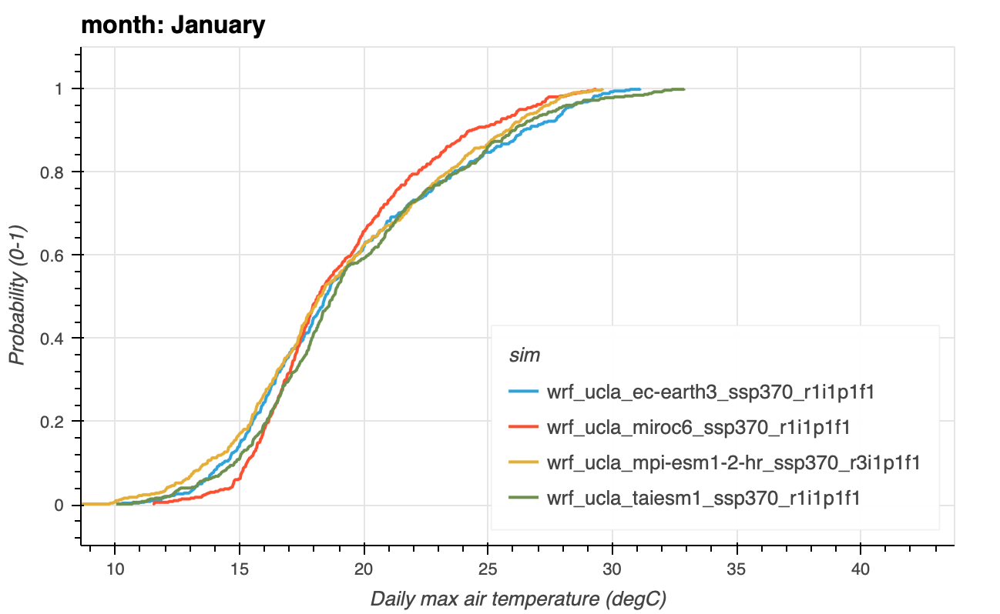
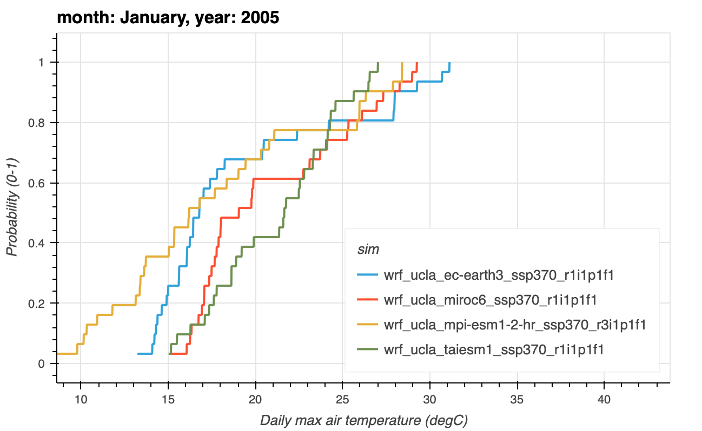
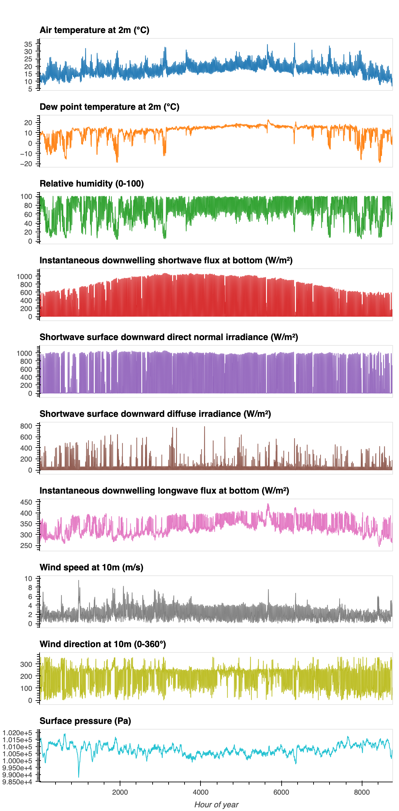

## Methodology 
A [typical meteorological year](/glossary/index.qmd#typical-meteorological-year) (TMY) profile is one year of hourly data that represents the median meteorological conditions for a point location over a set amount of time (at least 15 years required). The Analytics Engine recommends and utilizes a 30-year period for TMY calculation, which adheres to compliance with [global warming level](/glossary/index.qmd#global-warming-level) (GWL) calculations.

A TMY profile is built from ten specific weather variables that are weighted based on TMY standards ([NSRDB](https://nsrdb.nrel.gov/data-sets/tmy), [Wilcox and Marion 2008](https://docs.nrel.gov/docs/fy08osti/43156.pdf)). TMYs statistically assess the median conditions for those variables and select the most “typical” month for each month during a year. These are compiled into a single climate profile. For example, the most “typical” January within the 30 year period could be from 2010, while the most “typical” February could be from 2022, and so on. The end result is an hourly climate profile for an entire year with each month spliced together from multiple input years. TMY profiles are widely used as critical inputs for energy modeling, simulating solar energy conversion systems, and evaluating building standards and energy efficiency ([NSRDB](https://nsrdb.nrel.gov/data-sets/tmy), [Wilcox and Marion 2008](https://docs.nrel.gov/docs/fy08osti/43156.pdf); [Laxo 2023](https://hga.com/climate-forward/)).

::: {.callout-note title="Note"}
The TMY method and weighting schema in the Analytics Engine mirrors the NREL TMY version 3 method (NSRDB, Wilcox and Marion 2008).
:::

### Step 1: User selects location of interest and timeframe of interest (Historical TMY or Future TMY)
Calculating a historical or future TMY on the Analytics Engine is for point-based information, meaning that a user will first select a specific location of interest (e.g., a power plant or an airport weather station). At this point, the user will also select a period of time, such as a historical or future TMY (FTMY). On the Analytics Engine, at least 15 years of daily data is required; the Analytics Engine uses a default 30-year period. On the Analytics Engine, TMYs can be generated either via global warming level or time-based periods

### Step 2: Data is retrieved
The input data for determining a “typical” month is retrieved for that location, which includes the following variables:

- Mean air temperature
- Min air temperature
- Max air temperature
- Mean dew point temperature
- Min dew point temperature
- Max dew point temperature
- Mean wind speed
- Max wind speed
- Global irradiance
- Direct irradiance

It is important to note that only the 4 bias-adjusted WRF downscaled models have all of the required variables to calculate a TMY profile – in particular, the two solar variables. The Analytics Engine thus subsets the data to only include the relevant models. The last step in the data retrieval process is to ensure that all of the input data is in the **local time zone** for the location of interest. Because the input data is in UTC, the minimum temperature in hourly data “appears” on the day before (i.e., midnight on Monday in UTC corresponds to 5pm PST on Sunday). Converting to the local timezone is important to ensure that the daily minimum occurs on the correct day.

### Step 3: Calculate the long-term climatological distribution
The TMY method specifically uses a [cumulative distribution function](/glossary/index.qmd#cumulative-distribution-function) (CDF), which calculates the 30-year climatological distribution for each variable. This distribution is used as a baseline to determine which specific month within the 30-year period is closest to this baseline condition, and is repeated for all months (i.e., climatologically typical January, climatologically typical February, etc.).

::: {#fig-tmy-cdf-annual}
```{=html}
<iframe src="figures/html/tmy_cdf_annual.html" width="100%" height="500px" frameborder="0"></iframe>
```
::: {.content-visible when-format="pdf"}

:::
An example of the long-term climatological conditions of daily max air temperature, for use in a TMY. This CDF represents the baseline conditions of each month's max air temperatures in 4 bias-adjusted WRF models at Los Angeles International Airport (LAX) from 1990-2020.
:::

### Step 4: Calculate the per-year per-month distribution
The Analytics Engine then calculates the CDF for each month of each year (i.e., January 2001, January 2002, and so on). This process is repeated for all variables. At this point the Analytics Engine also removes specific months from consideration if they occurred during major volcanic eruptions like Pinatubo (June 1991 to December 1994), because volcanic aerosols have a major impact on solar variables.

::: {#fig-tmy-cdf-mon-yr-grouped}
```{=html}
<iframe src="figures/html/tmy_cdf_mon_yr_grouped.html" width="100%" height="500px" frameborder="0"></iframe>
```
::: {.content-visible when-format="pdf"}

:::

An example of a candidate month’s daily max air temperature, for use in a TMY. This CDF represents the conditions of max air temperatures in 4 bias-adjusted WRF models at Los Angeles International Airport (LAX) for every year-month combination in 2015. The TMY process identifies the closest candidate month to the long-term climatological conditions to pick a “typical” month of January. For example, one would look for the closest instance of the distribution in this figure to that of Figure 1.
:::

### Step 5: Identify the month closest to climatology
The long-term climatological distribution (Step 3) is then compared to the monthly distribution (Step 4) for each variable. The closest individual month to the climatology is determined by a [F-S statistic](https://academic.oup.com/biomet/article-abstract/58/3/641/233677?login=false), which describes the absolute difference between the climatological distribution and each candidate month’s distribution profile.

### Step 6: Weight the input variables
The results from the F-S statistic (Step 5) are then weighted based on the input variables. The Analytics Engine uses the [NREL scheme](https://docs.nrel.gov/docs/fy08osti/43156.pdf), which places higher weight on the solar variables due to their use in building and solar renewables applications:

- **Mean air temperature**: 2/20, or 10%
- **Min air temperature**: 1/20, or 5%
- **Max air temperature**: 1/20, or 5%
- **Mean dew point temperature**: 2/20, or 10%
- **Min dew point temperature**: 1/20, or 5%
- **Max dew point temperature**: 1/20, or 5%
- **Mean wind speed**: 1/20, or 5%
- **Max wind speed**: 1/20, or 5%
- **Global irradiance**: 5/20, or 25%
- **Direct irradiance**: 5/20, or 25%

Since the TMY methodology heavily weights the solar radiation input data, be aware that the final selection of “typical” months may not be typical for the non-solar radiation variables. In other words, what is selected as a typical June is based on the heavily weighted solar radiation conditions. That same month may not equally represent typical median June air temperatures.

::: {.callout-note title="Note"}
The [ISO method](https://cdn.standards.iteh.ai/samples/41371/c806f5d5f0f04d92a9da28f85bbfb5bd/ISO-15927-4-2005.pdf) for calculating TMYs utilizes a different weighting scheme, instead prioritizing air temperature, relative humidity, solar radiation, and wind speed.
:::

### Step 7: Select candidate month for each month of the year
Once weighted, the Analytics Engine selects the top month for each month of the year that has the lowest weighted sum, meaning that the candidate month is the closest or most “typical” to the long-term climatology for that specific month. The Analytics Engine TMY method ensures that model data is kept intact, meaning that the most typical month is selected from the same model, not across models (e.g., not: January from MIROC6 and February from EC-Earth3). The end result of this process is that a TMY profile is generated for each model. This provides a great opportunity to be able to do multi-model comparisons of TMY profiles in a physically consistent space.

### Step 8: Generate the TMY 8760 profile
Once the “typical” months are selected, the Analytics Engine generates the full hourly information by providing the standard meteorological information for a TMY profile. A TMY profile includes information on: air temperature, dewpoint temperature, relative humidity, global irradiance, direct irradiance, diffuse irradiance, downwelling radiation, wind speed and direction, and surface air pressure, for each of the specific months determined by Step 7 for all four models.

[Smoothing](https://docs.nrel.gov/docs/fy08osti/43156.pdf) at the monthly interface between months is performed via curve fit to prevent discontinuities between months (Wilcox and Marion 2008). TMY profiles are provided in several formats, based on the user’s needs: .csv, [.epw](https://bigladdersoftware.com/epx/docs/8-3/auxiliary-programs/energyplus-weather-file-epw-data-dictionary.html), and [.tmy](https://docs.nrel.gov/docs/fy08osti/43156.pdf). On the Analytics Engine, a TMY profile for a point location takes approximately 40 minutes to generate.

::: {#fig-tmy-8760}
::: {.content-visible when-format="html"}
```{=html}
<iframe src="figures/html/tmy_8760_by_variable.html" width="100%" height="900px" frameborder="0"></iframe>
```
:::
::: {.content-visible when-format="pdf"}

:::
An example historical TMY hourly profile for Los Angeles International Airport (LAX) for the 2038–2068 period, from MPI-ESM1-2-HR.
:::

## Applications
A TMY dataset is a specific kind of annualized hourly climate profile. They represent the most typical conditions for multiple variables during a designated climatological period and include the natural diurnal and seasonal variations that occur within a 1-year period (NSRDB). Because TMYs are specifically developed for long-term planning of solar energy and to inform the design of buildings, the variables and weights that they use are therefore also specific to these applications.

::: {.callout-note title="Note"}
Although TMYs may reduce simulation workload associated with evaluating every year of data for different variables ([Qian et al. 2023](https://link.springer.com/article/10.1007/s12273-022-0967-z)), misapplication of TMY data into planning processes can propagate misfitted assumptions about “median conditions” into risk assessments, infrastructure planning, and policy design.
:::

### Example appropriate applications of TMYs

- Average annual building energy consumption and design simulations ([Wilcox and Marion 2008](https://docs.nrel.gov/docs/fy08osti/43156.pdf); [NYSERDA 2020](https://www.resourcerefocus.com/ftmy-2020); [Sobie and Curry 2025](https://www.sciencedirect.com/science/article/pii/S235234092500397X)), especially heating and cooling loads
- Production estimates and performance comparisons of different energy systems types, especially solar systems ([Wilcox and Marion 2008](https://docs.nrel.gov/docs/fy08osti/43156.pdf); [Crawley and Lawrie 2015](https://publications.ibpsa.org/proceedings/bs/2015/papers/bs2015_2707.pdf); [Chowdhury 2023](https://www.ornl.gov/publication/multi-model-future-typical-meteorological-ftmy-weather-files-nearly-every-us-county); [Li et al. 2023](https://www.sciencedirect.com/science/article/abs/pii/S0378778823005303); [Zeng et al. 2025](https://www.sciencedirect.com/science/article/abs/pii/S1364032124009390?via%3Dihub))
- Energy asset and equipment sizing ([NYSERDA 2020](Energy asset and equipment sizing (NYSERDA 2020)))

### Example inappropriate applications of TMY

- Extreme event analysis, including high-impact hazards such as extreme heat, cold spells, wildfire ([Wilcox and Marion 2008](https://docs.nrel.gov/docs/fy08osti/43156.pdf); [Peltier et al. 2024](https://www.aceee.org/sites/default/files/proceedings/ssb24/assets/attachments/20240722160818203_c563a22d-adf2-42fa-9e31-789b98700ad6.pdf); [NYSERDA 2020](https://www.resourcerefocus.com/ftmy-2020)) and power outages ([NYSERDA 2020](https://www.resourcerefocus.com/ftmy-2020)) (see XMYs below for extreme event analysis)
- Capturing compounding and cascading events (see XMYs below for extreme event analysis)
- Historical TMYs should not be used for future building design ([Li et al. 2023](https://www.sciencedirect.com/science/article/abs/pii/S0378778823005303); [Zeng et al. 2025](https://www.sciencedirect.com/science/article/abs/pii/S1364032124009390?via%3Dihub); [Laxo 2023](https://hga.com/climate-forward/)) (see FTMYs below)
- Evaluation of actual system performance ([NYSERDA 2020](https://www.resourcerefocus.com/ftmy-2020))
- Near-real time forecasting ([Wilcox and Marion 2008](https://docs.nrel.gov/docs/fy08osti/43156.pdf))
- Custom weighting of variables; although alternative approaches may be appropriate based on specific use cases (e.g., specific building applications; [Qian et al. 2023](https://link.springer.com/article/10.1007/s12273-022-0967-z))

## Common Acronyms & Shorthand for TMYs
- **TMY: Typical Meteorological Year** - A TMY that provides the median conditions. TMYs can be computed for historical periods of time (a Historical TMY) or a future period of time (a Future TMY). The TMYs generated on the Analytics Engine are model-based TMYs.
- **Historical TMY** - A TMY profile that provides median weather conditions for a historical period, which can be derived from historical observations or historical climate model data.
- **FTMY: Future Typical Meteorological Year** - A TMY that provides median weather conditions for a future period, which can only be derived from future climate model data.
- **XMY: Extreme Typical Meteorological Year** - A TMY that provides extreme weather conditions, either for a historical or future period, which can only be derived from model data. XMYs may also be referred to as “EMY”.
- **AMY: Actual Meteorological Year** - The observed historical weather conditions from a specific year, which is used as a comparison to the synthetically-generated composite TMY year.

::: {.callout-note title="Note"}
The Analytics Engine has previously used “average meteorological year” for single-variable 8760s, which was also referred to as “AMY”. This terminology has been removed from the Analytics Engine to avoid confusion.
:::

## Future TMYs
Future TMYs (FTMYs) incorporate future climate model data into a TMY framework using the same variables and weighting scheme. Given the multi-decadal lifespan of buildings and potential changes to energy system performance under climate conditions, FMTYs enable more forward-looking assessments of expected changes in their performance than TMYs constructed using historical data ([Laxo 2023](https://hga.com/climate-forward/); [NYSERDA 2020](https://www.resourcerefocus.com/ftmy-2020); [Chowdhury 2023](https://www.ornl.gov/publication/multi-model-future-typical-meteorological-ftmy-weather-files-nearly-every-us-county); [Bass and New 2020](https://www.osti.gov/servlets/purl/1735419); [Smith et al. 2025](https://ieeexplore.ieee.org/document/10990270); [Sobie and Curry 2025](https://www.sciencedirect.com/science/article/pii/S235234092500397X); [Rady et al. 2025](https://www.tandfonline.com/doi/abs/10.1080/17512549.2025.2457649); [Peltier et al. 2024](https://www.aceee.org/sites/default/files/proceedings/ssb24/assets/attachments/20240722160818203_c563a22d-adf2-42fa-9e31-789b98700ad6.pdf)).

### Recommendations for FTMYs
- Carefully consider whether a global warming level or a time-based approach for calculating a FTMY, especially with regards to projected climatic change over several decades ([Laxo 2023](https://hga.com/climate-forward/); [Sobie and Curry 2025](https://www.sciencedirect.com/science/article/pii/S235234092500397X)). On the Analytics Engine, FTMYs can be calculated using a [global warming levels](/scientific-guidance/about-climate-projections.qmd#what-are-global-warming-levels) approach which ensures consistency between future climate projections and reduces uncertainties resulting from the wide range of climate sensitivity in climate models. 
- Select the location of interest as needed by the analysis, rather than relying on weather station locations. Historical observation-based TMYs are historically based on weather station locations which may be far away from urban areas and not accurately reflect the actual highly localized microclimatic environment, especially for phenomena such as the urban heat island effect ([Li et al. 2023](https://www.sciencedirect.com/science/article/abs/pii/S0378778823005303)). On the Analytics Engine, TMYs and FTMYs can be calculated at **any location** within the WECC area, given latitude and longitude coordinates.

## Extreme TMYs
Extreme TMYs (XMYs) are fairly new extensions of TMYs, which has been enabled by the increasing use of climate model simulations to statistically assess and characterize extremes. There is currently no one recommended or accepted methodology for calculating an XMY. However, the general intent of an XMY is to select more extreme months (e.g., [Crawley and Lawrie 2015](https://publications.ibpsa.org/proceedings/bs/2015/papers/bs2015_2707.pdf); [Crawley and Lawrie 2019](https://climate.onebuilding.org/papers/2019_09%20ShouldWeBeUsingTypicalWeatherData-BS2019_210594.pdf); [Bass and New 2020](https://www.osti.gov/servlets/purl/1735419); [Zeng et al. 2025](https://www.sciencedirect.com/science/article/abs/pii/S1364032124009390?via%3Dihub)) instead of the median conditions represented in a TMY, and to use a large set of climate model simulations to do so. 

Energy sector practitioners are interested in XMYs and extreme 8760s in order to better understand how a changing climate will affect building performance and other similar applications. This will require guidance, updated standards, and trust in the data to do so ([Peltier et al. 2024](https://www.aceee.org/sites/default/files/proceedings/ssb24/assets/attachments/20240722160818203_c563a22d-adf2-42fa-9e31-789b98700ad6.pdf)). The Analytics Engine intends to release extreme 8760s in 2026, alongside associated guidance and referenceable material.

## Working with TMY files
After generating model-based TMY files, users may ask what steps to take next. When generating TMY files on the AE, one TMY file per model is returned. No further aggregation or downsampling is performed, as the appropriate approach depends on the user’s specific application and need for the TMY information. The following guidance is provided to support next steps in using these data.

### When to evaluate the range of results
When the application requires an understanding of the range of future, or even extreme, options using a TMY data format, it is first recommended to evaluate whether a TMY, FTMY, or XMY is the most appropriate dataset to use. If a TMY or FTMY is needed, it is **recommended to use a GWL-based TMY or FTMY, instead of a time-based climatological reference period**. The GWL method reduces uncertainties between models and alleviates the [hot model problem](https://analytics.cal-adapt.org/guidance/about_climate_projections_and_models/), so that the user can more directly compare model-based FTMYs at a specific planning horizon. From there, evaluate the differences between models and how they can inform the analysis. At this stage, users may elect to aggregate the FTMYs and conduct an uncertainty analysis across the results.

### When to aggregate results
If an application requires a single TMY, users may elect to aggregate results. It is recommended to evaluate TMYs from all of the available models to understand where each falls in the spread of conditions as well as the need for physically consistent results.

- **Multi-model median**: A TMY itself is designed to capture median conditions, therefore calculating a multi-model median may be the most appropriate aggregation approach. A multi-model median is recommended over a multi-model mean, because the mean is sensitive to outliers (extreme values) whereas a median is not, even with a “typical” TMY. Different considerations should be made for XMYs (forthcoming).
- **Multi-model range**: Consider calculating the multi-model difference for each hour between the “max” and “min” model spread of conditions as a measure of uncertainty in addition to the multi-model median.

### When to select a single model
If an aggregated TMY (e.g., multi-model median) is not appropriate or desired (e.g. when it is necessary to retain a single model’s synthetic record rather than aggregate), users may elect to select a TMY from a single model. It is recommended that users first evaluate all of the available models to understand where each falls in the spread of “median” conditions. Additionally, it is strongly recommended that users document *which* model was selected and *why*.

- **Selecting the median model**: A TMY itself is designed to capture median conditions, therefore the median model may be the most appropriate selection.
- **Selecting any model**: If the range between models is very small, or not critical for the application or location, any model can serve as a representation of the ensemble.

### When to weight results
Weighting may be appropriate for the user’s application if the user needs to consider multiple locations in their analysis using TMY data. For example, weighting TMY profiles for a gridded area assessment is a common application, especially in the Building Standards space. Weighting options may include:

- **Population weighting**: for building capacity, or in comparison across different locations
- **Location-based weighting**: if your area of interest falls between several different weather stations
- **Load weighting**: for generation and demand forecasting capacity across a service territory
- **Building design weighting**: for comparison amongst different building types (e.g., commercial vs. residential)

# References

- Bass, B., and New, J. (2020). *Future Typical Meteorological Year.* Oak Ridge National Laboratory. <https://www.osti.gov/servlets/purl/1735419>
- Big Ladder Software. *EnergyPlus Weather File (EPW) Data Dictionary.* <https://bigladdersoftware.com/epx/docs/8-3/auxiliary-programs/energyplus-weather-file-epw-data-dictionary.html>
- Chowdhury, S. (2023). *Multi-Model Future Typical Meteorological (FTMY) Weather Files for Nearly Every US County.* Oak Ridge National Laboratory. <https://www.ornl.gov/publication/multi-model-future-typical-meteorological-ftmy-weather-files-nearly-every-us-county>
- Crawley, D.B., and Lawrie, L.K. (2015). "Should We Be Using Just Typical Weather Data in Building Performance Simulation?" *Proceedings of Building Simulation 2015.* <https://publications.ibpsa.org/proceedings/bs/2015/papers/bs2015_2707.pdf>
- Crawley, D.B., and Lawrie, L.K. (2019). "Should We Be Using Typical Weather Data for Building Performance Simulation?" *Proceedings of Building Simulation 2019.* <https://climate.onebuilding.org/papers/2019_09%20ShouldWeBeUsingTypicalWeatherData-BS2019_210594.pdf>
- Finkelstein, J.M., and Schafer, R.E. (1971). "Improved goodness-of-fit tests." *Biometrika*, 58(3), 641–645. <https://academic.oup.com/biomet/article-abstract/58/3/641/233677>
- ISO 15927-4:2005. *Hygrothermal performance of buildings — Calculation and presentation of climatic data — Part 4: Hourly data for assessing the annual energy use for heating and cooling.* International Organization for Standardization. <https://cdn.standards.iteh.ai/samples/41371/c806f5d5f0f04d92a9da28f85bbfb5bd/ISO-15927-4-2005.pdf>
- Laxo, V. (2023). *Climate Forward.* HGA. <https://hga.com/climate-forward/>
- Li, H., Huo, Y., Fu, Y., Yang, Y., and Yang, L. (2023). "Improvement of methods of obtaining urban TMY and application for building energy consumption simulation." *Energy and Buildings*, 295, 113300. <https://doi.org/10.1016/j.enbuild.2023.113300>
- National Renewable Energy Laboratory. *National Solar Radiation Database (NSRDB).* <https://nsrdb.nrel.gov/data-sets/tmy>
- NYSERDA. (2020). *Future Typical Meteorological Year (FTMY).* <https://www.resourcerefocus.com/ftmy-2020>
- Peltier, et al. (2024). *Proceedings of the 2024 ACEEE Summer Study on Energy Efficiency in Buildings.* <https://www.aceee.org/sites/default/files/proceedings/ssb24/assets/attachments/20240722160818203_c563a22d-adf2-42fa-9e31-789b98700ad6.pdf>
- Qian, H., et al. (2023). "Typical meteorological year development and future weather data with climate change." *Building Simulation.* <https://link.springer.com/article/10.1007/s12273-022-0967-z>
- Rady, M., Muhammad, M.K.I., and Shahid, S. (2025). "Evolving typical meteorological year (TMY) data for building energy simulation: a comprehensive review of methods, challenges, and future directions." *Advances in Building Energy Research*, 19(3), 269–299. <https://doi.org/10.1080/17512549.2025.2457649>
- Smith, E.T., Diaz, D.B., and Mardian, J. (2025). "A Climate-Informed Approach to Create Hourly Future Weather Timeseries for Power System Planning." *IEEE Access*, 13, 82796–82806. <https://doi.org/10.1109/ACCESS.2025.3567864>
- Sobie, S.R., and Curry, C.L. (2025). "Dataset of future-shifted weather files for Canada using climate projections from CMIP6." *Data in Brief*, 60, 111667. <https://doi.org/10.1016/j.dib.2025.111667>
- Wilcox, S., and Marion, W. (2008). *Users Manual for TMY3 Data Sets.* NREL/TP-581-43156. National Renewable Energy Laboratory. <https://docs.nrel.gov/docs/fy08osti/43156.pdf>
- Zeng, Z., Kim, J., Tan, H., Hu, Y., Cameron-Rastogi, P., Villa, D., New, J., Wang, J., and Muehleisen, R.T. (2025). "A review of future weather data for assessing climate change impacts on buildings and energy systems." *Renewable and Sustainable Energy Reviews*, 212, 115213. <https://doi.org/10.1016/j.rser.2024.115213>
