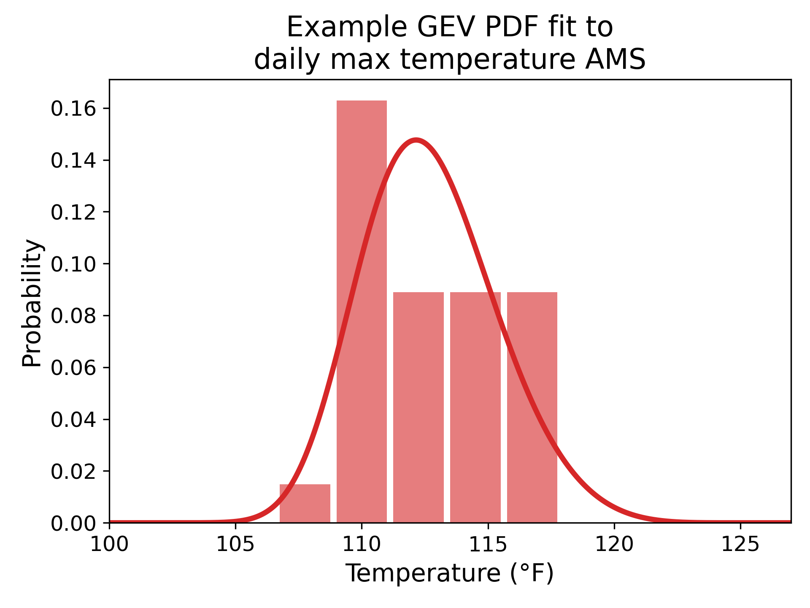
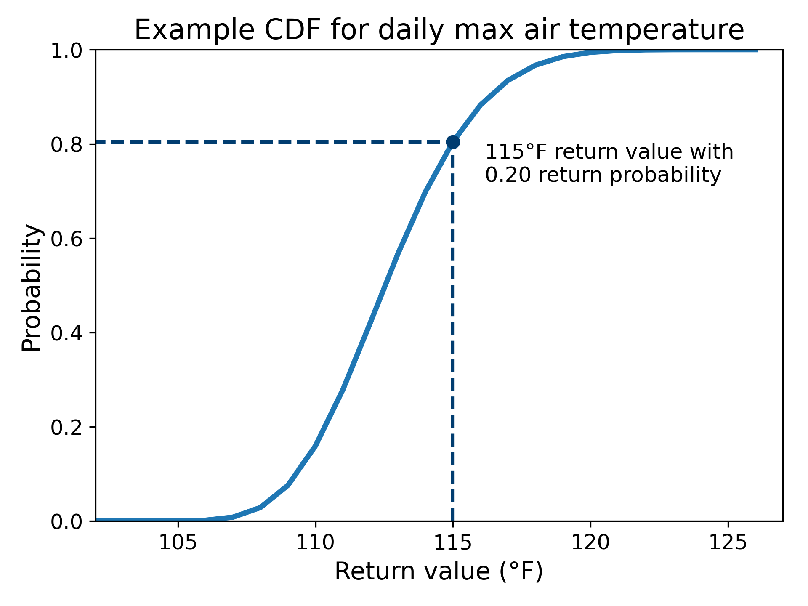
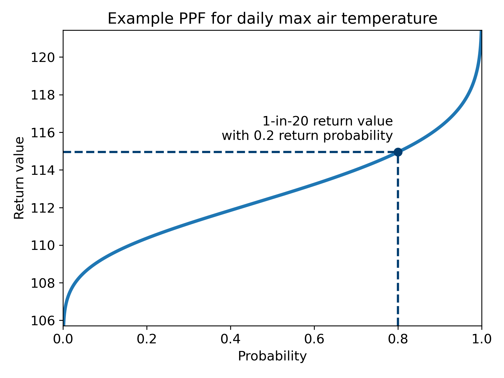

## Overview 

The [*climakitae* package](https://github.com/cal-adapt/climakitae/tree/main) available on the Analytics Engine (AE) provides numerous tools to assist with [Extreme Value Analysis](/glossary/index.qmd#extreme-value-analysis). This includes the calculation of [return probabilities](/glossary/index.qmd#return-probability), [return periods](/glossary/index.qmd#return-period), and [return values](/glossary/index.qmd#return-value). These terms are defined below within the context of meteorology and hydrology.

**Return probability:** The probability that a climate or weather event will exceed a specified magnitude in any given year [@wilksStatistical2011].

- For example, if the maximum temperature at a location has a 10% chance of exceeding 105°F in any year, the annual **return probability** of that temperature is 0.10.

**Return period:** The reciprocal of the return probability. This is commonly interpreted as the average expected wait time between threshold exceedances [@cooleyReturn2013; @douglasImpact2001; @volpiOne2015; @wilksStatistical2011].

- If the return probability of exceeding 105°F is 0.10 per year, the **return period** of that event is 1 ÷ 0.10 or 10 years.

**Return value:** The magnitude of a climate or weather event associated with a given return probability. Also called a return level [@colesIntroduction2001; @cooleyReturn2013].

- The 105°F threshold that has a 10% chance of being exceeded in a given year would be the 1-in-10 year **return value** for maximum temperature.

Extreme value analysis can be applied within the [Global Warming Levels](global-warming-levels.qmd) approach to compare return variables (return probability, period, or value) across warming levels [@liChanges2021; @slaterSubstantial2021]. A time-based approach can also be used.

## Methodology

### Block Maxima/Minima Series

The threshold tools on the Analytics Engine have implemented the Block Maxima/Minima Series (BMS) method for the stationary, single-variable case. In this method, a time series is divided into a series of evenly sized blocks. The collection of maximum or minimum values from these blocks is called the BMS. A statistical distribution is fitted to the BMS and then used to obtain return probabilities, values, or periods [@colesIntroduction2001; @cooleyReturn2013]. A typical block size for this method is one year, giving an [Annual Maximum Series (AMS)](/glossary/index.qmd#annual-maximum-series). The AMS or BMS can be obtained for data with any sub-annual time frequency including hourly, daily, and monthly frequencies. This method cannot be used to study extremes that are expected to occur more frequently than once per block.

### Effective Sample Size

Meteorological data is often temporally autocorrelated, meaning that the value at a given time depends to some degree on the value(s) at past times. When the data within a block of the BMS has too much autocorrelation it can bias the result of the extreme value analysis. One way to manage temporal autocorrelation in the blocks is to compute the [effective sample size (ESS)](/glossary/index.qmd#effective-sample-size) within each block and increase the block size as needed to obtain a sufficiently large ESS. The ESS is a scaled-down sample size that reflects the loss of information in a sample due to autocorrelation [@zwiersTaking1995].

The *climakitae* package offers the option to check the effective sample size of blocks and generate a warning when the effective sample size is below a minimum threshold value (by default this threshold is 25). To calculate the ESS, a variance inflation factor V is first estimated for each block [@wilksStatistical2011; @zwiersTaking1995] with:

$$V = 1 + 2\sum_{k=1}^{n-1}\left(1 - \frac{k}{n}\right)r_k$$

Where $n$ is the sample size and $r$ is the autocorrelation at lag $k$. The ESS is then:

$$\text{ESS} = \frac{n}{V}$$

For large time series with more than 500 time points per block, a logarithmic lag sampling scheme is used to speed up calculation time.

### Distribution Fit

Once the BMS has been constructed, a known statistical distribution can be fitted to model the distribution of extreme values. This distribution is then used to obtain the return values, periods, and probabilities.

The *climakitae* package offers the following probability distributions for modeling extreme values. While all of these distributions are frequently used in climate and hydrologic applications, the choice of distribution will depend on the specific application and underlying data [@cooleyReturn2013; @englandGuidelines2018; @katzStatistics2002; @furrerStatistical2010]. When in doubt, the [Generalized Extreme Value distribution](/glossary/index.qmd#generalized-extreme-value) is a good starting point as it is commonly used with climate data and the BMS method [@cooleyReturn2013; @colesIntroduction2001].

- [Generalized extreme value (GEV) distribution](/glossary/index.qmd#generalized-extreme-value)
- [Gumbel distribution](/glossary/index.qmd#gumbel-distribution)
- [Weibull distribution](/glossary/index.qmd#weibull-distribution)
- [Generalized Pareto distribution](/glossary/index.qmd#generalized-pareto-distribution)
- [Gamma distribution](/glossary/index.qmd#gamma-distribution)
- [Pearson Type III distribution](/glossary/index.qmd#pearson-type-iii)

The [Kolmogorov-Smirnov (K-S) Goodness of Fit test](/glossary/index.qmd#ks-test) can be used to evaluate how well the selected probability distribution fits the data with the following null and alternative hypotheses [@wilksStatistical2011; @kharinChanges2007]:

- H~0~ = input data is distributed according to the selected distribution
- H~1~ = input data is *not* distributed according to the selected distribution

The corresponding p-value shows the significance of the fit:

- If p-value < ɑ, reject H~0~. If p-value ≥ ɑ, fail to reject H~0~
- Where ɑ is the significance level (often set to 0.05 or 5%)

The *climakitae* package can be used to obtain these p-values. Users should be aware that the K-S test is sensitive to sample size and p-values will change as sample size increases.

Once a distribution is selected, the [Maximum Likelihood Estimation](/glossary/index.qmd#maximum-likelihood-estimation) method is used to estimate the distribution parameters [@colesIntroduction2001]. As currently implemented in *climakitae*, all parameters are constants.

The fitted probability distribution can then be used to calculate the return probability, return period, and return value as described below.

### Return Probability

The [cumulative distribution function (CDF)](/glossary/index.qmd#cumulative-distribution-function) is calculated for the fitted probability distribution. Using the CDF, the exceedance probability is read for a desired return value [@wilksStatistical2011]. In the maximum case, the return probability is one minus the exceedance probability. In the minimum case, the return probability is equal to the exceedance probability.

- Maximum case: `return_probability = (1 - fitted_distribution.cdf(return_value))`
- Minimum case: `return_probability = fitted_distribution.cdf(return_value)`

Figure 1 provides a demonstration of this procedure for the Maximum case.

::: {#fig-eva-return-probability layout-ncol=2}

This figure shows the CDF (right) for a GEV distribution (left) fitted to an AMS of daily maximum air temperature from a simulation. The return probability of 0.2 is read for a return value of 115°F (1 - 0.8 = 0.2), meaning that there is a 20% chance of temperatures exceeding 115°F in any given year at this location.
:::

### Return Period

The return probability is obtained as described above, then inverted to obtain the return period. Using the example in @fig-eva-return-probability, the return period would be 1 / 0.2 or 5 years.

`return_period = 1 / return_probability`

### Return Value

A [percentage point function](/glossary/index.qmd#percentage-point-function) (PPF, also known as an inverse CDF) [@colesIntroduction2001] for the fitted probability distribution is used to obtain the return value for a given event probability. In the maximum case, the event probability is one minus the return probability. In the minimum case, the event probability is equal to the return probability:

- Maximum case: `return_value = fitted_distribution.ppf(1 - return_probability)`
- Minimum case: `return_value = fitted_distribution.ppf(return_probability)`

Figure 2 provides a demonstration of this procedure for the Maximum case.

::: {#fig-eva-return-value}
{width=70%}

This figure shows the PPF for a GEV distribution fitted to an AMS of daily maximum air temperature from a simulation. The return value of 115°F is read for the return probability of 0.2 (1 - 0.8 = 0.2), meaning that there is a 20% chance of temperatures exceeding 115°F in any given year at this location.
:::

### Confidence Intervals

The bootstrap method is used to obtain confidence intervals on these return variables [@efronBootstrap1986; @efronBetter1987]. This involves pulling random samples (with replacement) of the same sample size from the original BMS series and obtaining return variable estimates from those samples. *Climakitae* allows users to adjust the number of bootstrap samples, with 50–200 often being sufficient to obtain confidence limits [@efronBootstrap1986]. Percentiles are used to select the confidence limits from the bootstrapped estimates — for example, the 95% confidence intervals are obtained from the 2.5 and 97.5 percentile values of these estimates. These confidence intervals represent uncertainty due to internal variability and sampling error, but there are other sources of uncertainty in the return variable results such as model physics and scenario uncertainty that are not captured by these confidence intervals [@kharinEstimating2005].

## Aggregation

This section describes some general ways in which extreme value datasets can be aggregated. Users should always consider which methods are most appropriate for their specific applications.

### Time Aggregation

Time aggregation may be used on input data as long as the final version of the input data is a time series. For example, an hourly precipitation time series could be resampled to a daily sum that is then used in the extreme value analysis.

### Spatial Aggregation

Spatial aggregation can be applied prior to creating the BMS or after calculating extreme value results. For gridded data, *climakitae* threshold tools include an option to stack time series from multiple grid cells to increase sample size [@englandGuidelines2018; @katzStatistics2002]. Alternatively, summary statistics such as spatial mean and median can be applied to a region to create a BMS for that entire region. Such statistics can also be applied to return variables, for example to obtain an average regional return value for a 1-in-10 event that has been calculated on a gridcell basis.

The stage at which spatial aggregation should be applied will depend on the variable used and research question being asked. For example, one investigation of basin-wide snow volume may require a single, basin-wide time series per simulation. A different investigation of extreme precipitation could focus on the most extreme return values in the region and choose to look at a spatial maximum of the return value. Users do not need to use any spatial aggregation and could instead look at single stations or maps of values.

### Simulation Aggregation

When working with the [CMIP6](/glossary/index.qmd#cmip6) GCM data and tools provided on AE, extreme value analysis should be conducted on a simulation-by-simulation basis. Time series should not be aggregated over simulations, for example by taking a time mean by simulation, prior to creating the BMS. Each simulation should have its own time series and corresponding return variables.

Once the return variables are generated, it may be appropriate to aggregate by simulation. For example, a user interested in finding the return period of 105°F temperatures at a location could generate the return period by simulation and take the median over all the simulations. A subset of simulations could also be selected, such as simulations that have statistically significant p-values for the extreme value distribution fit.

There are many examples of multi-model assessments of return periods and return values in the peer-reviewed literature including [@kharinEstimating2005; @kharinChanges2007; @wehnerCharacterization2020].
