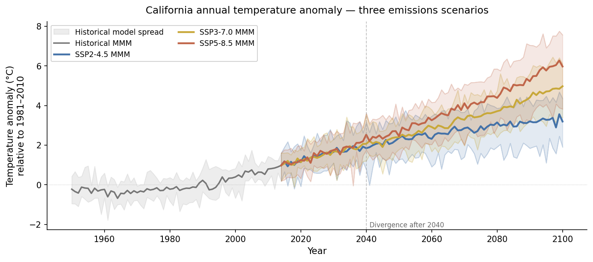
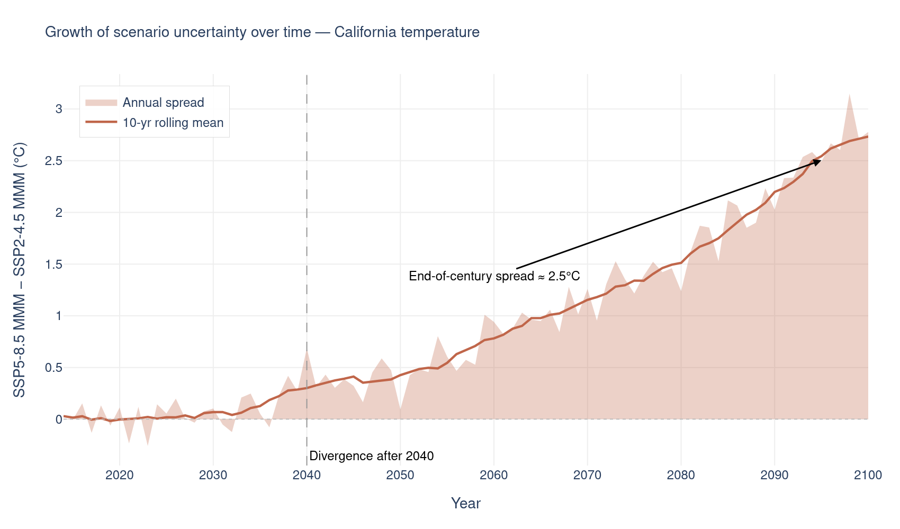
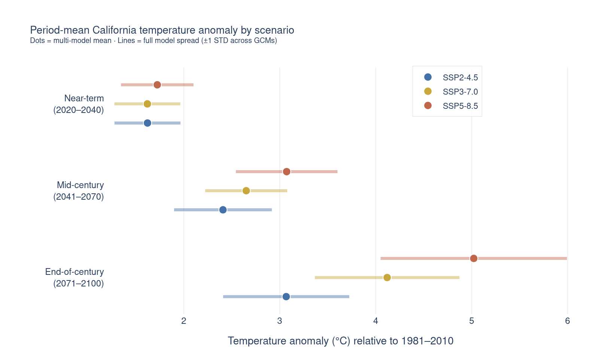
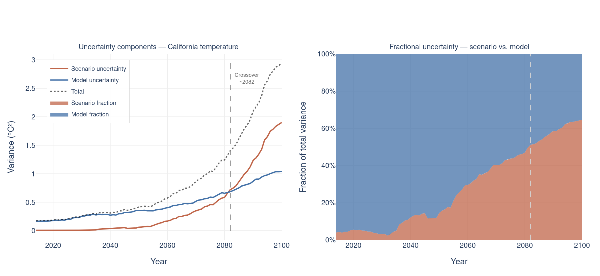
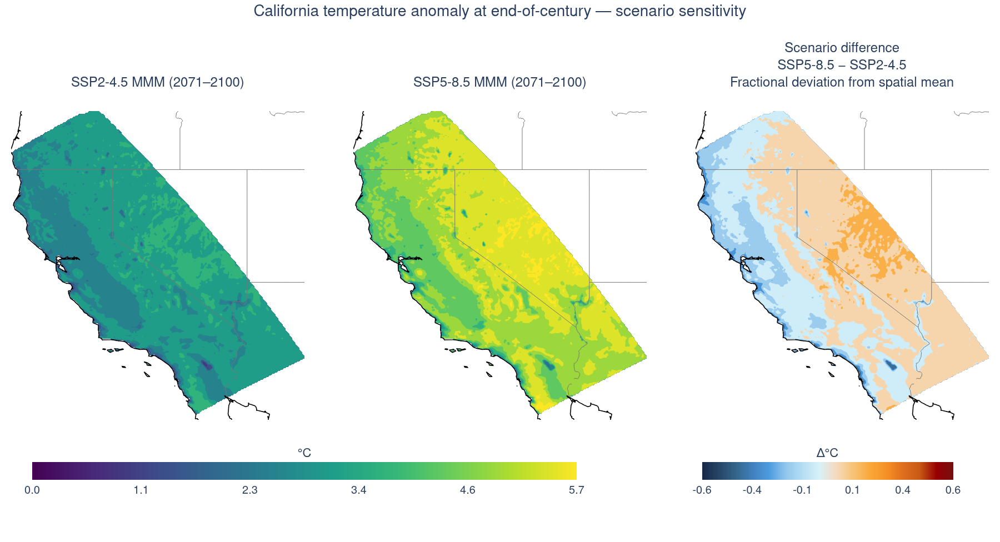

# What is scenario uncertainty?

Scenario uncertainty is the second of three sources of uncertainty in climate projections, alongside [model uncertainty](model_uncertainty.qmd) and [internal variability](internal_variability.qmd). It arises because the future trajectory of greenhouse gas (GHG) emissions depends on decisions — societal, economic, and political — that have not yet been made and cannot be predicted. The uncertainty is in which pathway the world will follow.

The scientific community represents this uncertainty through **Shared Socioeconomic Pathways (SSPs)**, a set of plausible future worlds defined by narratives about population growth, economic development, energy technology, and land use. Each SSP produces a distinct GHG concentration trajectory, and therefore a distinct climate projection:

| Pathway | Radiative forcing by 2100 | Rough narrative |
|---|---|---|
| SSP2-4.5 | 4.5 W/m² | Middle of the road: moderate mitigation |
| SSP3-7.0 | 7.0 W/m² | Regional rivalry: high emissions, weak cooperation between nations |
| SSP5-8.5 | 8.5 W/m² | Fossil-fuelled development: highest emissions |

Two key properties of scenario uncertainty distinguish it from the other two sources:

- It is **not reducible by adding more models or ensemble members:** it reflects genuine ignorance of the future, not a sampling problem.
- It **grows with time:** in the near term (< ~2040), all three pathways produce nearly identical projections because atmospheric GHG concentrations have not yet diverged enough to matter. By end-of-century, scenario choice dominates total uncertainty for temperature.

::: {.callout-note title="IPCC AR6 Synthesis Report"}
Scenario uncertainty is fundamentally a statement about human choices, not about the limits of climate science. The range between pathways is not a flaw to be narrowed by better models, it is a quantified expression of how much today's emissions decisions will shape the climate of the future. For deeper treatment, see the IPCC AR6 Synthesis Report [@calvinIPCC2023] and Pirani et al. [@piraniScenarios2024].
:::


# What data are used in these analyses?

The analyses on this page use **monthly maximum air temperature at 2m** from the Cal-Adapt LOCA2 statistically downscaled models, for all three emissions scenarios (SSP2-4.5, SSP3-7.0, SSP5-8.5) and the historical baseline. Temperature is used because it has the cleanest scenario signal. For precipitation, internal variability often dominates (see [internal variability](internal_variability.qmd)).

The historical baseline is scenario-independent, as all three pathways share the same observed forcing history. This baseline is used to express results as **anomalies relative to each simulation's 1981–2010 mean**. Calculating the anomalies removes the inter-model mean biases and allows the three scenario lines to start near zero and diverge upward. The future period runs from 2015 to 2100, covering the full divergence of the three pathways.


# How does scenario spread grow over time?

Each scenario's **multi-model mean (MMM)** is shown as a bold line; the **shaded envelope** spans the full range across the LOCA2 models within that scenario. The envelope shows within-scenario model uncertainty; the gap between the bold lines shows between-scenario (scenario) uncertainty.

::: {#fig-plume}
::: {.content-visible when-format="html"}
```{=html}
<div class="figure-container d-none d-md-block">

</div>
```
{.d-md-none fig-alt="Timeseries plume chart of California annual temperature anomaly multi-model means and model-spread envelopes for three SSP emissions scenarios."}
:::
::: {.content-visible when-format="pdf"}
{fig-alt="Timeseries plume chart of California annual temperature anomaly multi-model means and model-spread envelopes for three SSP emissions scenarios."}
:::
**California annual temperature anomaly, three emissions scenarios.** Each bold line is the multi-model mean of California-mean annual temperature anomaly (relative to 1981–2010) under one SSP; the shaded envelope spans the full range across the LOCA2 models within that scenario. The vertical dashed line at 2040 marks the approximate onset of scenario divergence.
:::

Reading @fig-plume, the three bold lines represent the multi-model mean projection under each scenario. The shaded envelopes around each line show how much the LOCA2 models disagree *within* that scenario — that is the model uncertainty contribution. The gap *between* the three bold lines is the scenario uncertainty contribution.

Before roughly 2040, the three envelopes largely overlap, scenario choice makes little practical difference for planning at that horizon. After 2040 the lines separate clearly, and by 2071–2100 the difference between SSP5-8.5 and SSP2-4.5 is typically larger than the model spread within either scenario.


# By how much does scenario choice change the outcome?

The spread between the highest and lowest scenario MMMs, plotted as a single line, makes the growth of scenario uncertainty explicit. This is the quantity most relevant for decision-makers: *by how much does my planning outcome change depending on which emissions pathway the world follows?*

::: {#fig-spread}
::: {.content-visible when-format="html"}
```{=html}
<div class="figure-container d-none d-md-block">

</div>
```
{.d-md-none fig-alt="Timeseries of the growing spread between SSP5-8.5 and SSP2-4.5 multi-model mean temperature anomalies over time."}
:::
::: {.content-visible when-format="pdf"}
{fig-alt="Timeseries of the growing spread between SSP5-8.5 and SSP2-4.5 multi-model mean temperature anomalies over time."}
:::
**Growth of scenario uncertainty over time.** The difference between the SSP5-8.5 and SSP2-4.5 multi-model means at each year (filled area = annual spread; bold line = 10-year rolling mean). The vertical dashed line marks 2040; the annotation marks the end-of-century spread.
:::

As shown in @fig-spread, the spread is near zero through 2035, rises gradually through mid-century, and accelerates sharply after 2060. The end-of-century value represents the full range of plausible California warming under current uncertainty about future emissions. This number cannot be reduced by running more models; it can only be reduced if global emissions policy narrows the range of plausible futures.


# How does scenario choice compare across planning horizons?

The plume chart shows trends; this bar chart makes the comparison between planning horizons concrete and numerical. For each of three standard planning windows, the scenario MMMs are shown side by side with the model spread overlaid as bars.

::: {#fig-bars}
::: {.content-visible when-format="html"}
```{=html}
<div class="figure-container d-none d-md-block">

</div>
```
{.d-md-none fig-alt="Bar chart of period-mean California temperature anomaly by emissions scenario across near-term, mid-century, and end-of-century planning horizons, with model spread shown as bars."}
:::
::: {.content-visible when-format="pdf"}
{fig-alt="Bar chart of period-mean California temperature anomaly by emissions scenario across near-term, mid-century, and end-of-century planning horizons, with model spread shown as bars."}
:::
**Period-mean California temperature anomaly by scenario.** Dots are the multi-model means for each scenario over three planning horizons (near-term 2020–2040, mid-century 2041–2070, end-of-century 2071–2100); bars span the full model spread (±1 standard deviation across the LOCA2 models).
:::

Reading @fig-bars, the dots are the multi-model means and the bars span the full range across the LOCA2 models within each scenario. In the near-term panel, the three dots are very close, making the scenario choice less relevant than the model uncertainty at that horizon. By the end-of-century, the dots are well-separated, making the scenario choice comparable and/or more relevant to the model spread; the scenario choice is the dominant source of uncertainty as shown in @fig-variance.


# When does scenario uncertainty overtake model uncertainty?

The plume chart shows this qualitatively; here it is quantified formally. Two variance components are estimated at each year:

- **Scenario uncertainty** $S(t)$: variance of the three scenario MMMs around their grand mean *how much does the answer change depending on which emissions pathway you assume?*
- **Model uncertainty** $M(t)$: average within-scenario variance across models *how much do the models disagree, given the same scenario?*

Their sum approximates total uncertainty (excluding internal variability, which requires large ensembles — see [internal variability](internal_variability.qmd)). The **crossover point**, where $S(t)$ exceeds $M(t)$, is the year after which scenario choice matters more than model choice.

::: {#fig-variance}
::: {.content-visible when-format="html"}
```{=html}
<div class="figure-container d-none d-md-block">

</div>
```
{.d-md-none fig-alt="Two-panel chart of scenario versus model variance over time, showing absolute variance and fractional contribution, with the crossover year marked where scenario uncertainty exceeds model uncertainty."}
:::
::: {.content-visible when-format="pdf"}
{fig-alt="Two-panel chart of scenario versus model variance over time, showing absolute variance and fractional contribution, with the crossover year marked where scenario uncertainty exceeds model uncertainty."}
:::
**Scenario vs. model uncertainty over time.** Left: absolute variance of the scenario component, the model component, and their total. Right: fractional contributions of each component to total variance. The dashed line marks the crossover year after which scenario uncertainty exceeds model uncertainty.
:::

Reading @fig-variance:

- **Left panel (absolute variance):** both components grow over time, but scenario uncertainty grows faster and crosses model uncertainty around the crossover year. Before the crossover, running multiple models matters more than choosing between scenarios. After it, the reverse is true.
- **Right panel (fractional contributions):** the orange fill shows the scenario fraction of total variance; the blue fill shows the model fraction. Early in the century the chart is mostly model-dominated; late in the century it is mostly scenario-dominated.

::: {.callout-tip title="Practical implication for ensemble design"}
If your application is end-of-century and the crossover has already occurred, including all three scenarios is more important than maximizing the number of models per scenario. If your application is near-term (< 2040), scenario choice barely affects the result. Focus instead on model spread and internal variability.
:::


# Where in California does scenario choice matter most?

The timeseries above is a California-wide average. Scenario uncertainty is not spatially uniform, some regions are more sensitive to emissions pathway than others. The maps below compare the **multi-model mean temperature change** under SSP2-4.5 and SSP5-8.5 over 2071–2100, then plot their **difference** showing the spatial field of scenario uncertainty.

::: {#fig-spatial}
::: {.content-visible when-format="html"}
```{=html}
<div class="figure-container d-none d-md-block">

</div>
```
{.d-md-none fig-alt="Three-panel map of California end-of-century temperature anomaly under SSP2-4.5 and SSP5-8.5, and their difference showing the spatial field of scenario uncertainty."}
:::
::: {.content-visible when-format="pdf"}
{fig-alt="Three-panel map of California end-of-century temperature anomaly under SSP2-4.5 and SSP5-8.5, and their difference showing the spatial field of scenario uncertainty."}
:::
**California temperature anomaly at end-of-century, scenario sensitivity.** Left and centre: multi-model mean temperature anomaly (relative to 1981–2010) under SSP2-4.5 and SSP5-8.5 over 2071–2100. Right: the difference (SSP5-8.5 − SSP2-4.5) shows the local temperature change (SSP5-8.5 − SSP2-4.5) expressed as a fraction of the domain-mean temperature change; positive values indicate above-average warming, negative values indicate below-average warming, relative to the spatial mean.
:::

Reading @fig-spatial, the left and centre panels show the multi-model mean temperature change under the two bookend scenarios. Both show broadly similar spatial patterns, with more warming inland than on the coast, amplified warming at elevation, with the SSP5-8.5 values uniformly larger. The right panel shows the **difference map is the spatial field of scenario uncertainty**. The choice of emissions pathway matters most for some locations than others. Geographic regions that are projected to warm the fastest also have the largest sensitivity to emissions scenario. In California those regions are the interior valleys and Sierra Nevada.


# When does scenario choice matter?

The analyses above consistently show the same pattern. In the near term (< 2040), scenario is the lowest uncertainty contributor; by mid-century it begins to matter for temperature; by end-of-century it dominates total uncertainty. 


<!-- **Practical checklist for any scenario uncertainty analysis:** -->

1. **What is your planning horizon?** If < 2040, scenario choice is not the main source of uncertainty in your result (note this explicitly to your audience and focus on model spread and internal variability instead).
2. **What is your variable?** Temperature has a cleaner scenario signal than precipitation. For precipitation, the uncertainty decomposition will show whether internal variability or scenario uncertainty dominates your specific question.
3. **Are you communicating risk or central tendency?** For risk applications (infrastructure design, emergency planning), use SSP3-7.0 and SSP5-8.5 to capture the upper bounds of future climate risk.
4. **Are you showing spatial results?** Show different scenarios spatial distribution and difference maps as a companion to any single-scenario map. It immediately reveals where your spatial conclusions are sensitive to scenario choice and where they are robust.
5. **Are multiple scenarios impractical?** If you can only include one, use SSP3-7.0 as the central estimate and document the choice and report the spread so readers can assess its significance.


# Key takeaways

- Scenario uncertainty reflects genuine ignorance of future human choices, not a sampling problem. It cannot be reduced by adding more models or ensemble members, only by the world narrowing its range of plausible emissions futures.
- Scenario uncertainty grows with time. In the near term (< 2040) all three SSPs converge and scenario choice is nearly irrelevant; by end-of-century it becomes the dominant source of uncertainty for temperature.
- There is a crossover year after which scenario uncertainty exceeds model uncertainty. Before it, model spread matters more; after it, scenario choice matters more. This  could be a key consideration for ensemble design.
- Scenario sensitivity is spatially variable. The difference map between high and low scenarios reveals where projected warming is most sensitive to emissions pathway, typically the interior valleys and Sierra Nevada.
- When planning for the worst-case scenario, always include the high scenario (SSP5-8.5). Reporting only the middle scenario or the multi-model mean underestimates the upper tail of plausible outcomes.

