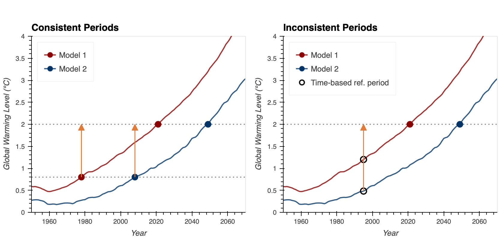
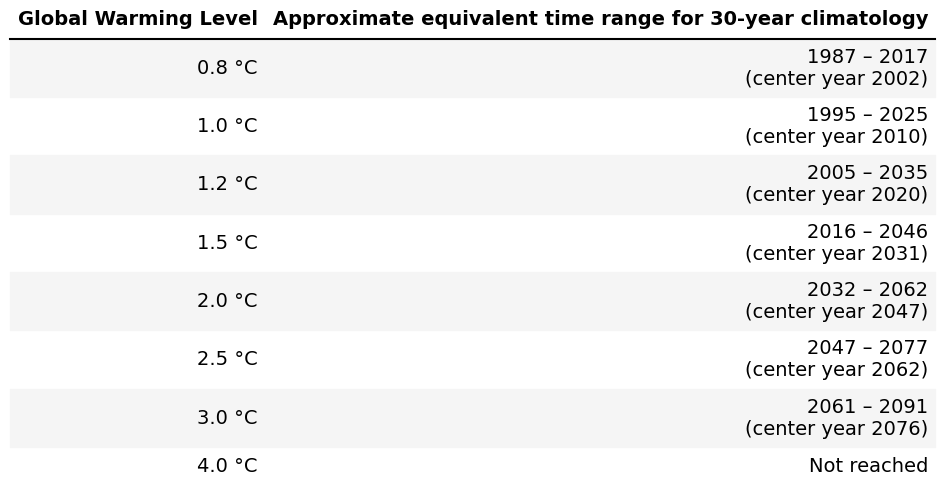
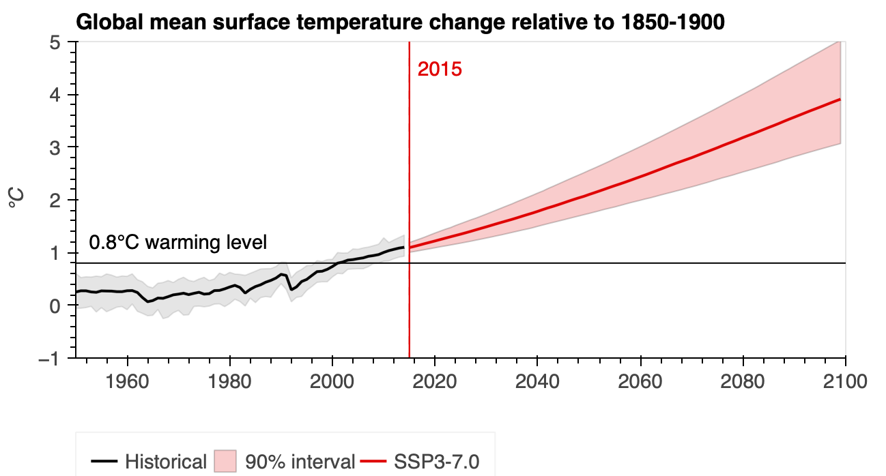

Below are answers to some common questions about climate data that the Analytics Engine users may encounter. It is recommended that users review these answers before they use the data or tools in AE. These answers are not meant to be prescriptive but rather to provide a framework to think through some of the choices that a user may have to make. 

## What dataset is most appropriate for my application/context?
The Analytics Engine hosts two types of downscaled datasets: [WRF](https://www.energy.ca.gov/sites/default/files/2024-06/02_DynamicalDownscaling_DataJustificationMemo_Rahimi_Adopted_v2May2024_ada.pdf) and [LOCA2-Hybrid](https://www.energy.ca.gov/sites/default/files/2024-03/04_HybridDownscaling_DataJustificationMemo_Pierce_Adopted_ada.pdf). The dynamically downscaled WRF dataset and the hybrid downscaled LOCA2-Hybrid dataset were developed to emphasize different strengths of the two downscaling methods and provide users with distinct dataset options. However, the two datasets differ in several important ways. Therefore, before deciding which dataset to use, **users should review the hyperlinked data memos above, which provide fundamental information about the datasets, as well as the downscaling methods, uncertainties, and credibility of the data.** To provide one illustrative example of how these datasets can differ – although both datasets provide downscaled climate projections over California at 3-km grid spacing, WRF has hourly data and more variables but for a much smaller set of GCMs, only one SSP, and only one ensemble member. LOCA2-Hybrid data is available for fewer variables at daily resolution but provides projections from many more GCMs, multiple ensemble members, and often for three SSPs. Additional information on WRF and LOCA2-Hybrid downscaling approaches can be found in journal articles linked in the [References](/general-resources/external-references.qmd) page.

In general, choices between these two datasets may be based on:

1. **Data fit**: whether the datasets have the variables, temporal and spatial scales, and SSPs that fit the user’s application context
2. **Sampling needs**: whether the user needs to sample widely across models and ensemble members
3. **Consistency**: whether there user needs dynamical or physical consistency among different climate variables
4. **Bias correction**: whether the user needs a specific type of bias corrected data

Broadly, users should first map the key characteristics of both datasets, and determine if one or both have the specific types of information (scales, variables, models, SSPs, etc.) that are essential for a given context or application. For most applications that need daily data within California, the LOCA2-Hybrid dataset provides a wider range of models, ensemble members, and SSPs. The WRF dataset is useful in cases where users need hourly data, WECC (Western Electricity Coordinating Council) wide data, a larger set of variables than the LOCA2-Hybrid dataset provides, or dynamically consistent variables. Dynamically consistent variables are variables within a dataset that are internally consistent and reflect the realistic physics of the climate system, because they are generated from a model that forces variables to be consistent with each other. This ensures that relationships between variables obey real-world physics. 

### Example: Variable Consistency 
Temperature and dew point temperature in a dynamically consistent dataset will always behave realistically - dew point will never be higher than air temperature. This consistency is important for accurate climate and weather analysis, especially when studying how different variables like wind, humidity, and precipitation interact.

### Example: Chosing between WRF and LOCA2-Hybrid
For a WECC-wide analysis that requires hourly wind data the WRF data might be the only viable option, because WRF offers hourly wind data at a 9-km resolution that covers the WECC region. For examining the return period of daily temperature or precipitation extremes (i.e. 1-in-X-events) in California, the LOCA2-Hybrid dataset might be more appropriate since it enables a wider sampling of possible outcomes. In this case, users might also choose to simultaneously examine the WRF dataset, to see if and how results look across the two datasets (see next question).

## Can you use both WRF and LOCA2 in the same analysis? 
Both WRF and LOCA2-Hybrid are credible datasets, however they differ in how they were developed. For example, the datasets differ in how they were bias-corrected and how some of the physical variables such as wind or precipitation were computed. Therefore, there is not an easy apples to apples comparison between the two datasets, and they cannot be readily combined together. However, **it may be beneficial (and appropriate) to look at both WRF and LOCA2-Hybrid data in tandem but as separate datasets**. For instance, if a user wants to understand how certain extreme events will change in the future, they can examine the detailed dynamics of a single extreme event within the hourly WRF data while also separately examining the distribution of similar events within the much larger set of LOCA2-Hybrid projections.

**Because of the differences in the two datasets, it is not advised to "combine" WRF and LOCA2-Hybrid into a super ensemble dataset without additional data processing.** If users do indeed find it necessary to combine WRF and LOCA2-Hybrid data, they should first consult with a climate science expert on the type of additional data processing that might be essential to make the two datasets comparable with one another. For example, users may need to ensure that the [bias correction](/glossary/index.qmd#bias-correction) approaches that have been applied and the computation of physical variables such as wind or precipitation are comparable across the datasets. Also, since some of the same [model runs](/glossary/index.qmd#model-run) have been downscaled using both WRF and LOCA2-Hybrid methods, the issue of double counting the same run would need to be addressed.

## Should I use bias-corrected data? 
The Analytics Engine hosts a-priori bias corrected as well as non-bias corrected WRF data. If users determine that the WRF dynamically downscaled dataset is most appropriate for their application, **it is recommended that they choose the a-priori bias corrected models** (i.e. `MIROC6 r11i1p1f1`, `TaiESM1 r1i1p1f1`, `EC-Earth3 r1i1p1f1`, `MPI-ESM1-2-HR r3i1p1f1`, `EC-Earth3-Veg r1i1p1f1`). These models will likely be the most appropriate option for energy sector applications due to their ability to produce more realistic representations of regional climate than the non-bias corrected WRF models.

Detailed analyses of the non-bias corrected WRF data have shown that they generate results for precipitation, temperature and snow that do not seem to be physically plausible. These non-bias corrected models might still be useful for some advanced applications where users only want to examine the degree of change in the projected data (i.e. change between modeled future and modeled historical conditions) without using absolute values. In this case, users should consult with a climate science expert to carefully factor the implications of the biases in the data into their analyses and results. Users can also review this [bias correction memo](https://www.energy.ca.gov/sites/default/files/2024-03/01_BiasCorrectioninWRF_and_LOCA2Projections_DataJustificationMemo_Pierce_Adopted_ada.pdf) and [Rahimi et al., 2024](https://agupubs.onlinelibrary.wiley.com/doi/full/10.1029/2023GL106264) that describe the benefits of bias-correction in WRF data.

## How should I chose models and/or ensemble members? 

The [Data](DEAD LINK) page details the total number of models and ensemble members from both WRF and LOCA2-Hybrid datasets that are available to users. Broadly, the WRF and LOCA2-Hybrid datasets include several models, and LOCA2-Hybrid has multiple ensemble members for a select few models. Both the WRF and LOCA2-Hybrid datasets come from GCMs that have been pre-selected based on a rigorous skill evaluation of how well they capture key characteristics of California’s climate ([Krantz et al., 2021](https://www.energy.ca.gov/sites/default/files/2022-09/20220907_CDAWG_MemoEvaluating_GCMs_EPC-20-006_Nov2021-ADA.pdf)).

Once users have selected a dataset, it is generally recommended that they examine as many models and ensemble members as possible to develop the most complete picture of the range of plausible future outcomes. This is the default setting using Analytics Engine tools for data download. The Analytics Engine has tools and functionalities that allow users to more easily work with a larger number of models than was previously feasible for the energy sector.

However, there may be certain instances where selecting a smaller number of model runs is necessary (e.g. time series data applications). How a user undertakes this type of sub-selection will depend on the type of climate data application (including the variable, location, and scale of analysis) and the user’s ability to process large amounts of data. In cases where it is necessary to select a smaller set of model runs, users must first perform a preliminary exploratory analysis on the full suite of available data within the Analytics Engine to determine the appropriate set of models and ensemble members for their specific context. 

During the exploratory analysis, it might be useful for users to determine if, for their specific application, they care more about: 

1. Sampling across a range of potential outcomes, or 
2. Gaining a statistical understanding of (changing) extreme weather events. 

While choosing between these two different options is not ideal and is always limiting, there are cases where such difficult trade-offs might need to be made based on practical considerations.

### When a Range of Outcomes is Needed
For cases where it is determined that a range of outcomes are needed, the users’ preliminary analysis could entail a ranking exercise to characterize all the available model runs for the range of outcomes for the region, timescale, and primary variable(s) of interest (e.g. characterizing model runs from hottest to coolest, or wettest to driest, or based on the change signal in the models). Users can then sub-select a set of model runs to represent the median, mean, and/or either tail of the distribution, depending on which aspect of the distribution is most relevant to their application. If the goal is to select a plausible range of outcomes, then it may not be necessary to distinguish among models and ensembles. If calculating a mean, median, or some other statistical property of the model distribution, though, users should be mindful of how models with different numbers of ensembles are weighted.

### When Extreme Event Analysis is Required
For cases where it is determined that a statistically robust understanding of changing extreme weather events is required, it is recommended that users avoid sub-sampling to the extent possible. Extreme event analyses require large ensembles of climate data because these events are often poorly sampled within a single climate model run (a 1-in-100 year event may only occur once in a given ensemble run). Properly understanding the statistics of such extremes requires large ensembles so that there are enough instances of rare events to understand their properties and frequencies.

A user’s preliminary analysis should then entail an assessment of both the [internal variability](/glossary/index.qmd#internal-variability) and [model uncertainty](/glossary/index.qmd#model-uncertainty) of the entire dataset. This is because both these types of variability are important for extreme event analyses. Internal variability can be examined in the Analytics Engine as the differences among ensemble members from each individual model (i.e. as intra-model variability), and model uncertainty can be examined as the differences between various models in the dataset (i.e. as model-to-model variability or intra-model variability). 

The availability of multiple ensemble members for some models hosted in the Analytics Engine makes it possible to conduct extreme event analyses for each individual model, and to distinguish how different models represent changing characteristics of extreme events. After comparing across models to see how similarly or differently they represent the internal variability, users can then choose models and ensemble members accordingly. If a user still finds it necessary to sub-sample the models, they should perform the aforementioned analyses of the two types of variability for all the Analytics Engine models that have multiple ensemble members. Users should then cross-check the inter-model spread of their chosen sub-sample with the inter-model spread of the broader dataset to check if the full range of outcomes is captured in their sub-sample.

## What are General Use Projections (GUPs) and can they be used?

While it is always recommended for users to examine as many models and ensemble members as possible, Analytics Engine also hosts a set of “General Use Projections”. These five LOCA2-Hybrid model runs (`ACCESS-CM2 r1i1p1f1`, `MPI-ESM1-2-HR r3i1p1f1`, `EC-Earth r1i1p1f1`, `FGOALS-g3 r1i1p1f1`, `MIROC6 r1i1p1f1`) have been pre-selected to reasonably capture a range of future outcomes for a limited number of commonly used climate variables, scales, and SSPs. If users are unable to perform context-specific preliminary analyses as suggested in the previous question and/or are less comfortable working with large amounts of data, **the GUPs can provide a minimum set of model runs to start with before more sophisticated analyses can be done.**

Users should review [this short memo](https://www.energy.ca.gov/sites/default/files/2025-07/a_General_Use_Projections_Selection_Process_sept2024_ada.pdf) for details on how the GUPs were identified and what ranges of outcomes they span (and do not span). Broadly, the GUPs were evaluated for SSP 370 and 2045-2074 (mid-century) changes relative to the 1950-2014 historical period. This was done for selected variables including temperature (change in statewide average annual daily Tmax, degree F), precipitation (change in statewide average annual precipitation, % change), and wind (change in statewide average annual wind speed, % change). In the assessments, the five selected GUPs were able to reasonably capture the range of projected changes for the above-mentioned precipitation and temperature metrics. Future changes in wind speed projected by these GCMs varied quite a lot by location in the state, therefore users who require changes in wind at specific locations should evaluate a broader set of models for their specific location of interest rather than relying solely on the reduced set of general use projections.

### Limitations of GUPs
**Since GUPs only represent a minimum set of starter projections, they are limited in their scope, and users should exercise caution while drawing conclusions from this sub-selection.** While the GUPs attempt to cover a range of variability for a limited set of pre-determined metrics, it cannot be guaranteed that these model runs will necessarily cover the appropriate range for every user-relevant outcome, i.e. for different time periods, SSPs, regions, and/or variables/metrics. Particularly for applications which involve examining extreme events, the GUPs may not be appropriate, as they may not be able to reasonably capture the full range of extremes. Therefore to the extent possible, it is recommended that users rely upon a larger number of models and ensembles, or conduct their own preliminary analyses to determine which models are needed to capture the appropriate range of plausible outcomes for their specific contexts (as recommended in the model selection question). It is worthwhile to reiterate that existing and forthcoming tools of the Analytics Engine will make working with larger amounts of model runs much easier for users, and therefore users will be able to make use of the full suite of data rather than relying on limited sets of projections.

## What temporal scale should I consider?
Temporal scale considerations for users often include four key choices: 

1. Temporal resolution of the data (hourly or daily)
2. Sampling window (number of years of analyses)
3. Temporal aggregations (whether and how to average across years of analyses)
4. Timeframe (historical, earlier-21st, mid-century, end-century)

The data and tools in the Analytics Engine allow a user to work with different options for these four choices. Note that these choices have big implications for the size of the data and computational time required to perform analyses. Therefore choices need to be made thoughtfully based on the type of application and potential tradeoffs, i.e. choosing the finest temporal resolution of data might limit the ability to work with longer sampling windows or a larger number of models (if data size is an issue). A user can also conduct preliminary analysis within the Engine’s JupyterHub to examine the implications of these different choices before a decision is made on the temporal scale of the data to be downloaded for further use.

### Temporal Resolution
In the AE, depending on the type of data and variable of interest, a user can select between hourly or daily resolution data or pre-aggregated data at daily or monthly scales ([refer to this Analytics Engine data table for more details](DEAD LINK)). Users’ choice about the temporal resolution of the data should be informed by the temporal nature of the climate hazard of interest and how it interacts with the user’s system and planning process.

**Overall, the broad recommendation is for users to identify specific temporal aspects of their application, start coarsely with some preliminary analyses, and then work towards larger sets of data with finer resolutions.** For instance, if users are working with broader trend analysis, changes in central tendency, or seasonal questions, where very specific temporal characteristics are less relevant, they may be able to work with data at daily scales or even pre-aggregated monthly, seasonal, or annual scale data. However, if the application or process involves a daily or hourly model, or if an 8760 analysis is needed, then the user will likely need to work with the higher resolution data. Generating a [Typical Meteorological Year (TMY)](DEAD LINK) is another example where hourly data may be required for a long climatological period. See the [TMY methodology notebook](DEAD LINK) on AE.

Additionally, if a user is looking at applications or hazards where a certain temporal characteristic (e.g. time of day or the diurnal pattern of data) is of critical importance, then the choice of daily versus hourly data can make a big difference to the results. For instance, examining wildfire risk in the afternoons, hourly exceedances for parking lot design, storm surges, or Santa Ana winds may need hourly or sub-hourly data, whereas examining the recurrence of long-term droughts might not require as fine resolution data (i.e. it may be okay to trade off finer resolution data in exchange for the ability to include a larger number of years in the sampling window).

### Sampling Window 
Often the choice of an appropriate sampling window is determined by the type of planning or modeling processes that a user is interested in. **It is important to note that longer time windows (i.e. 30+ years) are better able to sample key modes of variability that affect California**, e.g. a 30 year sampling window is needed to capture a reasonable number of El Niño or La Niña cycles, as well as positive and negative Pacific Decadal Oscillations. In addition, some applications like Extreme Value Analyses require at least 30 years of simulation to appropriately pull event maxima. While it is possible to select and examine shorter sampling windows within the AE, users need to be aware that these windows might not adequately represent the modes of variability, and therefore may not be fully representative of the various hazards that might impact their systems (i.e. there is a possibility of missing out on key hazards).

If users have to choose a sampling window that is less than 30 years, it is recommended that they use as many models and ensemble members as possible in their analysis. Using data with many different initial conditions and perturbations enables a better representation of different forms of natural variation over a shorter sampling window, than a single model and ensemble member.

### Temporal Aggregations
When analyzing data at certain resolutions and sampling windows, some applications may require further temporal aggregations (e.g., for input into other models, or for developing summary statistics or graphs for reports). The tools in the Analytics Engine allow users to analyze events or metrics at a finer scale within the engine’s JupyterHub, and then aggregate and download (or further analyze) the data at a coarser scale. For instance, users can evaluate certain heat wave metrics at a fine scale within the engine (e.g. use hourly data to examine total hours of heat index above 90 °F). Users can then choose to temporally aggregate the resultant derived heat wave data more coarsely before downloading (i.e., total daily/weekly hours of heat index above 90 °F, or daily max heat index) without losing the quality of information. In this manner, the Analytics Engine enables users to examine heat waves at a fine scale using hourly data, without having to download the entire suite of hourly data from every model. Some fine-scale metrics (such as heat index) are already pre-aggregated in the Analytics Engine. 

Broadly, it is recommended that the temporal averaging (if necessary) be done at the end, once the temporal variability and distribution have been examined and considered within the Analytics Engine JupyterHub. For example, upon examining hourly versus more temporally aggregated data, it was found that for energy demand forecasts, it is more appropriate to calculate demand for each hour and then average or summarize the demand outputs across several years. This was found to be more appropriate than calculating energy demand from the average over a day or over several years, since energy demand varies non-linearly with temperature and other factors.

### Timeframe
Users often need to align their timeframe choices with their planning horizon and/or with the lifetime of the asset/infrastructure under consideration. However, climatic changes, as well as the impacts and risks that stem from these changes, could be non-linear and increase at a more rapid rate towards the end of the century. Hence, near-term timeframes might not always provide a holistic picture of long-term risk and impacts, particularly for the higher SSPs.

For instance, if peak load forecasting is analyzed only until 2050, it might not provide a good understanding of the risk that might ensue post 2060. **Therefore, when feasible, users should consider the evolution of risk over longer periods of time (e.g. 2070, end of century, etc), and then break up the analysis into shorter time windows that better align with their planning horizons, asset lifetimes, or other application-specific considerations.** Such longer-term analyses may be essential to better understand how decisions or actions may need to scale over time, particularly for climate impacts that are likely to change at a much faster rate after mid-century (e.g. sea level rise). It can be noted here that using Global Warming Levels (GWL) as an alternate framework can help to overcome some of these challenges (see question on GWLs below), as this framework is more suited to adaptive planning.

## What spatial scale should I consider? 
Spatial scale considerations for users often include three key choices:

1. Spatial resolution of data (the size of grid cell or data at a point location)
2. Spatial extent (the area over which data is analyzed)
3. Spatial aggregations (whether and how to aggregate over a larger geographic area, such as counties or hydrological units, HUCs)

Similar to [temporal scales](#what-temporal-scale-should-i-consider), the data and tools in the Analytics Engine offer different options for these choices. Given that these choices have big implications for the size of the data and computational time required to perform analyses, **it is recommended that users conduct preliminary analyses within the Analytics Engine JupyterHub to examine these implications before deciding on the spatial scale of the data to be downloaded or synthesized for further use.**

### Spatial Resolution 
The first spatial scale choice that climate data users often need to make is whether they need data at a point location or if they are able to work with gridded data. In general, if users want to examine a hyper-local issue (e.g. a point-based asset such as a substation) or if they are working with a model or workflow that is parameterised or dependent on a particular weather station, then they may need to use point location data. However, if users are looking at regional climate responses, then gridded data might be most appropriate.

#### Point Location Data
Climate models do not automatically output data at point locations. However, the Analytics Engine has developed a [Weather Station Localization notebook](DEAD LINK) that allows users to generate data at particular locations for which the user has historical data. Hourly temperature data is also available on the Analytics Engine at 32 select weather stations that were identified as important for the energy sector for the LOCA2-Hybrid dataset. If users are looking to examine a point location that does not have available historical data, then they would need to conduct a qualitative assessment using the finest resolution gridded data for the nearest gridcells to the point location to determine how representative the grid cell average is of the specific point location.

#### Gridded Data 
If users choose the LOCA2-Hybrid dataset, this is offered only at 3km x 3km resolution. However if users choose the WRF dataset, this data is available at 9km x 9km as well as 3km x 3km resolution. **When choosing a spatial resolution, the broad recommendation is that users should first identify the specific spatial aspects of their application, and then conduct preliminary analyses in the Analytics Engine JupyterHub to compare between different resolutions.** Users should evaluate the tradeoffs (information that is gained or lost) by choosing different resolutions. 

For instance, if users have data size or computational constraints, choosing very fine resolution data may restrict their ability to examine a greater number of model runs or larger spatial extents. It can also be noted that higher resolution spatial data is not always better or necessary for every analysis. Many informed decisions and investments can be made by using lower resolution data that considers more models and plausible future outcomes. When conducting preliminary analyses, users must also be aware of the spatial heterogeneity/variability (topographic, climatic, or other) within the region that they want to assess. Finer resolution data could provide greater benefits for regions that are spatially heterogeneous (e.g. areas of complex terrain or regions that transition quickly from water to land) as compared to regions that are more spatially homogeneous (e.g. the Central Valley). 

It can be noted that many areas in California are characterized by a high degree of spatial variability in weather, topography, and the human dimensions of infrastructure and demographics. Therefore, depending on the region and climate variable under consideration, the spatial heterogeneity within a grid cell (and also across adjacent/nearby grid cells) might be large. Overall, the goal should be to select the most appropriate spatial resolution for the context, that also allows for a broad range of model runs to be included.

### Spatial Extent 
The choice of spatial extent is often dependent on the risk or climate hazard that users want to analyze, and/or the question they are trying to answer. The spatial extent needs to be large enough to properly analyze the climate issue under consideration. For instance, to analyze the impacts of a heat event on system-level planning, a user may need to examine the entire regional extent where the impacts of the heat events may occur. For other specialized analyses, such as evaluation of streamflow, sector-specific domains (or spatial extents) such as watersheds can be applied to gridded climate data. Here, care must be taken to create a rigorous workflow which carefully considers edge cases where a gridcell may be only partially included in a polygon area (In the AE, functions such as [`rioxarray clip()`](https://corteva.github.io/rioxarray/stable/rioxarray.html#rioxarray.raster_array.RasterArray.clip) have been used to better examine some of these issues).

Users should also note that conducting hyper-local spatial analyses (e.g. using census tracts in urban areas) may require specialized approaches that are highly dependent upon a given question or application. Please see the  [Census Tracts](/scientific-guidance/census-tracts.qmd) page for more information.

### Spatial Aggregations 
Some applications may require aggregating data across a larger spatial area (such as a county or a watershed) before it is downloaded or examined for further use (e.g. for developing synthesis graphs or summary numbers for reports). However, users should note that some of the quality of the information may be lost when spatially aggregating across different locations or gridcells. For instance some aggregations (such as averaging over large spatial areas) could lead to missing out on specific distributional impacts for different communities, which might have equity implications. Therefore, users need to be aware of the types of impacts that they might miss out on when aggregating across gridcells.

If aggregation is necessary, it is recommended that users do not default to spatial averaging. **Instead, users should first examine climate impacts without aggregation, and then aggregate at the end, once the spatial variability and distribution have been examined within the Analytics Engine JupyterHub.** For example, finer scale analyses of population-weighted heat exposure can be first assessed at the gridcell level and then aggregated to a county level for reporting, after the variability has been examined. In such cases, users should consider reporting other distributional statistics over the aggregated areas, such as the spatial variability within the county.

The homogeneity of the climate hazard over the spatial area that a user is aggregating over is also very important. For instance, aggregating heat metrics over a largely homogenous plain area might be less challenging than aggregating precipitation over a topographically diverse area. In addition, users must exercise further caution when aggregating over gridcells for assessments of extremes, such as for [extreme value analysis]([extreme values](/scientific-guidance/extreme-value-analysis.qmd)). In extreme value analyses, if multiple gridcells from a climatologically diverse area are averaged, there is a chance of accidentally biasing the results to the most extreme value in the area and/or missing an extreme of interest. As in several of the previous questions, users will need to make an informed decision about the right balance between performing a good quality and rigorous analysis versus one that is computationally light and technically feasible within their context.

## How should I use reference periods? 

### What is a reference period?
To evaluate climate impacts from climate model outputs, it is often helpful to calculate the difference between future conditions and a historical reference period. This difference is called a “change signal” or a “delta signal”. To compute this change signal an appropriate future timeframe and reference period must be chosen. The reference period is often called a baseline climatology. Both the future period and the reference period should be long enough to characterize the average climate conditions and year-to-year variability during a given historical period. It is typically recommended that the future and reference periods be 30 years long. For consistent comparisons, the future period and reference period should also generally be the same length as each other.

Depending on the goal of the analysis, reference periods can be chosen to approximate present day conditions or some other point in the past (e.g. 1950 to 1980). The choice of reference period can have a significant impact on the apparent magnitude and characteristics of the change signal, so care should be taken with this selection. The discussion below will help inform decisions about reference periods for different types of analyses in the Analytics Engine.

### Why use reference periods?
There are two major reasons to use a reference period to calculate a climate change signal rather than directly using future values from a climate model: 

1. It frames the severity of future climate conditions in a meaningful context. This means that relative metrics like percent change from a historical period can be calculated.
2. It helps avoid biases in climate models. By calculating changes relative to a baseline from the same model, biases in the underlying climate state are cancelled out. The result is a better estimate of the change signal that can be directly compared between different climate models.

### Reference periods for time-based analyses
When examining future climate conditions using time-based analyses, any time period can be chosen as a reference period, provided it is sufficiently long to characterize the mean climate. Scientific best practices recommend 30 years, but 20-year reference periods may be appropriate in a limited number of application-specific cases. For the WRF simulations in the Analytics Engine data catalog, the earliest year simulated is 1980, so 1980-2010 is a standard baseline climatology. For LOCA2 simulations, data extends back to 1950, so earlier climatologies can be calculated if desired.

:::{.callout-note title="Later reference periods"}
The climate simulations in the Analytics Engine data catalog use a 'historical' scenario for the years 1950-2014, and split into separate simulations that follow different SSP scenarios for years 2015 and onward. It is possible to define a reference period that extends beyond 2015 (e.g. 1995-2025), but it requires combining data from the historical scenario and a chosen SSP simulation.
:::

### Reference periods for global warming levels
When examining future climate conditions using a global warming levels approach, the selected reference period should also be defined as a global warming level. This will help prevent adding uncertainty to the calculated change signal. In essence, if a time-based reference period (e.g., 1980-2010) is used as the baseline for a warming level (e.g., 2.0°C) inconsistencies can be introduced as not every simulation warms at the same rate. We illustrate this in the figure below.

Using warming levels as the future target and the reference period ensures that consistent and comparable change signals are calculated for each simulation. Because global warming levels are agnostic to SSP scenarios, you do not have to choose a scenario when using a warming level as a reference period.

### How selecting GWL reference periods can influence results

- **Consistent Periods**: Comparing conditions at 2.0 °C of global warming to conditions at 0.8 °C of warming creates a consistent change signal (1.2 °C of global warming) across simulations and scenarios. This ensures that results focus on the change signal and comparative impacts.
- **Inconsistent Periods**: Comparing conditions at 2.0 °C of global warming to time-based reference of 1980-2010 results in comparing a different amount of warming in each simulation. In this example one model has warmed by 1.1 °C while the other has warmed by 1.6 °C, adding additional uncertainty to the change signal.

::: {#fig-gwl-periods fig-cap="Consistent vs. Inconsistent GWL Reference Periods. Each line shows the global mean surface temperature trajectory for an individual CMIP6 model simulation (data source: [IPCC](https://data.ceda.ac.uk/badc/ar6_wg1/data/spm/spm_08/v20210809/panel_a)) relative to 1850–1900. Left: Using GWL-based reference periods, the change signal between 0.8°C and 2.0°C is a consistent 1.2°C across all simulations (orange). Right: Using a fixed time-based reference period (1980–2010, green shading), each simulation corresponds to a different amount of warming at the reference period, introducing additional uncertainty into the change signal (orange)."}
::: {.content-visible when-format="html"}
```{=html}
<div class="figure-container">

</div>
```
:::
::: {.content-visible when-format="pdf"}

:::
:::

The Analytics Engine has several global warming levels designed specifically to be used as reference periods. Global data (data source: [IPCC](https://data.ceda.ac.uk/badc/ar6_wg1/data/spm/spm_08/v20210809/panel_a)) at several GWLs are summarized in the table below.

::: {#fig-warming-levels-table fig-cap="Global Warming Levels and Approximate 30-Year Climatology Windows. Center years and 30-year time ranges associated with each global warming level, based on the IPCC AR6 multi-model ensemble mean global mean surface temperature change relative to 1850–1900 under SSP 3-7.0."}
::: {.content-visible when-format="html"}
```{=html}
<div class="figure-container">

</div>
```
:::
::: {.content-visible when-format="pdf"}

:::
:::

For each reference period, the approximate equivalent time range is determined using the IPCC’s aggregation of the historical climate record and estimated timings for future warming under the SSP 3-7.0 Scenario, as shown below for the 0.8 °C warming level.

::: {#fig-warming-trajectory fig-cap="Estimate of the year the world reached 0.8 °C of warming. Figure produced by the Cal-Adapt: Analytics Engine (data source: [IPCC](https://data.ceda.ac.uk/badc/ar6_wg1/data/spm/spm_08/v20210809/panel_a))."}
::: {.content-visible when-format="html"}
```{=html}
<div class="figure-container">

</div>
```
:::
::: {.content-visible when-format="pdf"}

:::
:::

### Additional considerations for selecting global warming level reference periods
The default reference warming level on the Analytics Engine is 0.8 °C, and is recommended unless a particular use case requires a different choice. Because 0.8 °C is the earliest warming level that can be defined with this dataset, it provides the clearest change signal to future warming levels like 1.5°C. The 1.0 °C and 1.2 °C warming levels are useful when a warming level closer to present-day conditions is needed, or if the approximate timeframe of these warming levels is more consistent with an existing planning process.

Depending on the length of the climatology that is needed, some simulations from `EC-Earth3` and `EC-Earth3-Veg` are not available at the 0.8 °C and 1.0 °C warming levels. These simulations have warmer historical temperatures, and therefore exceed 0.8 °C or 1.0 °C of warming before the start of the downscaled simulations. When 0.8°C and 1.0°C warming levels are used within the Analytics Engine, either individually or as a part of a change signal, we have ensured simulations from EC-Earth3 and EC-Earth3-Veg are not retrieved. If including these simulations is important, using the 1.2 °C reference period will ensure that data from all simulations is retrieved.

### Note on pre-industrial reference period
In line with the IPCC definition, Global Warming Levels are defined as warming relative to pre-industrial conditions (years 1850-1900). This time period defines the 0 °C warming level, but this time period is not an option for a reference period for regional climate impacts on the AE.

There are two important reasons we don’t use 0 °C of warming as a reference period:

1. Significant changes have occurred in the climate between the pre-industrial period and present day. From a planning perspective, pre-industrial conditions are not familiar, and not very useful in the context of modern infrastructure and societal needs.
2. The downscaled climate simulations in the Analytics Engine only extend back to 1980 (WRF) or 1950 (LOCA2), so downscaled data at 0 °C of warming is not available. The lowest global warming level that can defined with our downscaled data is 0.8 °C

## How is a GWL approach different than a time-based approach? 
Until the last few years, it was most common to assess climate projections at a particular time period, such as mid-century or end-of-century, and for different emission scenarios (RCPs or SSPs). However, it is becoming increasingly common to assess climate projections at different levels of warming, for example how regional climate change might look like in a world that is 2˚C or 3˚C warmer on average than pre-industrial levels. Key national and international climate assessments such as the IPCC AR6 and the NCA5, are using the warming level framework for several reasons. This [blog post](https://cmip5.cal-adapt.org/blog/understanding-warming-levels/) and slides 11-17 of [this presentation](https://docs.cpuc.ca.gov/PublishedDocs/Efile/G000/M520/K563/520563621.PDF) explain in detail why the warming level framework has been preferred.

Broadly, one of the main reasons for using GWLs rather than a time-based approach, is that **there is less certainty around the rate (timing) of climate change than the range of possible temperature outcomes at a given level of warming** (see this Analytics Engine [blog post](https://cmip5.cal-adapt.org/blog/understanding-warming-levels/) for a visual representation). When using a time-based approach to plan for a specific target year(s), users are often forced to pick projections from a particular emissions trajectory. This limits the overall sample size of model runs and therefore reduces the ability to holistically characterize future outcomes, specifically extremes and rare events.

On the other hand, **the GWL framework allows users to avoid choosing among the different emissions trajectories and hence increases the sample size of model runs that they can use.** That is, to evaluate climate impacts in a 2˚C warmer world one can combine the regional projections from all available simulations, regardless of the emissions scenario and regardless of when they reach 2˚C of global average warming. This larger sample size provides users with a greater ability to holistically examine risks and, in particular, to better characterize risks from extremes. The approach also allows for isolation of the different sources of uncertainty in regional climate responses, which lends itself to a more adaptive management approach (see this Analytics Engine blog for more details). Overall, the GWL framework allows more robust climate change analyses, as summarized in the IPCC AR6 "…robust projected geographical patterns of many variables can be identified at a given level of global warming, common to all scenarios considered and independent of timing when the global warming level is reached.

The Analytic Engines' Warming Level Notebooks allow users to easily examine regional climate impacts for a specific global warming level. In these notebooks, users can first identify target warming levels (e.g. 2˚C or 3˚C global warming), and then calculate the regional climate response of interest for those GWLs with the largest possible set of model runs. These notebooks also have functionalities that allow users to examine the median time period when a given warming level might be reached (i.e. go from GWL to time estimates), thereby also providing a time-based estimate for planning purposes. This [example application](DEAD LINK) can help users get familiar with the functions of the notebook. Similar to the recommendations on choice of timeframes, it is also recommended that users do not fix-in on any one warming level, but also undertake exploratory analyses at additional warming levels. In particular, including a higher-end warming level may be beneficial for capturing potential nonlinear impacts of climate change, which can enable adaptive planning.

## How should I decide between a GWL approach and a time-based approach? 
Determining whether to use GWLs versus time- or scenario-based approaches will depend on the goals of the analysis, and/or external requirements for planning. As a starting point for making these decisions:

- If planning occurs around discrete future time periods that use a climatology (i.e. averaging conditions over a 30-year period), it is recommended that a GWLs approach is used.
- If planning relies on viewing a long-term trend (e.g. through the end of the century) as a continuous time-series, it is recommended that a time-based approach is used.

### When should I choose GWLs for my planning?
Using Global Warming Levels (GWLs) for planning comes with some distinct advantages over a traditional time-based approach:

- Avoiding additional uncertainty about warming trajectories due to [hot models in CMIP6](https://www.carbonbrief.org/guest-post-how-climate-scientists-should-handle-hot-models/).
- Improving statistical robustness by incorporating climate simulations from all scenarios.
- Enabling an adaptive, scenario-agnostic planning approach that focuses on critical thresholds.
- Providing consistency with climate change analyses from the Intergovernmental Panel on Climate Change (IPCC) [AR6 report](https://www.ipcc.ch/report/ar6/syr/downloads/report/IPCC_AR6_SYR_FullVolume.pdf), the [Fifth National Climate Assessment](https://nca2023.globalchange.gov/), and [recommendations from the California Public Utilities Commission (CPUC)](https://docs.cpuc.ca.gov/PublishedDocs/Efile/G000/M534/K315/534315135.PDF).

For these reasons, it is recommended that GWL approaches are used with CMIP6 data whenever possible. This is particularly true when a climate analysis needs to be conducted around a future time period, such as 30 years in the middle or end of the century (i.e. a future climatology).

For California’s Investor Owned Utilities, the California Public Utilities Commission specifically requires planning ([Rulemaking 18-04-019, Agenda ID #22703](https://docs.cpuc.ca.gov/PublishedDocs/Efile/G000/M534/K315/534315135.PDF)) around global warming levels of 1.5 and 2.0 °C when completing a Climate Adaptation and Vulnerability Assessment (CAVA).

Using GWLs in the Analytics Engine is as straightforward as using time-based climate data. An overview of how to easily retrieve data on GWLs along with a detailed methodology of how this is implemented is available on our [methods page](DEAD LINK). The table on [this page](DEAD LINK) can help you choose GWLs that correspond to a relevant future period for your analysis, and communicate results in situations where time-based planning may be more familiar.

### When is time-based planning recommended instead of GWLs?
Despite the advantages of GWLs, time-based data may be more appropriate for certain approaches, such as:

- Using a continuous time series to visualize or analyze a long-term climate trend (e.g. through the end of the century).
- Comparing the timing or intensity of climate impacts between different scenarios explicitly (e.g. comparing SSP 3-7.0 to SSP 5-8.5).

Additionally, climate impacts that exhibit a significant delay in response to global temperature increase or are sensitive to the rate of warming are difficult to analyze with GWLs. Examples of these impacts are sea-level rise, glacial melt, and coastal processes driven by land-sea temperature differences.

Finally, when using time-based climate data it is important to keep in mind that increased uncertainties about future warming and climate impacts arising from the “hot model problem” will become more pronounced towards the end of the century.

## How can I assess the credibility of the Analytics Engine data?
All of the downscaled data available in the Analytics Engine comes from GCMs that have been pre-selected based on a rigorous skill evaluation of how well the models capture several relevant characteristics of California’s climate. These GCMs were shown to perform well for both process-based as well as local climate metrics. The models were able to simulate the key physical processes and patterns that strongly influence the hydrological cycle and extreme weather in California, and they were also able to capture local climatic patterns such as annual and seasonal patterns of temperature and precipitation. This sort of state-level GCM assessment is unique, and lends broad credibility to the data that is being hosted in the AE. More details on how the GCMs were evaluated and selected are available in [Krantz et al., 2021](https://www.energy.ca.gov/media/7264).

**Although all the models in the Analytics Engine have been shown to perform well at capturing California’s climate broadly, this does not necessarily mean that all models perform equally well for any specific sub-region within California or for any specific metric** (particularly ones that were not evaluated within the GCM selection process). In such cases, users may want to additionally understand whether and to what extent the data being used is credible for their specific region, metric, or application. Here, an additional level of credibility analysis could be of interest to a user. However, the approach for such additional user-driven GCM evaluations is still an evolving area of research and experimentation that scientists and practitioners are collectively trying to figure out. If users are interested in undertaking additional credibility evaluations, it is recommended that they thoroughly review the Guiding Principles section (upcoming), and consult with a climate expert who is well-versed in GCM evaluation approaches.

For additional credibility analyses, users may first want to qualitatively assess whether and to what extent the GCMs represent the key underlying physical processes that are relevant to the phenomenon or region of interest. This can be done using existing studies or literature on the GCMs. Then they may want to quantitatively examine the historical performance of the models or dataset, for the metric that is of interest. Upon such analyses, users might consider three key questions:

1. Are the class of models available suitable/appropriate for the specific [use case](/glossary/index.qmd#use-case), climate phenomenon, or variable of interest?
2. Is there a need to differentiate between the various models based on their historical performance?
3. Should some models be avoided (or culled) for specific regions,variables, or applications?

However, these are nuanced questions that require advanced analyses that cannot be predicted or easily identified. **Overall, it is worthwhile to reiterate that user-centric credibility evaluations are still an evolving matter in both science and practice.** Sub-selections or culling of models based on very specific credibility assessments need to be done carefully and in consultation with climate science experts on the best course of action.

### Credibility evaluation when using wind data 
One instance where an additional credibility evaluation might be useful to users, is for cases where specific wind variables are needed. Wind is often a tricky variable to capture well in climate models due to its extremely local characteristics, which can be affected by local buildings, trees, hills, etc. A user may want to validate that the data they are using reasonably captures the distribution of wind extremes in a given location of interest before proceeding to analyze changes in that metric in the future. (It can be noted that such a validation analysis might need access to specific observed data sets to compare to, which can be difficult to obtain for variables like wind). When such fine-scale features are being examined, it is possible that only a subset or even none of the models represent the phenomenon of interest very well. In this case users may want to rule out certain models or might determine that the available data is not appropriate for their application. Ruling out models should be balanced with considerations about sampling (see the model selection question), so that users ensure that they do not overscreen models and miss out on plausible and realistic outcomes.

## How can users examine uncertainties in climate data?
Justine, can we remove this section since we are fleshing out a comprehensive uncertainty page?
We could just move the text from this section into the overview page for uncertainty? LMK what you think

## References

- Cal-Adapt. *Understanding Warming Levels.* <https://cmip5.cal-adapt.org/blog/understanding-warming-levels/>
- California Energy Commission. (2024). *Bias Correction in WRF and LOCA2 Projections — Data Justification Memo.* <https://www.energy.ca.gov/sites/default/files/2024-03/01_BiasCorrectioninWRF_and_LOCA2Projections_DataJustificationMemo_Pierce_Adopted_ada.pdf>
- California Energy Commission. (2024). *Dynamical Downscaling (WRF) — Data Justification Memo.* <https://www.energy.ca.gov/sites/default/files/2024-06/02_DynamicalDownscaling_DataJustificationMemo_Rahimi_Adopted_v2May2024_ada.pdf>
- California Energy Commission. (2024). *General Use Projections Selection Process.* <https://www.energy.ca.gov/sites/default/files/2025-07/a_General_Use_Projections_Selection_Process_sept2024_ada.pdf>
- California Energy Commission. (2024). *Hybrid Downscaling (LOCA2-Hybrid) — Data Justification Memo.* <https://www.energy.ca.gov/sites/default/files/2024-03/04_HybridDownscaling_DataJustificationMemo_Pierce_Adopted_ada.pdf>
- California Public Utilities Commission. *Rulemaking 18-04-019, Agenda ID #22703.* <https://docs.cpuc.ca.gov/PublishedDocs/Efile/G000/M534/K315/534315135.PDF>
- Hausfather, Z. (2022). *Guest post: How climate scientists should handle 'hot models.'* Carbon Brief. <https://www.carbonbrief.org/guest-post-how-climate-scientists-should-handle-hot-models/>
- Intergovernmental Panel on Climate Change (IPCC). (2023). *Sixth Assessment Report: Synthesis Report.* <https://www.ipcc.ch/report/ar6/syr/downloads/report/IPCC_AR6_SYR_FullVolume.pdf>
- Intergovernmental Panel on Climate Change (IPCC). (2021). *AR6 WGI Summary for Policymakers, Figure SPM.8.* <https://data.ceda.ac.uk/badc/ar6_wg1/data/spm/spm_08/v20210809/panel_a>
- Krantz, D., et al. (2021). *Evaluating Global Climate Models for California's Fifth Climate Change Assessment.* California Energy Commission. <https://www.energy.ca.gov/media/7264>
- Fifth National Climate Assessment. (2023). <https://nca2023.globalchange.gov/>
- Rahimi, S., et al. (2024). *Atmospheric River Precipitation in the WRF-CMIP6 Ensemble.* *Geophysical Research Letters.* <https://agupubs.onlinelibrary.wiley.com/doi/full/10.1029/2023GL106264> 

