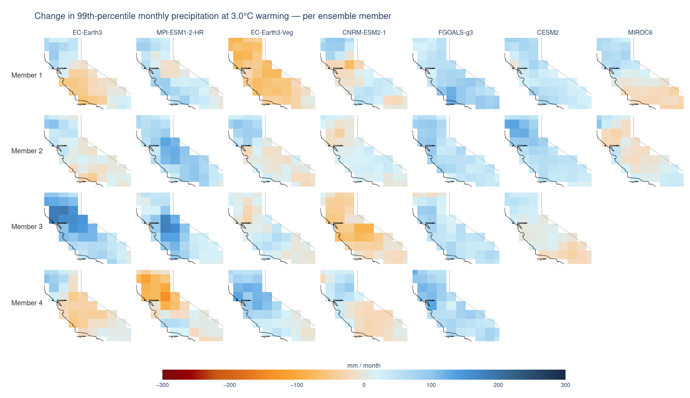
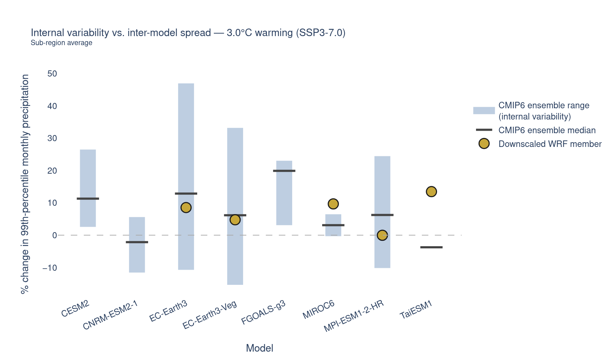
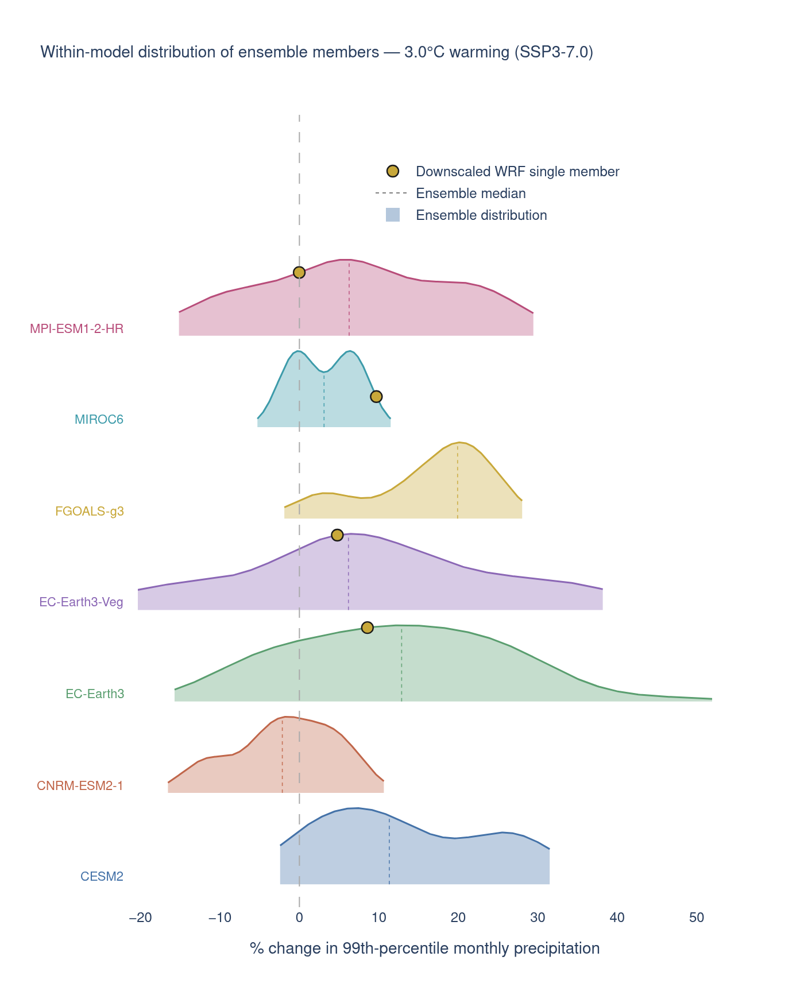
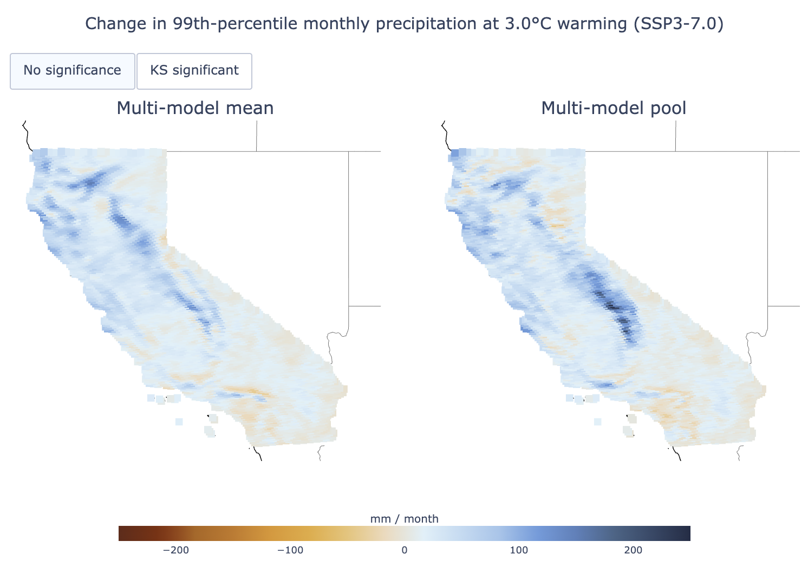
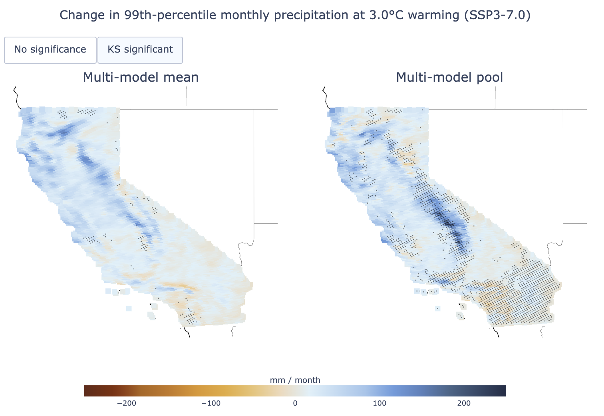

# What is internal variability?

Internal variability is one of three sources of uncertainty in climate projections, alongside [model uncertainty](model_uncertainty.qmd) (different GCMs give different answers) and [scenario uncertainty](scenario_uncertainty.qmd) (different emissions pathways give different answers). It arises from the inherently chaotic behavior of the climate system itself — interactions among the atmosphere, ocean, land surface, and sea ice produce natural fluctuations that are not predictable beyond weather timescales.

Two runs of the *same* model with the *same* forcing, differing only in their initial conditions (different ensemble "members"), will diverge over time purely due to this internal variability. It is distinct from *external* natural forcing (volcanic eruptions, solar fluctuations) because it originates *inside* the climate system, and is most apparent at **regional scales** and **short time horizons** (seasonal to decadal). At multi-decadal scales, model and scenario uncertainty progressively dominate.

Internal variability matters most for:

- **Extremes** (e.g. 99th-percentile precipitation) rather than means
- **Regional / local** scales rather than global
- **Near-term** projections (next few decades) rather than end-of-century
- Variables with naturally **high year-to-year variance**, like precipitation, more so than temperature

::: {.callout-note title="IPCC AR5 Uncertainty Guidance"}
Internal variability is an irreducible component of climate uncertainty — it cannot be narrowed by improving models or constraining emissions. The appropriate response is to sample it explicitly, through multiple ensemble members, and to communicate the resulting range honestly. For a deeper scientific treatment, see the [IPCC AR5 uncertainty guidance](https://www.ipcc.ch/site/assets/uploads/2017/08/AR5_Uncertainty_Guidance_Note.pdf) and [Hawkins & Sutton (2009)](https://journals.ametsoc.org/view/journals/bams/90/8/2009bams2607_1.xml).
:::


# What data are used in these analyses?

The analyses on this page use **monthly precipitation** because precipitation has among the highest internal variability of any climate variable — making it the clearest case for illustrating why internal variability matters and how to handle it. Two complementary datasets are used:

- **Downscaled WRF precipitation (Cal-Adapt models):** seven dynamically downscaled models over California at 9 km resolution, historical + SSP3-7.0. Each model here has exactly **one** ensemble member — so this dataset captures **inter-model spread**, not within-model internal variability.
- **CMIP6 ensemble members for the same models:** for each of the seven Cal-Adapt models, raw CMIP6 provides multiple **ensemble members** — runs of the same model with slightly different initial conditions. The spread across these members captures genuine internal variability, since the model structure and forcing are identical within each model — only the starting conditions differ.

Throughout, results are anchored to the [global warming levels](https://analytics.cal-adapt.org/guidance/about_climate_projections_and_models#what-are-global-warming-levels) framework, comparing a 1981–2010 baseline against a window centered on the year each simulation crosses a target warming level under SSP3-7.0.


# How large is internal variability within a single model?

For seven Cal-Adapt models, raw CMIP6 provides multiple ensemble members. Because the model structure and forcing are identical across members, differences between maps **within a column** are internal variability alone, while differences **between columns** (different models) mix internal variability with model uncertainty.

::: {#fig-members}
::: {.content-visible when-format="html"}
```{=html}
<div class="figure-container">

</div>
```
:::
::: {.content-visible when-format="pdf"}

:::
**Change in 99th-percentile monthly precipitation per ensemble member.** Each column is one CMIP6 model; each row within a column is a different ensemble member of that model. Differences *within* a column reflect internal variability alone (identical model physics and forcing); differences *between* columns mix internal variability with model uncertainty. Values are the change in the 99th-percentile of monthly precipitation at the selected warming level, relative to the 1981–2010 baseline.
:::

Reading @fig-members, focus on variation *within* a single column first. Some models show one member with a strong wetting signal in the Sierra Nevada and another member with near-zero or even negative change in the same region — despite identical model physics and identical forcing. This within-column spread is internal variability. In several cases, the within-column spread is comparable in magnitude to the between-column (inter-model) spread — which is the central finding these analyses set out to quantify.


# How does internal variability compare to inter-model spread?

The spatial maps show the *pattern*; the next chart makes the comparison between internal variability and inter-model spread directly *quantitative*. For each model, a bar spans the full range of 99th-percentile precipitation changes across all CMIP6 ensemble members for that model — this range is internal variability — while a tick marks the ensemble median and a separate marker shows the single downscaled WRF member available for that model, one draw from that distribution. All values are area-averaged over a representative sub-region of Northern/Central California and expressed as % change from the 1981–2010 baseline.

::: {#fig-range}
::: {.content-visible when-format="html"}
```{=html}
<div class="figure-container">

</div>
```
:::
::: {.content-visible when-format="pdf"}

:::
**Internal variability vs. inter-model spread.** For each CMIP6 model, the bar spans the full range of % change in 99th-percentile monthly precipitation across all of that model's ensemble members (internal variability); the horizontal tick marks the ensemble median; the gold dot marks the single downscaled WRF member available for that model. Values are area-averaged over a Northern/Central California sub-region at the selected warming level under SSP3-7.0.
:::

The key observation from @fig-range is that the bars (internal variability within each model) are typically **larger** than the spread between model medians (inter-model spread). For extreme precipitation, choosing a different starting condition within the same model produces more spread than choosing a completely different model entirely — a striking and counterintuitive result that underscores why internal variability cannot be ignored for this variable.

The gold WRF dot sits somewhere within the bar for most models — where exactly depends on which ensemble member happened to be selected for downscaling. A WRF dot near the top of a model's bar does not mean that model projects more precipitation change than others; it means that particular member happened to draw from the upper tail of natural variability.

::: {.callout-important title="Single-member conclusions are fragile"}
Conclusions drawn from a single WRF member are sensitive to which member was chosen, not just to differences in model physics. When only one realization is available, treat its placement within the ensemble range as a draw from natural variability rather than a robust model signal.
:::


# What does the distribution of ensemble members look like?

The range chart shows only the min–max and median. The ridgeline below shows the **full probability density** of each model's ensemble, making it possible to see whether a model's distribution is narrow and peaked, wide and flat, or skewed.

::: {#fig-ridgeline}
::: {.content-visible when-format="html"}
```{=html}
<div class="figure-container">

</div>
```
:::
::: {.content-visible when-format="pdf"}

:::
**Within-model distribution of ensemble members.** Each ridge is the kernel density estimate of % change in 99th-percentile monthly precipitation across one model's CMIP6 ensemble members, at the selected warming level under SSP3-7.0. The dotted line marks the ensemble median; the gold dot marks where the single downscaled WRF member lands on that distribution.
:::

In @fig-ridgeline, wider, flatter ridges indicate higher internal variability within that model — the single WRF member (gold dot) could have landed anywhere in that distribution, and a different random seed could easily have produced a very different downscaled outcome. Narrower, taller ridges indicate that ensemble members cluster more tightly, meaning the forced response is more consistently captured regardless of which member you happen to use.

Some models show only the distribution with no gold dot — no corresponding downscaled WRF member is available for those models, so we can only see their CMIP6 ensemble spread, not where a single realization happened to land.


# Why does internal variability matter for extremes?

A 99th-percentile statistic is, by construction, computed from a small number of extreme months. With only ~360 historical months and a few hundred future months *per model*, the sample feeding the percentile estimate is small — and small samples are noisy. If we compute statistics from a **single ensemble member per model** (as the WRF downscaled product gives us), our estimate of "how precipitation extremes change" is entangled with that one particular realization of internal variability, not just the forced climate-change signal.

The practical question this raises: when comparing historical vs. future precipitation extremes, **is the difference we see real (a forced signal) or could it just as easily be internal noise?** Answering that requires a statistical significance test.


# How should high internal variability be handled?

When internal variability is large relative to the forced signal, computing statistics from a single ensemble member per model gives unreliable results — the estimate depends heavily on which member or model was chosen, not on the underlying climate physics.

The recommended approach is to **pool all models together** before computing statistics, treating each model-month as one independent sample. This inflates the effective sample size, which gives a more stable estimate of the underlying distribution and makes significance tests more conservative and trustworthy.

<!-- ::: {.callout-warning title="A critical pitfall: the seasonal cycle"}
Before running any significance test on raw monthly precipitation, the **seasonal cycle** must be removed (deseasonalize). California precipitation is sharply seasonal — wet in winter, near-zero in summer. If raw monthly values are fed straight into a distribution test, the test will detect the seasonal cycle itself as "significant," not genuine climate change, because the historical and future periods may simply sample different numbers of wet-season vs. dry-season months. Deseasonalizing is applied before every significance test in these analyses.
::: -->

To compare distributions rather than just means, a two-sample **Kolmogorov–Smirnov (KS) test** is run at every grid cell, comparing the full distribution of historical vs. future deseasonalized precipitation. Two approaches are compared side by side:

1. **Multi-model mean (MMM)** — average across models first, then test
2. **Pooled** — keep every model-month as a separate sample, then test

::: {#fig-ks}
::: {.content-visible when-format="html"}
```{=html}
<div class="figure-container">

</div>
```
:::
::: {.content-visible when-format="pdf"}



:::
**Change in 99th-percentile monthly precipitation — multi-model mean vs. pooled.** Left: the change computed from the multi-model mean. Right: the change computed from the pooled sample (every model-month treated as a separate sample). The "KS significant" view stipples the grid cells where a two-sample Kolmogorov–Smirnov test detects a statistically significant difference (p < 0.05) between the deseasonalized historical and future precipitation distributions.
:::

Reading @fig-ks:

- The raw difference maps ("No significance" view) are nearly identical between the mean and pooled approaches — both capture the same broad spatial pattern of intensifying wet-season extremes in the north and weakening/more erratic extremes in the south.
- The **significance pattern differs substantially** ("KS significant" view): the multi-model mean tends to show significance almost everywhere — an overconfident result driven by noise suppression from averaging — while the pooled approach shows significance concentrated specifically where the signal is strongest and most consistent across models.

::: {.callout-tip title="Use the pooled result as the primary output"}
For variables or regions where internal variability is high, reporting significance from a multi-model mean **overstates confidence**. The pooled result, not the mean result, should be treated as the primary, most defensible significance estimate.
:::


# When does internal variability matter?

Internal variability is not equally important for all variables, regions, or time horizons. The guidance below summarizes the key rules of thumb that follow from the analyses above.

| Context | Internal variability dominates? | Recommended approach |
|---|---|---|
| Near-term (< 20 yr), any variable | **Yes** | Pool ensemble members; acknowledge large uncertainty |
| Long-term (> 40 yr), temperature | **No** — model/scenario dominate | Multi-model ensemble, keep scenarios separate |
| Long-term (> 40 yr), extreme precipitation | **Yes** | Pool; use KS test with conservative thresholds |
| Regional scale | **Yes** — amplified regionally | Pool; avoid single-model conclusions |
| Global scale | **Partial** | Standard multi-model mean is more defensible |

**Practical checklist for any new internal-variability analysis:**

1. Are you analyzing an **extreme** statistic (percentile, max, count of threshold exceedances)? If so, internal variability likely matters — don't skip the pooling step.
2. Are you testing significance on a **multi-model mean**? Be skeptical of results that look significant almost everywhere — cross-check against the pooled result.
3. Do you have only **one ensemble member per model**? You're capturing inter-model spread but not true within-model internal variability — for that, you need a single-model large ensemble.
<!-- 4. Does your variable have a strong **seasonal cycle**? If so, deseasonalize before any significance test. -->


# Key takeaways

- Internal variability is the climate system's own unforced, chaotic fluctuation — irreducible by better models or constrained emissions, and most important at regional scales and short time horizons.
- For extreme precipitation, internal variability within a single model is often **larger** than the spread between different models. Conclusions drawn from a single ensemble member are sensitive to which member was chosen, not just to model physics.
- Estimating change from a single ensemble member entangles the forced signal with one particular realization of internal noise. Pooling all models inflates the effective sample size and yields more stable, trustworthy estimates.
- Precipitation must be deseasonalized before any distribution-based significance test; otherwise the seasonal cycle is mistaken for a climate-change signal.
- Significance reported from a multi-model mean overstates confidence where internal variability is high. The pooled result is the more defensible primary output.


# References

- Hawkins, E. & Sutton, R. (2009). *The Potential to Narrow Uncertainty in Regional Climate Predictions.* Bulletin of the American Meteorological Society. <https://journals.ametsoc.org/view/journals/bams/90/8/2009bams2607_1.xml>
- Intergovernmental Panel on Climate Change (IPCC). *AR5 Uncertainty Guidance Note.* <https://www.ipcc.ch/site/assets/uploads/2017/08/AR5_Uncertainty_Guidance_Note.pdf>
- Climate West. *Uncertainty 101: Understanding Climate Models.* <https://climatewest.ca/2022/09/27/uncertainty-101-understanding-climate-models/>
- ClimateData.ca. *Uncertainty in Climate Projections.* <https://climatedata.ca/resource/uncertainty-in-climate-projections/>
- Cal-Adapt Analytics Engine. *About Climate Projections and Models — Global Warming Levels.* <https://analytics.cal-adapt.org/guidance/about_climate_projections_and_models#what-are-global-warming-levels>
